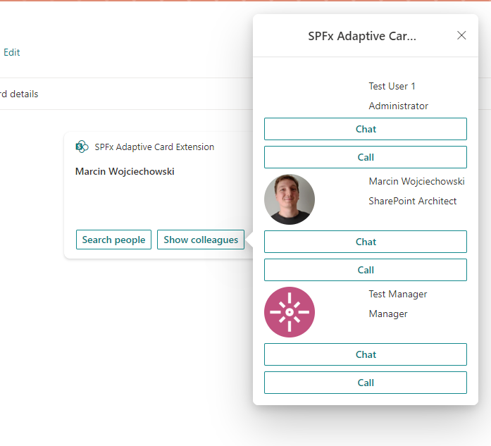

# basic-card-card-composition

## Summary

This sample tackles a scenario in which you want to reuse part of your Adaptive Card in multiple places or you need to divide your ACE QuickView into smaller ones for readability and maintainability. In a real world scenario your ACE can grow quite a lot making handling hundreds lines of JSON quite difficult.




## Used SharePoint Framework Version


## Applies to

- [SharePoint Framework](https://aka.ms/spfx)
- [Microsoft 365 tenant](https://docs.microsoft.com/en-us/sharepoint/dev/spfx/set-up-your-developer-tenant)

> Get your own free development tenant by subscribing to [Microsoft 365 developer program](http://aka.ms/o365devprogram)

## Solution

| Solution    | Author(s)                                               |
| ----------- | ------------------------------------------------------- |
| basiccard-cardcomposition |  [Marcin Wojciechowski](https://github.com/mgwojciech) [@mgwojciech](https://twitter.com/mgwojciech) |

## Version history

| Version | Date             | Comments        |
| ------- | ---------------- | --------------- |
| 1.0     | June 7, 2022 | Initial release |

## Disclaimer

**THIS CODE IS PROVIDED _AS IS_ WITHOUT WARRANTY OF ANY KIND, EITHER EXPRESS OR IMPLIED, INCLUDING ANY IMPLIED WARRANTIES OF FITNESS FOR A PARTICULAR PURPOSE, MERCHANTABILITY, OR NON-INFRINGEMENT.**

---

## Minimal Path to Awesome

- Clone this repository
- Ensure that you are at the solution folder
- in the command-line run:
  - **npm install**
  - **gulp serve**

- There are unit tests in the solution, run:
  - **npx jest**

## Features

The core of the solution is template getter in src\adaptiveCardExtensions\userPreview\quickView\BaseQuickView.ts

``` JavaScript
    let mainAce = require(`./template/${this.baseTemplateName}.json`);
    let userPreview = require('./template/UserPreviewTemplate.json');
    let usersContainer = mainAce.body.find(el => el.dataId === "PeopleSearchResults");
    usersContainer.items.push(...userPreview);
    this.aceSchema = mainAce;
```

As You can see the main part of our ACE will be loaded dynamically based on template name provided in constructor. However we will find PeopleSearchResults container in the AC and add there a partial ACE (UserPreviewTemplate) to handle rendering of users.

In the sample we have two QuickViews - one which allows us to search users and the other to render my colleagues based on me/people endpoint. Both will render a user with picture and option to start a chat or call them. Thanks to src\viewManager\PeopleViewManager.ts we can handle actions from both quick views in one location.

This solution uses graph-auto-batching - You can discover more about this topic from [this sample](https://github.com/pnp/sp-dev-fx-webparts/tree/main/samples/react-graph-auto-batching).

Action handling is done using variation of chain of responsibility implementation pattern. You can find similar solution useful for every problem that requires a lot of if statements in original implementation. Chain of responsibility makes it easier to handle some kind of input based on condition associated with input itself (in our case it's action).

Hope You'll enjoy the sample.

## References

- [Getting started with SharePoint Framework](https://docs.microsoft.com/en-us/sharepoint/dev/spfx/set-up-your-developer-tenant)
- [Building for Microsoft teams](https://docs.microsoft.com/en-us/sharepoint/dev/spfx/build-for-teams-overview)
- [Use Microsoft Graph in your solution](https://docs.microsoft.com/en-us/sharepoint/dev/spfx/web-parts/get-started/using-microsoft-graph-apis)
- [Publish SharePoint Framework applications to the Marketplace](https://docs.microsoft.com/en-us/sharepoint/dev/spfx/publish-to-marketplace-overview)
- [Microsoft 365 Patterns and Practices](https://aka.ms/m365pnp) - Guidance, tooling, samples and open-source controls for your Microsoft 365 development

