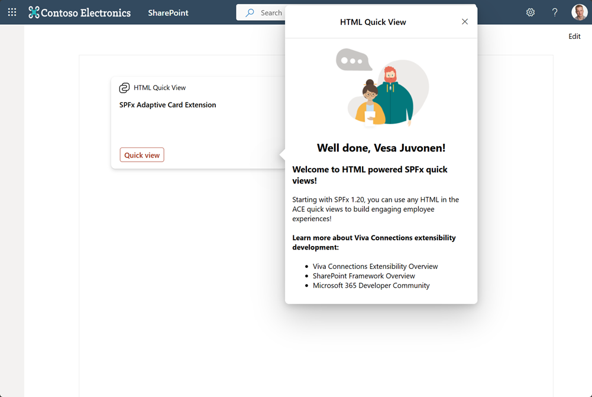
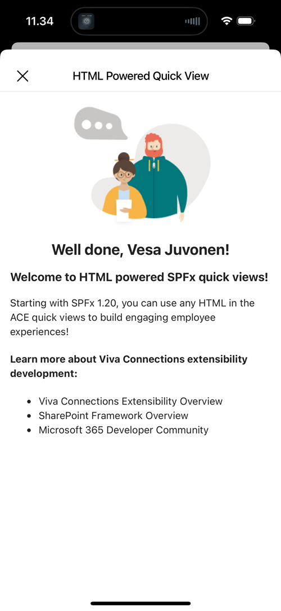

# HTML Quick View demo

## Summary

This is baseline demo for the using HTML Quick Views in Viva Connections Adaptive Card Extensions. This is an optional rendering capability introduced in the SharePoint Framework version 1.20. HTML powered Quick Views can be more advance vs the adaptive card powered quick views.

By deafault ACE template solution does not include support for the SCSS definitions. You need to include `@microsoft/sp-office-ui-fabric-core` package to the solution to be able to to use SCSS powered styles as demonstrated in this solution.

## Used SharePoint Framework Version

Notice that this version is NOT available publicly and solution will be updated to use public 1.20 preview version as that's available. Code is currently provided as a reference point to adopt, but you cannot use that externally.

## Applies to

- [SharePoint Framework](https://aka.ms/spfx)
- [Microsoft 365 tenant](https://docs.microsoft.com/en-us/sharepoint/dev/spfx/set-up-your-developer-tenant)

> Get your own free development tenant by subscribing to [Microsoft 365 developer program](http://aka.ms/o365devprogram)

## Prerequisites

- None

## Solution

| Solution    | Author(s)                                               |
| ----------- | ------------------------------------------------------- |
| BasicCard-HTML-QuickView | Vesa Juvonen (Microsoft) |

## Version history

| Version | Date             | Comments        |
| ------- | ---------------- | --------------- |
| 1.0     | August 20, 2024 | Initial release with preview packages |

## Disclaimer

**THIS CODE IS PROVIDED _AS IS_ WITHOUT WARRANTY OF ANY KIND, EITHER EXPRESS OR IMPLIED, INCLUDING ANY IMPLIED WARRANTIES OF FITNESS FOR A PARTICULAR PURPOSE, MERCHANTABILITY, OR NON-INFRINGEMENT.**

---

## Minimal Path to Awesome

- Clone this repository
- Ensure that you are at the solution folder
- in the command-line run:
  - **npm install**
  - **gulp serve**

## Features

This extension illustrates the following concepts:

- Using HTML Quick Views in the Adaptive Card Extensions
- Using SCSS definitions in the HTML Quick Views (you'll need to include `@microsoft/sp-office-ui-fabric-core` package)

## References

- [Introduction to HTML Quick Views with SPFx in Viva Connections cards](#)
- [Getting started with SharePoint Framework](https://aka.ms/spfx)
- [Overview of Viva Connections Extensibility](https://learn.microsoft.com/en-us/sharepoint/dev/spfx/viva/overview-viva-connections)
- [Microsoft 365 & Power Platform Community](https://aka.ms/community/home) - Guidance, tooling, samples and open-source controls for your Microsoft 365 development