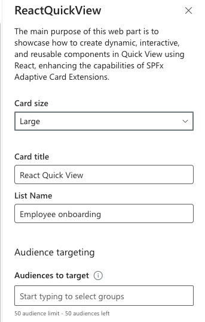

# **Adaptive Card Extension with React Quick View Demo**

## **Summary**

This project demonstrates how to leverage the new features introduced in **SPFx 1.20**, which allow developers to utilize **React** components within the **Quick View** of an Adaptive Card Extension (ACE). The main purpose of this web part is to showcase how to create dynamic, interactive, and reusable components in Quick View using React, enhancing the capabilities of SPFx Adaptive Card Extensions.

For a detailed step-by-step guide, visit the author's [Step-by-Step Guide to Building a React QuickView with Adaptive Card Extensions in SPFx 1.20](https://ahmadjadalhak.hashnode.dev/step-by-step-guide-to-building-a-react-quickview-with-adaptive-card-extensions-in-spfx-120), which covers the entire solution in depth.

## Screenshots




## Used SharePoint Framework Version


## Applies to

- [SharePoint Framework](https://aka.ms/spfx)
- [Microsoft 365 tenant](https://docs.microsoft.com/en-us/sharepoint/dev/spfx/set-up-your-developer-tenant)

## Solution

| Solution                  | Author(s)       |
| ------------------------- | --------------- |
| BasicCard-React-QuickView | Ahmad Jad Alhak  [GitHub](https://github.com/ahmad-jad-alhak), [Blog - Hashnode](https://ahmadjadalhak.hashnode.dev)|

## Version history

| Version | Date             | Comments        |
| ------- | ---------------- | --------------- |
| 1.0     | October 05, 2024 | Initial release |

## **Key Features**

- **React in Quick View**: Demonstrates the integration of **React** in the Quick View, making it easier to build complex and interactive UI elements.
- **SPFx 1.20 Adaptive Card Extension**: Leverages the new capabilities of **SPFx 1.20**, offering a flexible, modern approach to building Adaptive Card Extensions.
- **PnPjs for SharePoint Data Fetching**: Uses **PnPjs** to fetch and display data from a SharePoint list dynamically in the Quick View.
- **Dynamic Data**: Fetches and displays SharePoint list items in a user-friendly Quick View UI.

## **Installation and Setup**

1. **Pre-requisites**:

   - [Node.js](https://nodejs.org/) (LTS version recommended).
   - [Yeoman](http://yeoman.io/) generator for SPFx: `npm install -g @microsoft/generator-sharepoint`.
   - SPFx 1.20 – Ensure that you are using SPFx 1.20 by checking your package.json or upgrading your current project to SPFx 1.20 (see steps below). Learn more about SPFx 1.20 features and updates in the [SPFx 1.20 release notes](https://learn.microsoft.com/en-us/sharepoint/dev/spfx/release-1.20).
     - A SharePoint tenant with the ability to deploy SPFx solutions.
       > Get your own free development tenant by subscribing to [Microsoft 365 developer program](http://aka.ms/o365devprogram)

2. **Install Dependencies**:
   After cloning the repository, navigate to the project folder and run:

   ```bash
   npm install

   ```

3. **Build the Solution:**:
   Once dependencies are installed, build the solution using:

   ```bash
   gulp build
   ```

4. **Run the Project in Workbench:**:
  To run the web part locally in the SharePoint Workbench, use:

   ```bash
   gulp serve
   ```

5. **Bundle and Deploy:**:
  If you’re ready to deploy the solution to a SharePoint site, follow these steps:

   ```bash
   gulp bundle --ship
   gulp package-solution --ship
   ```

Then upload the generated `.sppkg` file to your SharePoint App Catalog and install the solution on your site.

## How It Works

This project focuses on creating an **Adaptive Card Extension (ACE)** where the **Quick View** is built using **React components**, which is a new capability introduced in **SPFx 1.20**.

## Key Components

- **QuickViewComponent.tsx**: The main React component that handles the rendering of data within the Quick View. This component:
- Uses **PnPjs** to fetch SharePoint list data.
- Renders a simple UI that dynamically displays list items.
- Handles loading states and error handling for the data fetching process.

- **AdaptiveCardExtension.ts**: The main SPFx extension file, where the **React Quick View** is initialized and passed relevant props like the SharePoint context and list name.

## Usage

- **Viewing the Quick View**: Once deployed, you can add the Adaptive Card Extension to your SharePoint page. The Quick View will display a list of items retrieved from a SharePoint list, showcasing the use of React for dynamic content rendering.

- **Modify List Name**: The list name used in the Quick View can be customized to fetch data from any SharePoint list of your choosing. Simply update the `listName` prop passed to the `QuickViewComponent`.

## Technologies Used

- **SPFx 1.20**: Latest version of SharePoint Framework, which introduces support for React in Quick View.
- **React**: JavaScript library used to build dynamic, interactive user interfaces.
- **PnPjs**: Simplified API wrapper for interacting with SharePoint data.
- **TypeScript**: Strongly typed programming language used throughout the project.

This project is licensed under the MIT License

## Disclaimer

**THIS CODE IS PROVIDED _AS IS_ WITHOUT WARRANTY OF ANY KIND, EITHER EXPRESS OR IMPLIED, INCLUDING ANY IMPLIED WARRANTIES OF FITNESS FOR A PARTICULAR PURPOSE, MERCHANTABILITY, OR NON-INFRINGEMENT.**

## References

- [Getting started with SharePoint Framework](https://docs.microsoft.com/en-us/sharepoint/dev/spfx/set-up-your-developer-tenant)
- [Building for Microsoft teams](https://docs.microsoft.com/en-us/sharepoint/dev/spfx/build-for-teams-overview)
- [Use Microsoft Graph in your solution](https://docs.microsoft.com/en-us/sharepoint/dev/spfx/web-parts/get-started/using-microsoft-graph-apis)
- [Publish SharePoint Framework applications to the Marketplace](https://docs.microsoft.com/en-us/sharepoint/dev/spfx/publish-to-marketplace-overview)
- [Microsoft 365 Patterns and Practices](https://aka.ms/m365pnp) - Guidance, tooling, samples and open-source controls for your Microsoft 365 development


