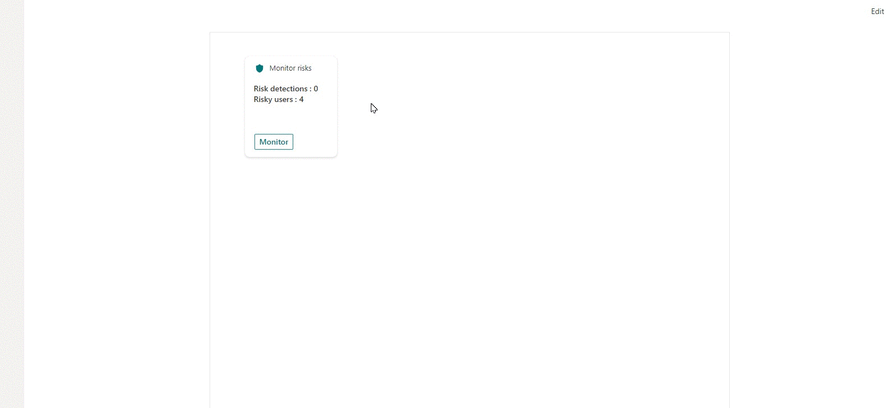
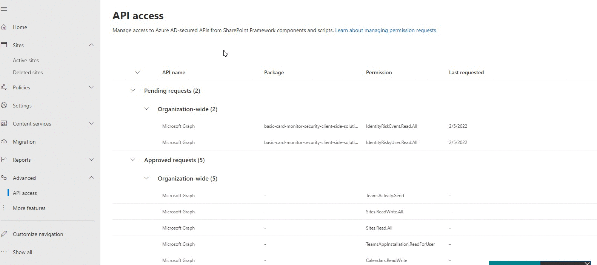

# Identity Protection Security Monitor from Adaptive Card Extension

## Summary

This solution provides a security monitoring feature using identity protection graph endpoint and ACE 

>See [Features](#Features) section for individual listing of features.

## Compatibility

 
 
 

## Permissions

Microsoft Graph

- IdentityRiskEvent.Read.All
- IdentityRiskyUser.Read.All

## Applies to

* [SharePoint Framework](https://docs.microsoft.com/sharepoint/dev/spfx/sharepoint-framework-overview)
* [Microsoft 365 tenant](https://docs.microsoft.com/sharepoint/dev/spfx/set-up-your-development-environment)

> Get your own free development tenant by subscribing to [Microsoft 365 developer program](http://aka.ms/o365devprogram)
## Prerequisites

After deploying the solution to app catalog, SharePoint administrator needs to approve the Graph API permissions from SharePoint admin center > Advanced > API access.

## Solution

Solution|Author(s)
--------|---------
Monitor Security | [Arijit Mondal](https://www.linkedin.com/in/arijit-cloud/)

## Version history

Version|Date|Comments
-------|----|--------
1.0|February 05, 2022|Initial release

## Disclaimer

**THIS CODE IS PROVIDED *AS IS* WITHOUT WARRANTY OF ANY KIND, EITHER EXPRESS OR IMPLIED, INCLUDING ANY IMPLIED WARRANTIES OF FITNESS FOR A PARTICULAR PURPOSE, MERCHANTABILITY, OR NON-INFRINGEMENT.**

---

## Minimal Path to Awesome

* Clone this repository
* Ensure all pre-requisites are met
* Ensure that you are at the solution folder
* in the command line run:
  * `npm install`
  * `gulp serve`

## Features

* This adaptive card extension is build for identity administors to review security risks and risky user from Viva Connection dashboard. 
* This also illustrates ability to use [identity protection](https://docs.microsoft.com/en-us/graph/api/resources/identityprotection-overview) graph api on top of the SharePoint Framework.
* Graph api data and demo data toggle option, and set maximum number of returned result from graph Api using property pane

## References

- [Getting started with SharePoint Framework](https://docs.microsoft.com/en-us/sharepoint/dev/spfx/set-up-your-developer-tenant)
- [Building for Microsoft teams](https://docs.microsoft.com/en-us/sharepoint/dev/spfx/build-for-teams-overview)
- [Use Microsoft Graph in your solution](https://docs.microsoft.com/en-us/sharepoint/dev/spfx/web-parts/get-started/using-microsoft-graph-apis)
- [Publish SharePoint Framework applications to the Marketplace](https://docs.microsoft.com/en-us/sharepoint/dev/spfx/publish-to-marketplace-overview)
- [Microsoft 365 Patterns and Practices](https://aka.ms/m365pnp) - Guidance, tooling, samples and open-source controls for your Microsoft 365 development
- [Tutorial to create ACE](https://docs.microsoft.com/en-us/sharepoint/dev/spfx/viva/get-started/build-first-sharepoint-adaptive-card-extension)
