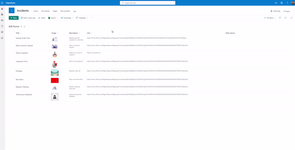
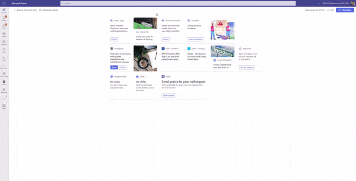
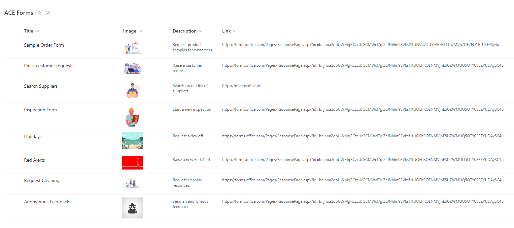
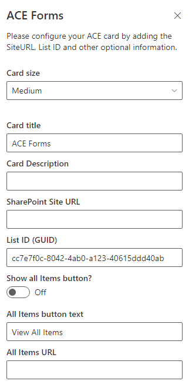

# Basic Card - Multiple Forms

## Summary

This Adaptive Card Extension shows how to have a single ACE card to display multiple Microsoft Forms or Multiple Power Apps that opens in the Stage View on Teams.

- Multiple Microsoft Forms

- Multiple PowerApps

The main advantage of opening on Stage View is that the user does not looses the context of Viva Connections by not being redirected somewhere else.

## Used SharePoint Framework Version

## Applies to

- [SharePoint Framework](https://aka.ms/spfx)
- [Microsoft 365 tenant](https://docs.microsoft.com/en-us/sharepoint/dev/spfx/set-up-your-developer-tenant)

> Get your own free development tenant by subscribing to [Microsoft 365 developer program](http://aka.ms/o365devprogram)

## Prerequisites

> Create a SharePoint list with the following fields:

| Column Title | Type             | 
| ------- | ---------------- 
| Title    | Single Line of Text |
| Image    | Image |
| Description    | Single Line of Text |
| Link    | Multiple Lines of Text |

## Solution

| Solution    | Author(s)                                               |
| ----------- | ------------------------------------------------------- |
| BasicCard-Multiple-Forms | Marcus Castro (https://www.linkedin.com/in/marcuscastrosp), Microsoft |

## Version history

| Version | Date             | Comments        |
| ------- | ---------------- | --------------- |
| 1.0     | April 13, 2023 | Initial release |

## Disclaimer

**THIS CODE IS PROVIDED _AS IS_ WITHOUT WARRANTY OF ANY KIND, EITHER EXPRESS OR IMPLIED, INCLUDING ANY IMPLIED WARRANTIES OF FITNESS FOR A PARTICULAR PURPOSE, MERCHANTABILITY, OR NON-INFRINGEMENT.**

---

## Minimal Path to Awesome

- Clone this repository
- Ensure that you are at the solution folder
  - in the command line run:
    - `npm install`
    - `gulp build --ship`
    - `gulp bundle --ship`
    - `gulp package-solution --ship`
  - Browse to your SharePoint app catalog and load the SPFX package.
  - in the command line run:
    - `gulp serve --nobrowser`
  - browse to your hosted workbench <https://YOURTENANT.sharepoint.com/sites/_layouts/15/workbench.aspx> and add the adaptive card extension.
- Configure your card by adding the SharePoint Site URL, List ID and other optional configuration details:

## Features

This ACE card shows how you can a have a single ACE Card to display multiple Microsoft Forms.

- Read information from a SharePoint list with link to multiple Microsoft Forms or PowerApps.
- Shows the list of items on Viva Connections.
- Open the Form or App on Stage View in Teams.

If you have the requirement of some items to be visible only to a set of users, you can use SharePoint out of the box item permission level to break item level permission and select groups that should be able to see each form. 

- Recommended only if you have a small number of items due to performance.

## References

- [Getting started with SharePoint Framework](https://docs.microsoft.com/en-us/sharepoint/dev/spfx/set-up-your-developer-tenant)
- [Build your first SharePoint Adaptive Card Extension](https://docs.microsoft.com/en-us/sharepoint/dev/spfx/viva/get-started/build-first-sharepoint-adaptive-card-extension)
- [Designing Viva Connections custom cards for your dashboard](https://docs.microsoft.com/en-us/sharepoint/dev/spfx/viva/design/design-intro)
- [Building for Microsoft teams](https://docs.microsoft.com/en-us/sharepoint/dev/spfx/build-for-teams-overview)
- [Use Microsoft Graph in your solution](https://docs.microsoft.com/en-us/sharepoint/dev/spfx/web-parts/get-started/using-microsoft-graph-apis)
- [Publish SharePoint Framework applications to the Marketplace](https://docs.microsoft.com/en-us/sharepoint/dev/spfx/publish-to-marketplace-overview)
- [Microsoft 365 Patterns and Practices](https://aka.ms/m365pnp) - Guidance, tooling, samples and open-source controls for your Microsoft 365 development

