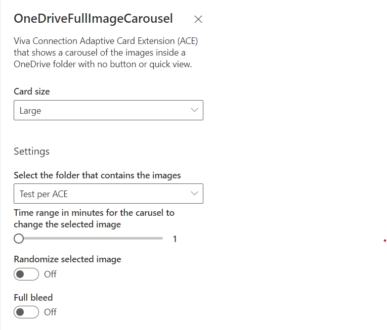

# basic-card-one-drive-carousel

## Summary

Viva Connection Adaptive Card Extension (ACE) that shows a carousel of the images inside a OneDrive folder without any buttons or quick views.

>This solution override part of the default behavior of the basic card view.

Large card view

Medium card view

Property pane

## Used SharePoint Framework Version

## Applies to

- [SharePoint Framework](https://aka.ms/spfx)
- [Microsoft 365 tenant](https://docs.microsoft.com/en-us/sharepoint/dev/spfx/set-up-your-developer-tenant)

> Get your own free development tenant by subscribing to [Microsoft 365 developer program](http://aka.ms/o365devprogram)

## Prerequisites

> None

## Solution

Solution|Author(s)
--------|---------
basic-card-one-drive-carousel | [GuidoZam](https://github.com/GuidoZam)

## Version history

Version|Date|Comments
-------|----|--------
1.0|April 11, 2022|Initial release

## Disclaimer

**THIS CODE IS PROVIDED *AS IS* WITHOUT WARRANTY OF ANY KIND, EITHER EXPRESS OR IMPLIED, INCLUDING ANY IMPLIED WARRANTIES OF FITNESS FOR A PARTICULAR PURPOSE, MERCHANTABILITY, OR NON-INFRINGEMENT.**

---

## Minimal Path to Awesome

- Clone this repository
- Ensure that you are at the solution folder
- in the command-line run:
  - **npm install**
  - **gulp serve**

## Features

Viva Connection Adaptive Card Extension (ACE) that shows an auto updating carousel of the images placed inside a OneDrive folder without any buttons or quick views.
It is possible to set a time range (in minutes) to specify the timing for the updates and is also possible to randomize the selected image.
From the property pane it is possible to enable the bleed property of the card view.
When clicked it opens up the selected OneDrive folder if specified, otherwise it opens the base OneDrive url.

## References

- [Getting started with SharePoint Framework](https://docs.microsoft.com/en-us/sharepoint/dev/spfx/set-up-your-developer-tenant)
- [Building for Microsoft teams](https://docs.microsoft.com/en-us/sharepoint/dev/spfx/build-for-teams-overview)
- [Use Microsoft Graph in your solution](https://docs.microsoft.com/en-us/sharepoint/dev/spfx/web-parts/get-started/using-microsoft-graph-apis)
- [Publish SharePoint Framework applications to the Marketplace](https://docs.microsoft.com/en-us/sharepoint/dev/spfx/publish-to-marketplace-overview)
- [Microsoft 365 Patterns and Practices](https://aka.ms/m365pnp) - Guidance, tooling, samples and open-source controls for your Microsoft 365 development

