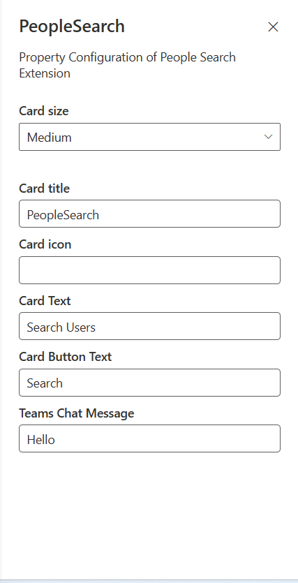

# People search

## Summary

This sample shows how to build an ACE with a card view and quick view to display users in a tenant and search users.

### Highlights

- Displays current logged in user's collection of person objects ordered by their relevance.
- Action buttons on card view to browse to Users.
- Quick view showing M365 User details.
- Click on user to take user to MS Teams chat with message provided in the configuration.

### Demo


### Screenshots of Configuration



## Used SharePoint Framework Version


## Applies to

- [SharePoint Framework](https://aka.ms/spfx)
- [Microsoft 365 tenant](https://docs.microsoft.com/en-us/sharepoint/dev/spfx/set-up-your-developer-tenant)

> Get your own free development tenant by subscribing to [Microsoft 365 developer program](http://aka.ms/o365devprogram)

## Prerequisites

After deploying the solution to tenant app catalog, SharePoint administrator needs to approve the Graph API permissions from SharePoint admin center > Advanced > API access blade.

You need following set of permissions in order to get Users. Find out more about consuming the [Microsoft Graph API in the SharePoint Framework](https://docs.microsoft.com/en-us/sharepoint/dev/spfx/use-aad-tutorial)

```
"webApiPermissionRequests": [  
  {
    "resource": "Microsoft Graph",
    "scope": "People.Read.All"
  },
  {
    "resource": "Microsoft Graph",
    "scope": "Directory.Read.All"
  },
  {
    "resource": "Microsoft Graph",
    "scope": "User.Read.All"
  }
]
```

## Solution

| Solution    | Author(s)                                               |
| ----------- | ------------------------------------------------------- |
| People search | [Kunj Sangani](https://github.com/kunj-sangani) , [@sanganikunj](https://twitter.com/sanganikunj) |

## Version history

| Version | Date             | Comments        |
| ------- | ---------------- | --------------- |
| 1.0     | January 08, 2022 | Initial release |

## Disclaimer

**THIS CODE IS PROVIDED _AS IS_ WITHOUT WARRANTY OF ANY KIND, EITHER EXPRESS OR IMPLIED, INCLUDING ANY IMPLIED WARRANTIES OF FITNESS FOR A PARTICULAR PURPOSE, MERCHANTABILITY, OR NON-INFRINGEMENT.**

---

## Minimal Path to Awesome

- Clone this repository
- Ensure that you are at the solution folder
- in the command-line run:
  - **npm install**
- Create the solution package (.sppkg file) using:
  - **gulp bundle --ship**
  - **gulp package-solution --ship**
- Deploy the package (basic-card-people-search.sppkg) to the tenant app catalogue.
- The solution needs following Microsoft Graph API permissions. Approve the API access requests in the SharePoint admin center.

  | Permissions         |
  |---------------------|
  | People.Read.All      |
  | Directory.Read.All  |
  | User.Read.All  |

- in the command-line run:
  - **gulp serve -l --nobrowser**
- Open the workbench page (<https://tenantname.sharepoint.com/sites/sitename/_layouts/15/workbench.aspx>)
- Add the ACE named **PeopleSearch** to the page.

## Features

This extension illustrates the following concepts:

- Using Microsoft Graph to get the M365 Groups
- Submit action handling in ACE and Quick View
- Customizing Quick View Adaptive Card JSON template to create customized UI

## References

- [Getting started with SharePoint Framework](https://docs.microsoft.com/en-us/sharepoint/dev/spfx/set-up-your-developer-tenant)
- [Building for Microsoft teams](https://docs.microsoft.com/en-us/sharepoint/dev/spfx/build-for-teams-overview)
- [Use Microsoft Graph in your solution](https://docs.microsoft.com/en-us/sharepoint/dev/spfx/web-parts/get-started/using-microsoft-graph-apis)
- [Publish SharePoint Framework applications to the Marketplace](https://docs.microsoft.com/en-us/sharepoint/dev/spfx/publish-to-marketplace-overview)
- [Microsoft 365 Patterns and Practices](https://aka.ms/m365pnp) - Guidance, tooling, samples and open-source controls for your Microsoft 365 development

