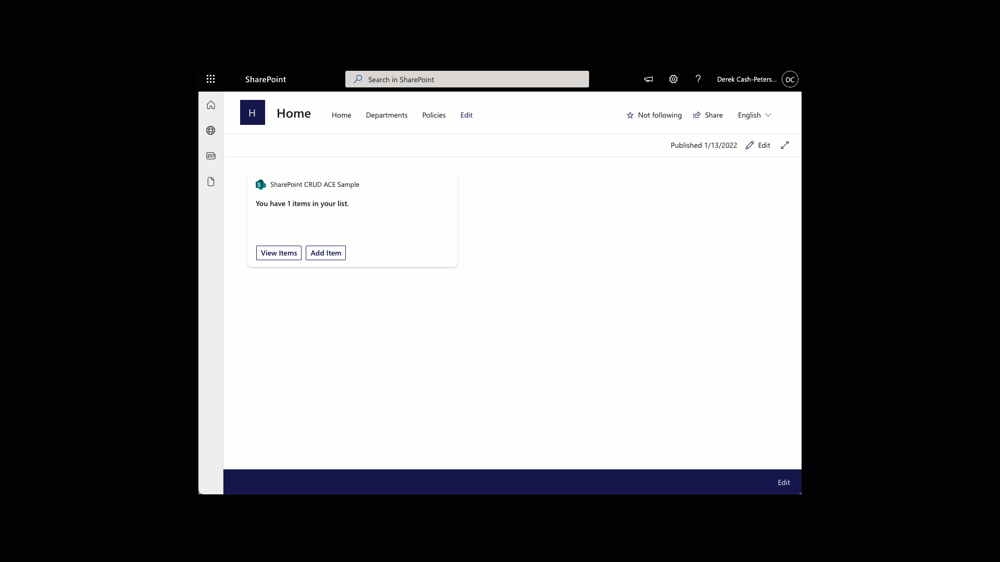

# basic-card-sharepoint-crud

## Summary

This Adaptive Card Extension shows how to work with form elements and form data in an Adaptive Card. It is an example of how to use an ACE to interact with SharePoint List data using PnPJS.

## Used SharePoint Framework Version

## Applies to

- [SharePoint Framework](https://aka.ms/spfx)
- [Microsoft 365 tenant](https://docs.microsoft.com/en-us/sharepoint/dev/spfx/set-up-your-developer-tenant)

> Get your own free development tenant by subscribing to [Microsoft 365 developer program](http://aka.ms/o365devprogram)

## Prerequisites

## Solution

Solution|Author(s)
--------|---------
BasicCard-SharePoint-CRUD | Derek Cash-Peterson ([@spdcp](https://twitter.com/spdcp)) [Sympraxis Consulting] (<https://www.sympraxisconsulting.com>)

## Version history

Version|Date|Comments
-------|----|--------
1.1|November 14, 2022|Upgrade to 1.15.2
1.0|January 13, 2021|Initial release

## Disclaimer

**THIS CODE IS PROVIDED *AS IS* WITHOUT WARRANTY OF ANY KIND, EITHER EXPRESS OR IMPLIED, INCLUDING ANY IMPLIED WARRANTIES OF FITNESS FOR A PARTICULAR PURPOSE, MERCHANTABILITY, OR NON-INFRINGEMENT.**

---

## Minimal Path to Awesome

- Clone this repository
- Ensure that you are at the solution folder
  - in the command line run:
    - `npm install`
    - `gulp build --ship`
    - `gulp bundle --ship`
    - `gulp package-solution --ship`
  - Browse to your SharePoint app catalog and load the SPFX package.
  - in the command line run:
    - `gulp serve --nobrowser`
  - browse to your hosted workbench <https://YOURTENANT.sharepoint.com/sites/_layouts/15/workbench.aspx> and add the adaptive card extension.

## Features

This ACE shows how to work with different form elements to collect and display data from an Adaptive Card and store that data in a SharePoint list. A sample list is automatically provisioned when the ACE is loaded for the first time. It also shows how to navigate from one view to another with multiple cards.

## References

- [Getting started with SharePoint Framework](https://docs.microsoft.com/en-us/sharepoint/dev/spfx/set-up-your-developer-tenant)
- [Build your first SharePoint Adaptive Card Extension](https://docs.microsoft.com/en-us/sharepoint/dev/spfx/viva/get-started/build-first-sharepoint-adaptive-card-extension)
- [Designing Viva Connections custom cards for your dashboard](https://docs.microsoft.com/en-us/sharepoint/dev/spfx/viva/design/design-intro)
- [Building for Microsoft teams](https://docs.microsoft.com/en-us/sharepoint/dev/spfx/build-for-teams-overview)
- [Use Microsoft Graph in your solution](https://docs.microsoft.com/en-us/sharepoint/dev/spfx/web-parts/get-started/using-microsoft-graph-apis)
- [Publish SharePoint Framework applications to the Marketplace](https://docs.microsoft.com/en-us/sharepoint/dev/spfx/publish-to-marketplace-overview)
- [Microsoft 365 Patterns and Practices](https://aka.ms/m365pnp) - Guidance, tooling, samples and open-source controls for your Microsoft 365 development

