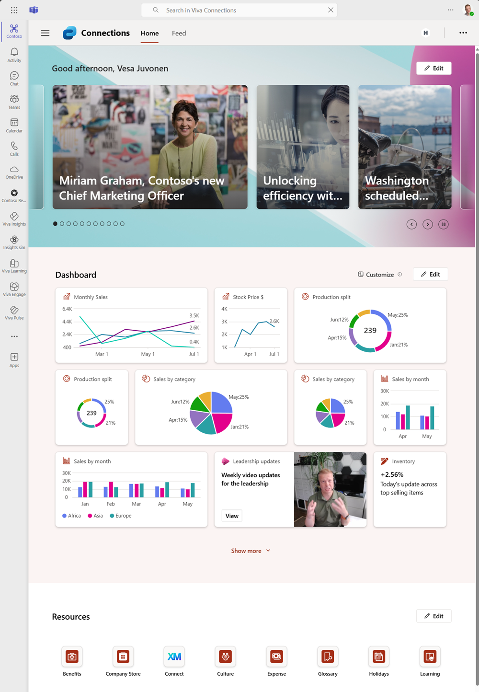
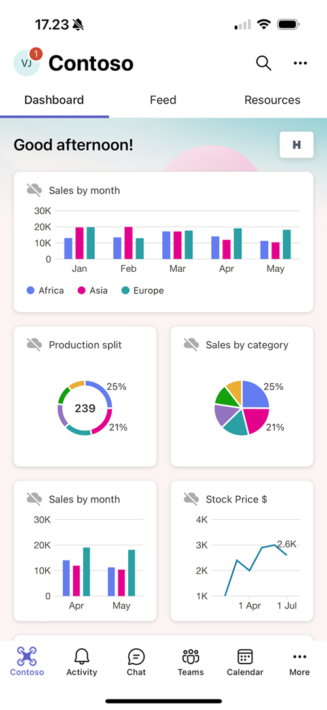

# Data Visualization options for ACE cards

## Summary

This is a baseline solution demonstrating the different data visualization options for the Viva Connections Cards. Line chart support was released as part of the SharePoint Framework 1.19 release and additional bar chart, pie chart and donat charts where introduced with the SharePoint Framework 1.20 release. Data visualization cards can be used to surface relevant business metrics directly in the Viva Connections dashboard, which can be easily accessed using desktop, tablet or mobile experiences.

## Used SharePoint Framework Version

## Applies to

- [SharePoint Framework](https://aka.ms/spfx)
- [Microsoft 365 tenant](https://docs.microsoft.com/en-us/sharepoint/dev/spfx/set-up-your-developer-tenant)

> Get your own free development tenant by subscribing to [Microsoft 365 developer program](http://aka.ms/o365devprogram)

## Prerequisites

None

## Solution

| Solution    | Author(s)                                               |
| ----------- | ------------------------------------------------------- |
| ChartCard-DataVisualizationOptions | Vesa Juvonen (Microsoft) |

## Version history

| Version | Date             | Comments        |
| ------- | ---------------- | --------------- |
| 1.0     | August 20, 2024 | Initial release with preview packages |

## Disclaimer

**THIS CODE IS PROVIDED _AS IS_ WITHOUT WARRANTY OF ANY KIND, EITHER EXPRESS OR IMPLIED, INCLUDING ANY IMPLIED WARRANTIES OF FITNESS FOR A PARTICULAR PURPOSE, MERCHANTABILITY, OR NON-INFRINGEMENT.**

---

## Minimal Path to Awesome

- Clone this repository
- Ensure that you are at the solution folder
- in the command-line run:
  - **npm install**
  - **gulp serve**

## Features

This solution focuses on demonstrating baseline features for the line chart, bar chart, pie chart and donut chart card designs for the Viva Connections.

This extension illustrates the following concepts:

- Line chart card layout
- Bar chart card layout
- Pie chart card layout
- Donut chart card layout

## References

- [Introduction to new data visualization components for Viva Connections](https://www.youtube.com/watch?v=zBLEEF6cC7I)
- [Getting started with SharePoint Framework](https://aka.ms/spfx)
- [Overview of Viva Connections Extensibility](https://learn.microsoft.com/en-us/sharepoint/dev/spfx/viva/overview-viva-connections)
- [Microsoft 365 & Power Platform Community](https://aka.ms/community/home) - Guidance, tooling, samples and open-source controls for your Microsoft 365 development
