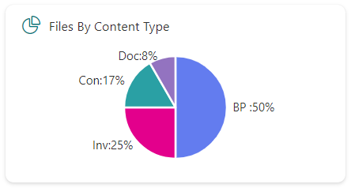
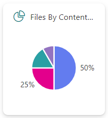

# ChartCard-FilesByContentType

## Summary

This Adaptive Card Extension displays a pie chart showing documents of a selected document library by content type.

Large view:

Medium view:

## Used SharePoint Framework Version

## Applies to

- [SharePoint Framework](https://aka.ms/spfx)
- [Microsoft 365 tenant](https://docs.microsoft.com/en-us/sharepoint/dev/spfx/set-up-your-developer-tenant)

## Prerequisites

> `Sites.Read.All` permission to be approved after uploading the package

## Solution

| Solution    | Author(s)                                               |
| ----------- | ------------------------------------------------------- |
| ChartCard-FilesByContentType | [Aimery Thomas](https://github.com/a1mery), [@aimery_thomas](https://twitter.com/aimery_thomas) |

## Version history

| Version | Date             | Comments        |
| ------- | ---------------- | --------------- |
| 1.0     | September 08, 2024 | Initial release |
| 1.1     | October 29, 2025 | Upgrade to SPFx 1.21.1 |

## Disclaimer

**THIS CODE IS PROVIDED _AS IS_ WITHOUT WARRANTY OF ANY KIND, EITHER EXPRESS OR IMPLIED, INCLUDING ANY IMPLIED WARRANTIES OF FITNESS FOR A PARTICULAR PURPOSE, MERCHANTABILITY, OR NON-INFRINGEMENT.**

---

## Minimal Path to Awesome

- Clone this repository
- Ensure that you are at the solution folder
- in the command-line run:
  - **npm install**
  - **gulp bundle --ship**
  - **gulp package-solution --ship**
- Deploy the package (chart-card-files-by-content-type.sppkg) to the tenant app catalogue.
- The solution needs following Microsoft Graph API permissions. Approve the API access requests in the SharePoint admin center.

  | Permissions               |
  |---------------------------|
  | Sites.Read.All |

- Add the ACE **Files By Content Type** to the Dashboard.

## Features

This sample demonstrate how to use the New Data Visualization Card options for Viva Connections released with SPFx 1.20 beta.

## References

- [Getting started with SharePoint Framework](https://docs.microsoft.com/en-us/sharepoint/dev/spfx/set-up-your-developer-tenant)
- [Building for Microsoft teams](https://docs.microsoft.com/en-us/sharepoint/dev/spfx/build-for-teams-overview)
- [Use Microsoft Graph in your solution](https://docs.microsoft.com/en-us/sharepoint/dev/spfx/web-parts/get-started/using-microsoft-graph-apis)
- [Publish SharePoint Framework applications to the Marketplace](https://docs.microsoft.com/en-us/sharepoint/dev/spfx/publish-to-marketplace-overview)
- [Microsoft 365 Patterns and Practices](https://aka.ms/m365pnp) - Guidance, tooling, samples and open-source controls for your Microsoft 365 development
