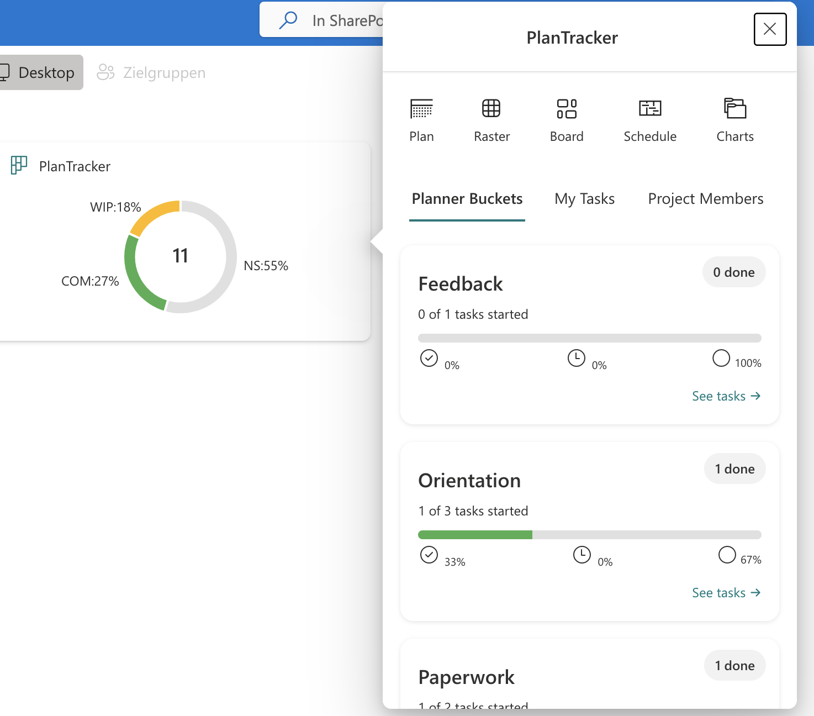
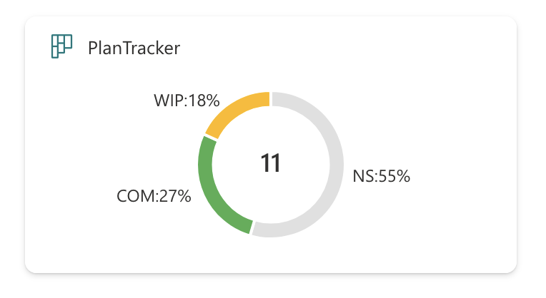
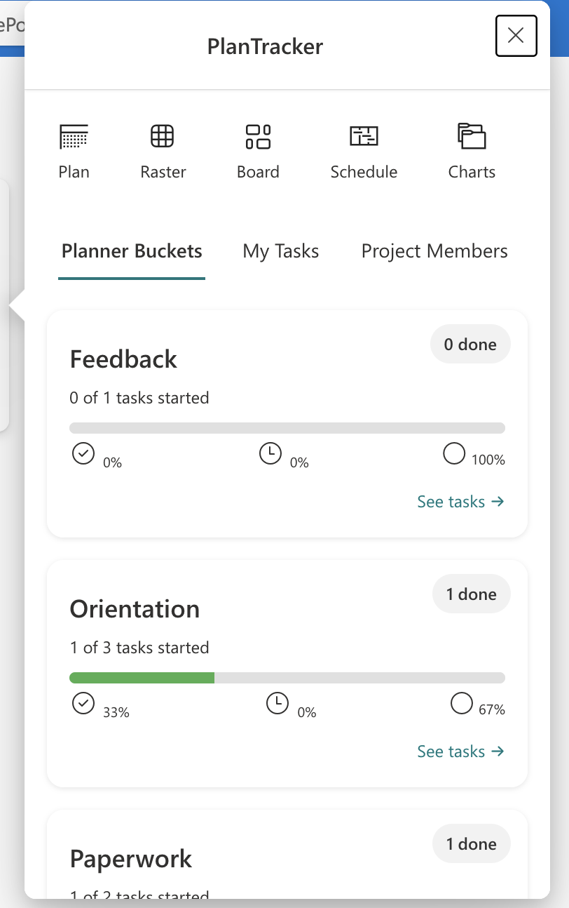
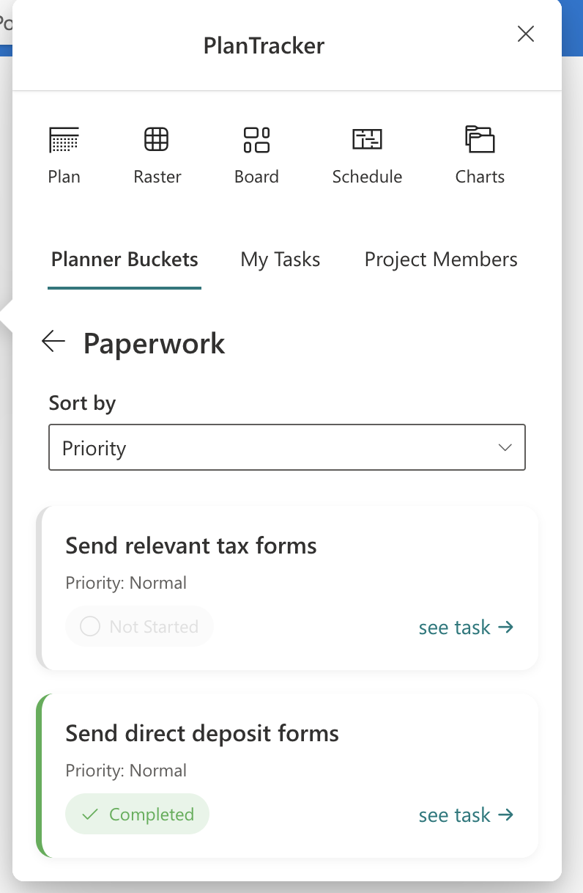

# Plan Tracker

## Summary

**Plan Tracker** is a SharePoint Framework (SPFx) Adaptive Card Extension (ACE) that provides a visually engaging and interactive dashboard for Microsoft Planner. It allows users to view buckets, tasks, project members, and personal assignments in an organized and customizable interface. Tasks can be sorted by priority or due date, and include visual status indicators, inline navigation, and plan-level insights.






## Used SharePoint Framework Version


## Applies to

- [SharePoint Framework](https://aka.ms/spfx)
- [Microsoft 365 tenant](https://docs.microsoft.com/en-us/sharepoint/dev/spfx/set-up-your-developer-tenant)

> Get your own free development tenant by subscribing to [Microsoft 365 developer program](http://aka.ms/o365devprogram)

## Prerequisites

- A valid Microsoft 365 tenant
- Microsoft Planner license
- Microsoft Graph API permissions for Planner and Users
- SPFx development environment set up

## Required Microsoft Graph API Permissions

To ensure proper functionality, the following Graph API permissions must be **approved in the SharePoint Admin Center** under **API Access** after deployment:

The **Plan Tracker** ACE requires the following **delegated Microsoft Graph API permissions**. These must be approved by a tenant administrator in the [Microsoft 365 Admin Center](https://admin.microsoft.com).

| Permission Type | Permission Scope         | Description                                         |
|------------------|--------------------------|-----------------------------------------------------|
| Delegated        | `Planner.Read`           | Read tasks, buckets, and plans in Planner           |
| Delegated        | `Group.Read.All`         | Access Planner plan group membership               |
| Delegated        | `User.ReadBasic.All`     | Read user basic profiles (for task assignees)       |
| Delegated        | `Organization.Read.All`  | Read tenant ID (used for Planner URL generation)    |

> **Note:** This solution uses read-only permissions to ensure safe, non-destructive access to Planner data.


> These are declared in `package-solution.json` under `webApiPermissionRequests`.


## Solution

| Solution    | Author(s)                                               |
| ----------- | ------------------------------------------------------- |
| plan-tracker | Ahmad Jad Alhak, [ahmad-jad-alhak](https://github.com/ahmad-jad-alhak) |

## Version history

| Version | Date          | Comments                   |
| ------- | ------------- | -------------------------- |
| 1.0     | July 10, 2025 | Initial release            |

## Disclaimer

**THIS CODE IS PROVIDED _AS IS_ WITHOUT WARRANTY OF ANY KIND, EITHER EXPRESS OR IMPLIED, INCLUDING ANY IMPLIED WARRANTIES OF FITNESS FOR A PARTICULAR PURPOSE, MERCHANTABILITY, OR NON-INFRINGEMENT.**

---

## Minimal Path to Awesome

- Clone this repository
- Navigate to the solution folder:
  ```bash
  cd plan-tracker
  ```
- Install dependencies and start the local server:
  ```bash
  npm install
  gulp serve
  ```

## Features

This extension offers the following features:

- View Planner buckets and task summaries in card-based layouts
- Filter and sort tasks by due date and priority
- View only “My Tasks” assigned to the current user
- Display project members from the Planner plan
- Navigate directly to Microsoft Planner for any task
- Customize card title and icon via property pane

> Designed with usability, performance, and modern UI alignment in mind.

## References

- [Getting started with SharePoint Framework](https://docs.microsoft.com/en-us/sharepoint/dev/spfx/set-up-your-developer-tenant)
- [Building for Microsoft Teams](https://docs.microsoft.com/en-us/sharepoint/dev/spfx/build-for-teams-overview)
- [Use Microsoft Graph in your solution](https://docs.microsoft.com/en-us/sharepoint/dev/spfx/web-parts/get-started/using-microsoft-graph-apis)
- [Publish SPFx apps to the Marketplace](https://docs.microsoft.com/en-us/sharepoint/dev/spfx/publish-to-marketplace-overview)
- [Microsoft 365 Patterns and Practices](https://aka.ms/m365pnp)


## Quick Navigation & Views

Plan Tracker includes three main views for navigating and interacting with your Planner data:

### 1. Planner Buckets View
- Displays all Planner buckets in a clean card layout.
- Allows drill-down into specific buckets.
- Tasks are shown with color-coded status and icons.
- Sorting options: **Priority** and **Due Date**.

### 2. My Tasks View
- Shows only tasks assigned to the current user.
- Same task layout as Planner view, with sorting support.
- Great for quickly reviewing individual work items.

### 3. Project Members View
- Displays members associated with the Planner plan.
- Useful for understanding team composition and responsibilities.

All views support consistent styling, vertical alignment, and adaptive layouts.

## Mapping Task Status to Short Names and Colors

Plan Tracker supports a customizable mapping between Planner task status and their visual representation.

| Status        | Short Name | Color     |
|---------------|------------|-----------|
| Not Started   | NS         | `#E0E0E0` |
| In Progress   | WIP        | `#ffb900` |
| Completed     | COM        | `#4CAF50` |

> These mappings are editable through the **Property Pane** using a collection data control. "Name" is locked, but users can change `shortName` and `color`.
