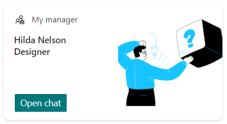
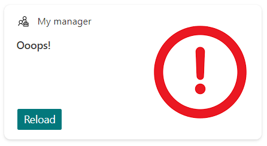

# User Manager ACE

## Summary

This Adaptive Card Extension (ACE) shows the manager of the currently logged in user.

## Used SharePoint Framework Version

## Applies to

- [SharePoint Framework](https://aka.ms/spfx)
- [Microsoft 365 tenant](https://docs.microsoft.com/en-us/sharepoint/dev/spfx/set-up-your-developer-tenant)

> Get your own free development tenant by subscribing to [Microsoft 365 developer program](http://aka.ms/o365devprogram)

## Solution

| Solution    | Author(s)                                               |
| ----------- | ------------------------------------------------------- |
| UserManager | [guidozam](https://github.com/guidozam) |

## Version history

| Version | Date             | Comments        |
| ------- | ---------------- | --------------- |
| 1.0     | March 09, 2024   | Initial commit  |

## Disclaimer

**THIS CODE IS PROVIDED _AS IS_ WITHOUT WARRANTY OF ANY KIND, EITHER EXPRESS OR IMPLIED, INCLUDING ANY IMPLIED WARRANTIES OF FITNESS FOR A PARTICULAR PURPOSE, MERCHANTABILITY, OR NON-INFRINGEMENT.**

---

## Minimal Path to Awesome

- Clone this repository
- Ensure that you are at the solution folder
- in the command-line run:
  - **npm install**
  - **gulp serve**

## Features

This Adaptive Card Extension (ACE) shows the manager of the currently logged in user. It uses the Microsoft Graph to get the manager of the user and then displays it.
The displayed informations, where available, are:
- display name
- job title
- business phone number
- office location

If the manager does not have a picture the card will display a default picture.

If there is a problem getting the manager's information the card will display an error.

## References

- [Getting started with SharePoint Framework](https://docs.microsoft.com/en-us/sharepoint/dev/spfx/set-up-your-developer-tenant)
- [Use Microsoft Graph in your solution](https://docs.microsoft.com/en-us/sharepoint/dev/spfx/web-parts/get-started/using-microsoft-graph-apis)
