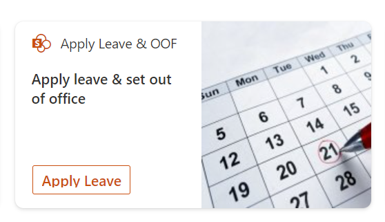
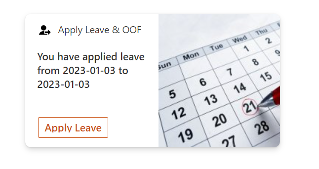
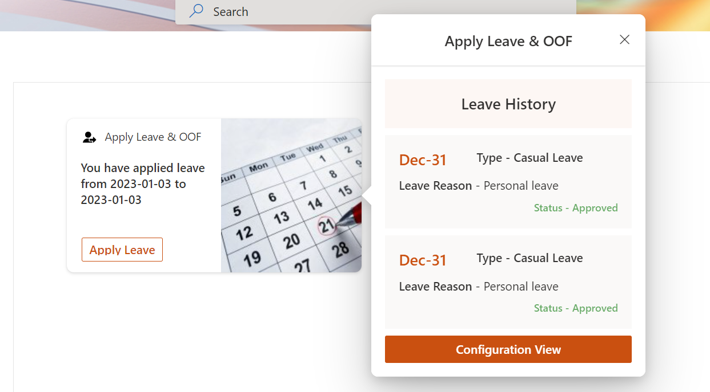
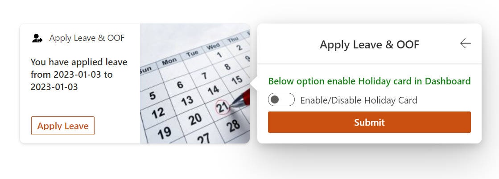
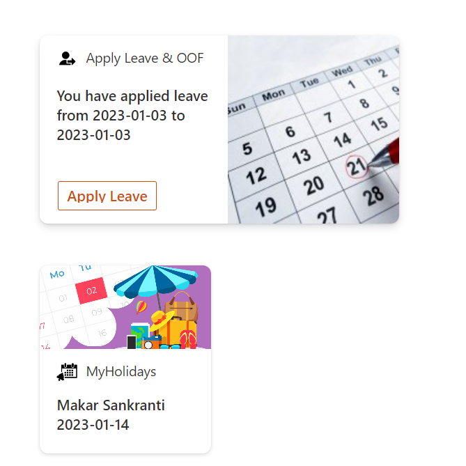

# image-card-applyleave-oof-holiday

## Summary
This card helps end user to apply leave and set out of office in parallel with leave. Apply leave card shows leave history on card click and it shows configuration to display MyHolidays card based on the user email.

[picture of the solution in action, if possible]

## Used SharePoint Framework Version

## Applies to

- [SharePoint Framework](https://aka.ms/spfx)
- [Microsoft 365 tenant](https://docs.microsoft.com/en-us/sharepoint/dev/spfx/set-up-your-developer-tenant)

> Get your own free development tenant by subscribing to [Microsoft 365 developer program](http://aka.ms/o365devprogram)

## Permissions
Microsoft Graph
- MailboxSettings.ReadWrite

## Prerequisites

> Create a SharePoint list (named "Leave Tracker") with the below columns
  - StartDate (Single line of text)
  - EndDate (Single line of text)
  - LeaveType (Single line of text)
  - LeaveDescription (Multi line of text)
  - AppliedBy (People & Group)

> Create a SharePoint list (named "ConfigList") with the below columns
  - Value (Single line of text)
  - Email (Single line of text)

  Note: To keep it simple I used column names type as "Single line of text", we can change the type of the column at any time.

## Solution

| Solution    | Author(s)                                               |
| ----------- | ------------------------------------------------------- |
| Ace-ApplyLeave-OOF-MyHolidays | [Vasanth Gowdru](https://github.com/MaheeTech) |

## Version history

| Version | Date             | Comments        |
| ------- | ---------------- | --------------- |
| 1.0     | January 01, 2023 | Initial release |

## Disclaimer

**THIS CODE IS PROVIDED _AS IS_ WITHOUT WARRANTY OF ANY KIND, EITHER EXPRESS OR IMPLIED, INCLUDING ANY IMPLIED WARRANTIES OF FITNESS FOR A PARTICULAR PURPOSE, MERCHANTABILITY, OR NON-INFRINGEMENT.**

---

## Minimal Path to Awesome

- Clone this repository
- Ensure that you are at the solution folder
- in the command-line run:
  - **npm install**
  - **gulp serve**

> Include any additional steps as needed.

## Features

This extension illustrates the following concepts:

- Using PnP js to get SharePoint list data for the current user
- On Card load, latest applied leave will be displayed
- On Card click, it will open Leave History view and Configuration for displaying My Holiday card in Dashboard
- On Card button click,end user can apply leave and set out of office for the applied leave.

## Card Screens

Below are the other screens displayed based on a scenarios mentioned below:

1. If there is no applied leave:
   

2. If there is applied leave:
   

3. Leave History:
   

4. Enable MyHoliday Card:
   

5. MyHolidays Card View:
   

## References

- [Getting started with SharePoint Framework](https://docs.microsoft.com/en-us/sharepoint/dev/spfx/set-up-your-developer-tenant)
- [Building for Microsoft teams](https://docs.microsoft.com/en-us/sharepoint/dev/spfx/build-for-teams-overview)
- [Use Microsoft Graph in your solution](https://docs.microsoft.com/en-us/sharepoint/dev/spfx/web-parts/get-started/using-microsoft-graph-apis)
- [Publish SharePoint Framework applications to the Marketplace](https://docs.microsoft.com/en-us/sharepoint/dev/spfx/publish-to-marketplace-overview)
- [Microsoft 365 Patterns and Practices](https://aka.ms/m365pnp) - Guidance, tooling, samples and open-source controls for your Microsoft 365 development

