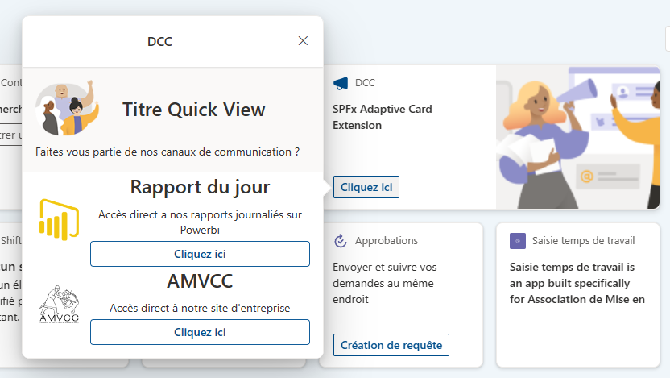

# Dynamic Content Card (aka DCC)

## Summary

Dynamic Content Card (aka DCC) is a SPFx ACE Card that displays dynamic content hosted on a Sharepoint list and filtered by the user's usageLocation property. Enabling you to display content based on the user's location and delegate the management of the content to the business users thanks to the Sharepoint list.

## Used SharePoint Framework Version

## Used PNP/Graph Version

## Applies to

- [SharePoint Framework](https://aka.ms/spfx)
- [Microsoft 365 tenant](https://docs.microsoft.com/en-us/sharepoint/dev/spfx/set-up-your-developer-tenant)

> Get your own free development tenant by subscribing to [Microsoft 365 developer program](http://aka.ms/o365devprogram)

## Prerequisites

 Graph permission to enable the solution to access the user profile. 

- User.read is the minimum permission required and used by the solution.

## Solution

| Solution    | Author(s)                                               |
| ----------- | ------------------------------------------------------- |
| DCC         | Eric Scherlinger - Sr Product Manager Microsoft         |

## Version history

| Version | Date             | Comments        |
| ------- | ---------------- | --------------- |
| 1.0     | March 20, 2024   | Initial release |

## Disclaimer

**THIS CODE IS PROVIDED _AS IS_ WITHOUT WARRANTY OF ANY KIND, EITHER EXPRESS OR IMPLIED, INCLUDING ANY IMPLIED WARRANTIES OF FITNESS FOR A PARTICULAR PURPOSE, MERCHANTABILITY, OR NON-INFRINGEMENT.**

---

## Minimal Path to Awesome

- Open the sample in VS Code
- Get the [Viva Connection Toolkit](https://marketplace.visualstudio.com/items?itemName=m365pnp.viva-connections-toolkit)
- In the Viva Connection Toolkit Window
  - Click on **"View samples"**
  - Search for "DCC"
  - Click on "Use" this will clone the sample to your local machine, Rename the solution and run the NPM install for you
  - Once the NPM install is done, you can run the solution by clicking on the **"Serve"** Task in the Viva Connection Toolkit Window
  - Please note that you might need to run the **"Grant API Permissions"** task to grant the required permission (User.Read) to the solution

## Features

The ACE Card is a SPFx web part that displays dynamic content hosted on a Sharepoint list and filtered by the user's usageLocation property. Enabling you to display content based on the user's location and delegate the management of the content to the business users thanks to the Sharepoint list.

This extension illustrates the following concepts:

- All Data is hosted in an SPO list that can be delegated to the content owners.
- The ACE Card uses the Graph API to fetch the user's usageLocation and filter the content based on it.
- Cards Property Pane enable you to change its Name but also create the SPO list and columns for you and access it quickly once created
- The card is designed to display URLs. Those URLs can be opened in Teams or on the device Native Browser. This enables you to leverage Universal Links and Deep Links to open the content in the right Application. For example view a PowerBi report directly in its Native Application or Open directly and Instagram page in the Instagram Application.
- All Strings are stored in the loc folder enabling you to quickly adapt the text to your usecase and add extras languages.

## References

- [Getting started with SharePoint Framework](https://docs.microsoft.com/en-us/sharepoint/dev/spfx/set-up-your-developer-tenant)
- [Building for Microsoft teams](https://docs.microsoft.com/en-us/sharepoint/dev/spfx/build-for-teams-overview)
- [Use Microsoft Graph in your solution](https://docs.microsoft.com/en-us/sharepoint/dev/spfx/web-parts/get-started/using-microsoft-graph-apis)
- [Publish SharePoint Framework applications to the Marketplace](https://docs.microsoft.com/en-us/sharepoint/dev/spfx/publish-to-marketplace-overview)
- [Microsoft 365 Patterns and Practices](https://aka.ms/m365pnp) - Guidance, tooling, samples and open-source controls for your Microsoft 365 development
