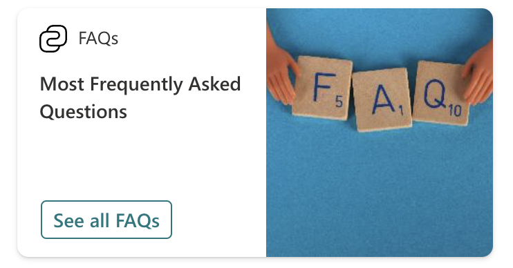
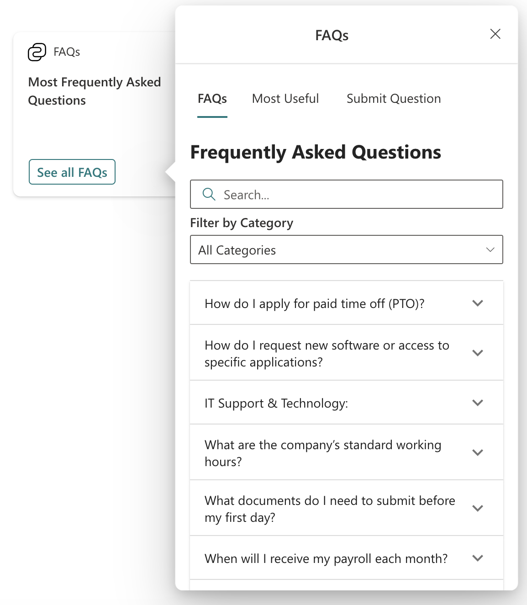
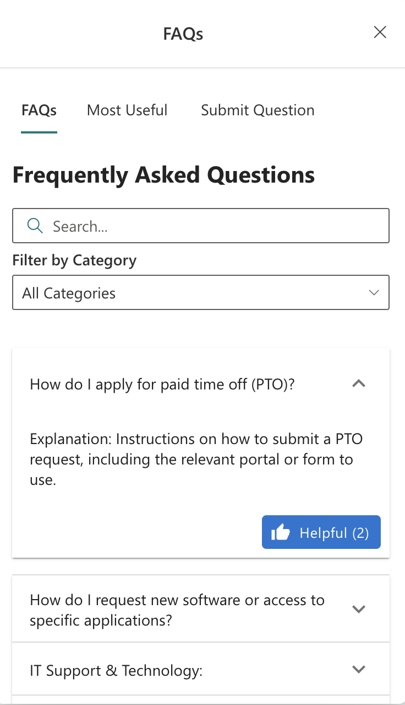

# FAQ Search Adaptive Card Extension

## Summary

The **FAQ Search Adaptive Card Extension** for SharePoint Framework (SPFx) is designed to display and manage frequently asked questions (FAQs) in a user-friendly interface. It offers users the ability to browse FAQs, filter questions by category, and submit new questions directly. Additionally, the extension features a "Most Useful" section, showcasing the questions that have been marked as the most helpful. This solution uses **PnPjs** to interact with SharePoint lists for data retrieval and submission, ensuring efficient integration with SharePoint.






## Compatibility

 


## Applies to

* [SharePoint Framework 1.20](https://docs.microsoft.com/sharepoint/dev/spfx/sharepoint-framework-overview)
* [Office 365 tenant](https://dev.office.com/sharepoint/docs/spfx/set-up-your-development-environment)

## Prerequisites

- Access to a SharePoint Online tenant
- Appropriate permissions to create and manage SharePoint lists
- FAQ list and submission lists created in SharePoint Online

The FAQ Search Adaptive Card Extension interacts with two SharePoint lists: **FAQ List** and **Submission List**. Below are the required columns for each list:

## SharePoint Lists & Columns
### FAQ List Columns

| Column Name       | Data Type  | Description                                      |
|-------------------|------------|--------------------------------------------------|
| Title             | Single line of text | The title of the FAQ question.               |
| Answer            | Multiple lines of text | The answer to the FAQ question.            |
| Category          | Choice     | Category under which the FAQ falls.              |
| HelpfulCount      | Number     | Count of how many users found the FAQ helpful.   |

### Submission List Columns

| Column Name       | Data Type  | Description                                      |
|-------------------|------------|--------------------------------------------------|
| Title             | Single line of text | The submitted question.                      |
| SubmissionDate    | Date and Time | The date and time the question was submitted.  |
| Status            | Choice     | The current status of the submitted question (e.g., "New", "Reviewed"). |
| Category          | Choice     | The category of the submitted question.          |


## Solution

Solution               | Author(s)
-----------------------|----------
FAQ Search Adaptive Card Extension | [Ahmad Jad Alhak](https://github.com/ahmad-jad-alhak)

## Version history

Version | Date        | Comments
--------|-------------|-----------------------------------
1.0     | October 2024| Initial release

## Minimal Path to Awesome

1. **Clone the repository:**

   ```bash
   git clone https://github.com/your-repo/faq-search-ace.git
   cd faq-search-ace

2. **Install dependencies:**

   ```bash
   npm install 

3. **Install dependencies:**
   ```bash
   gulp serve 
   
## Deployment

Follow these steps to deploy the FAQ Search Adaptive Card Extension:

1. **Pre-requisites:**
   - Ensure you have the correct [SPFx development environment](https://docs.microsoft.com/en-us/sharepoint/dev/spfx/set-up-your-development-environment) set up.
   - Install Node.js LTS (v16.x).

2. **Build the solution:**
   - Clone the repository to your local machine.
   - Navigate to the project folder in your terminal and run:
     ```bash
     npm install
     gulp build
     ```

3. **Package the solution:**
   - Once built, package the solution with:
     ```bash
     gulp bundle --ship
     gulp package-solution --ship
     ```

4. **Upload the package:**
   - Upload the `.sppkg` file located in the `sharepoint/solution` folder to your SharePoint App Catalog.

5. **Deploy the solution:**
   - Once uploaded, select the package in the App Catalog and click on "Deploy".

6. Add the Adaptive Card Extension to the Viva Connections Dashboard

Once the solution is deployed, you can add the Adaptive Card Extension to the Viva Connections Dashboard:

1. Navigate to the Viva Connections Dashboard of the site.
2. Edit the dashboard.
3. Add the newly available **FAQ Search Adaptive Card** from the list of available web parts.
4. Configure any required settings for the card in the property pane.

For more details, follow this guide on [Adding Cards to the Viva Connections Dashboard](https://learn.microsoft.com/en-us/sharepoint/dev/spfx/viva/add-card-to-dashboard).

7. **Configure the Web Part:**
   - Edit the page where you want to add the Adaptive Card Extension.
   - Select the FAQ Search Adaptive Card Extension from the list of available extensions.
   - Configure the web part by specifying the FAQ List Name, Submission List Name, and other properties.


## Features

The FAQ Search Adaptive Card Extension demonstrates the following features:

1. **FAQ Browsing:** Allows users to search and filter FAQs by category.
2. **Most Useful:** Displays the FAQs rated as most helpful.
3. **Question Submission:** Enables users to submit questions for review.
4. **PnPjs Integration:** Uses PnPjs to fetch, update, and manage FAQ and submission list items from SharePoint.

## Resources

- [SharePoint Framework Documentation](https://docs.microsoft.com/en-us/sharepoint/dev/spfx/sharepoint-framework-overview)
- [PnPjs Documentation](https://pnp.github.io/pnpjs/)

- [Viva Connections Adaptive Card Extensions](https://learn.microsoft.com/en-us/sharepoint/dev/spfx/viva/build-first-adaptive-card-extension)
- [Microsoft Viva Connections Documentation](https://learn.microsoft.com/en-us/viva/connections/)
- [Create an App Catalog site](https://learn.microsoft.com/en-us/sharepoint/use-app-catalog)
- [Deploying Viva Connections Adaptive Cards](https://learn.microsoft.com/en-us/sharepoint/dev/spfx/viva/build-first-adaptive-card-extension)
- [Viva Connections Dashboard setup](https://learn.microsoft.com/en-us/viva/connections/overview-viva-connections)

Disclaimer

THIS CODE IS PROVIDED AS IS WITHOUT WARRANTY OF ANY KIND, EITHER EXPRESS OR IMPLIED, INCLUDING ANY IMPLIED WARRANTIES OF FITNESS FOR A PARTICULAR PURPOSE, MERCHANTABILITY, OR NON-INFRINGEMENT.