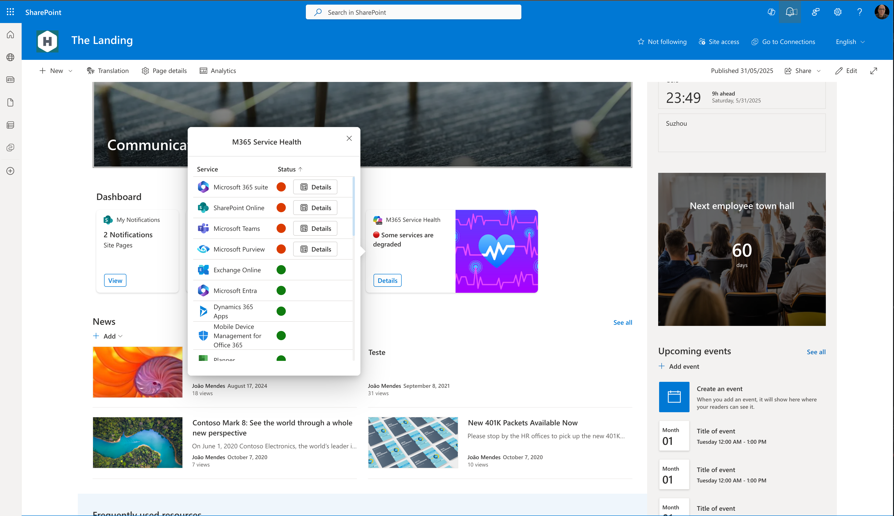
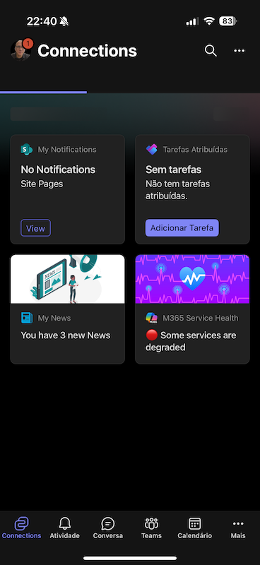
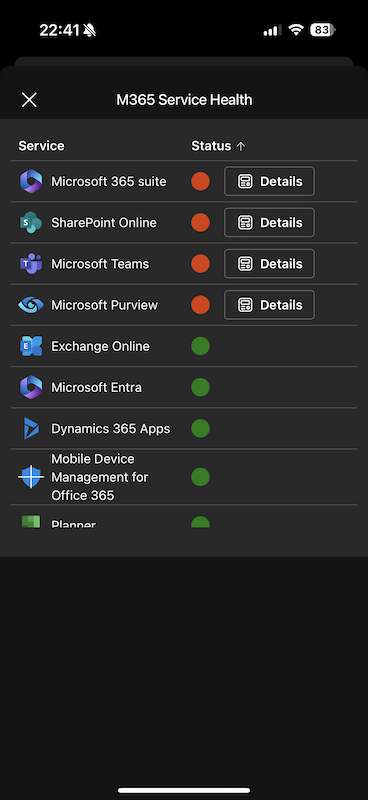
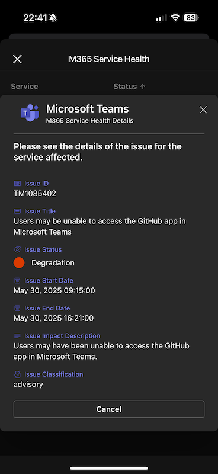

# SPFx ACE Service Health

## Overview

SPFx ACE Service Health is a SharePoint Framework (SPFx) extension designed to monitor and display the health status of various services within your Microsoft 365 environment. It provides real-time visual feedback on service status, helping users and administrators quickly identify operational issues or interruptions.

## Features

- **Service Health Dashboard:** Visualizes the current status of all monitored services.
- **Status Indicators:** Uses color-coded icons (🟢, 🟡, 🔴) to represent operational, restricted, or interrupted services.
- **Detailed Status Labels:** Friendly labels for each service state (e.g., Operational, Investigating, Degradation, Interruption).






## Technologies Used

- **SharePoint Framework (SPFx) v1.21.1**
- **React**
- **TypeScript**
- **@fluentui/react-components** for UI consistency

## Prerequisites

- Microsoft 365 tenant with SharePoint Online
- Node.js and npm installed
- SPFx development environment set up ([Get started](https://docs.microsoft.com/en-us/sharepoint/dev/spfx/set-up-your-developer-tenant))
- Azure FUnction deployed to provide service health data (optional, if using All usrs option selected on property pane,  )  found here [SPFx-ace-service-health-azure-function](react-extension-service-health-azfn.zip)
- Permissions to deploy SPFx solutions to the SharePoint site

## Required Graph Permissions

- `ServiceHealth.Read.All` - Read service health information for all services in the tenant.

## Getting Started

1. **Clone the repository:**

   ```bash
   git clone <your-repo-url>
   ```

2. **Navigate to the solution folder:**

   ```bash
   cd SPFx-ace-service-health
   ```

3. **Install dependencies:**

   ```bash
   npm install
   ```

4. **Run the solution locally:**

   ```bash
   gulp serve
   ```

## Usage

- Deploy the extension to your SharePoint site.
- The dashboard will automatically display the health status of configured services.
- Statuses are updated in real-time and reflected with clear color-coded indicators and descriptive labels.

## Version History

| Version | Date         | Comments         |
| ------- | ------------| ---------------- |
| 1.0     | May 31, 2025| Initial release  |

## Author

| Solution                | Author(s)                |
|-------------------------|--------------------------|
| ImageCard-HTML-React-Service-Health | João José Mendes         |

## Disclaimer

**THIS CODE IS PROVIDED _AS IS_ WITHOUT WARRANTY OF ANY KIND, EITHER EXPRESS OR IMPLIED, INCLUDING ANY IMPLIED WARRANTIES OF FITNESS FOR A PARTICULAR PURPOSE, MERCHANTABILITY, OR NON-INFRINGEMENT.**

---

## References

- [SharePoint Framework Documentation](https://docs.microsoft.com/en-us/sharepoint/dev/spfx/)
- [@fluentui/react-components](https://react.fluentui.dev/)
- [Microsoft 365 Patterns and Practices](https://aka.ms/m365pnp)
