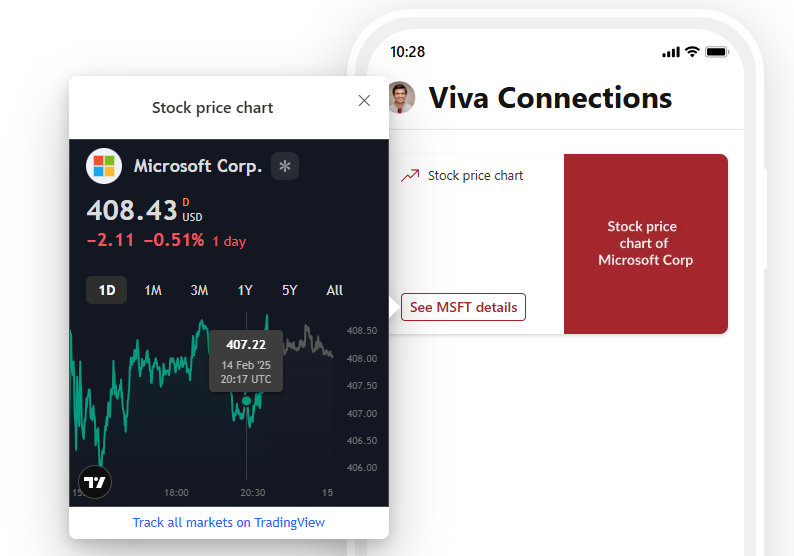

# ImageCard HTML React Stock Price Chart

## Summary

This Adaptive Card extension (ACE) sample shows how to use HTML and React in an ACEs which was introduced in SPFx 1.20.0.
This ACE allows you to see the stock price chart of a company. The stock price chart is displayed using the [TradingView widget](https://www.tradingview.com/widget-docs/widgets/charts/symbol-overview/). 
The stock symbol, company name and currency are stored in the properties of ACE and are used by the widget in the QuickView.

## Highlights
- Use of HTML and React in ACEs
- Use of React components in ACEs
- Dynamic update of colours based on the theme changes
- Use of simple widgets

## Demo

## Used SharePoint Framework Version

## Applies to

- [SharePoint Framework](https://aka.ms/spfx)
- [Microsoft 365 tenant](https://docs.microsoft.com/en-us/sharepoint/dev/spfx/set-up-your-developer-tenant)

> Get your own free development tenant by subscribing to [Microsoft 365 developer program](http://aka.ms/o365devprogram)

## Solution

| Solution    | Author(s)                                               |
| ----------- | ------------------------------------------------------- |
| ImageCard-HTML-React-Stock-Price-Chart | [Anoop T](https://linktr.ee/anoopt)

## Version history

| Version | Date             | Comments        |
| ------- | ---------------- | --------------- |
| 1.0     | Febuary 17, 2025 | Initial release |

## Disclaimer

**THIS CODE IS PROVIDED _AS IS_ WITHOUT WARRANTY OF ANY KIND, EITHER EXPRESS OR IMPLIED, INCLUDING ANY IMPLIED WARRANTIES OF FITNESS FOR A PARTICULAR PURPOSE, MERCHANTABILITY, OR NON-INFRINGEMENT.**

---

## Minimal Path to Awesome

- Clone this repository
- Ensure that you are at the solution folder
- in the command-line run:
  - **npm install**
  - **gulp serve**
- Add the "Stock price chart" ACE to the dashboard page
- Edit the properties of the ACE as needed

## References

- [Getting started with SharePoint Framework](https://docs.microsoft.com/en-us/sharepoint/dev/spfx/set-up-your-developer-tenant)
- [Building for Microsoft teams](https://docs.microsoft.com/en-us/sharepoint/dev/spfx/build-for-teams-overview)
- [Use Microsoft Graph in your solution](https://docs.microsoft.com/en-us/sharepoint/dev/spfx/web-parts/get-started/using-microsoft-graph-apis)
- [Publish SharePoint Framework applications to the Marketplace](https://docs.microsoft.com/en-us/sharepoint/dev/spfx/publish-to-marketplace-overview)
- [Microsoft 365 Patterns and Practices](https://aka.ms/m365pnp) - Guidance, tooling, samples and open-source controls for your Microsoft 365 development