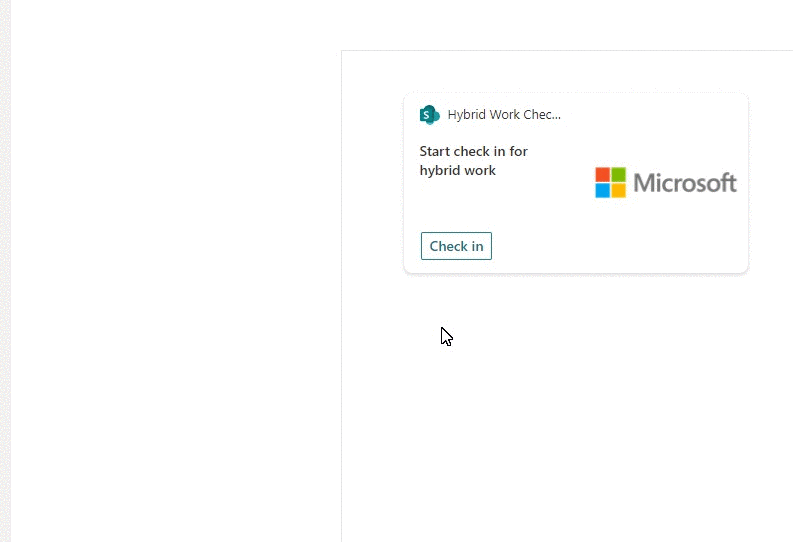
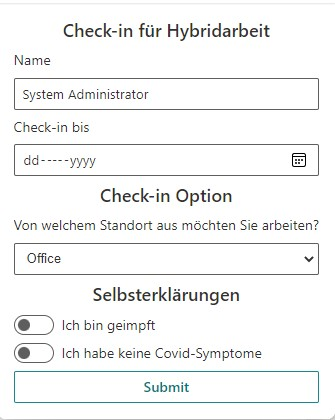
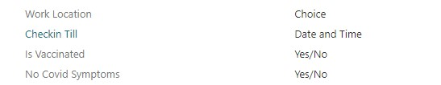

# Hybrid Work Employee Check-in from Adaptive Card Extension

## Summary

This solution provides a employee check-in feature in hybrid work scenario using SharePoint List and ACE 

>See [Features](#Features) section for individual listing of samples.

## Compatibility

 
 
 

## Applies to

* [SharePoint Framework](https://docs.microsoft.com/sharepoint/dev/spfx/sharepoint-framework-overview)
* [Microsoft 365 tenant](https://docs.microsoft.com/sharepoint/dev/spfx/set-up-your-development-environment)

> Get your own free development tenant by subscribing to [Microsoft 365 developer program](http://aka.ms/o365devprogram)

## Prerequisites

> Create a SharePoint list with generic template and the following configurations:
- List Name: Hybrid Work Employee Check in

> Columns: 
- Work Location: Choice (Remote, Office)
- Checkin Till (Date and Time)
- Is Vaccinated (Yes/No)
- No Covid Symptoms	(Yes/No) 

## Solution

Solution|Author(s)
--------|---------
Hybrid Work Check-in | [Arijit Mondal](https://www.linkedin.com/in/arijit-cloud/)

## Version history

Version|Date|Comments
-------|----|--------
1.0|November 29, 2021|Initial release
1.1|February 14, 2022|Added localization support for form, choice option from sp list

## Disclaimer

**THIS CODE IS PROVIDED *AS IS* WITHOUT WARRANTY OF ANY KIND, EITHER EXPRESS OR IMPLIED, INCLUDING ANY IMPLIED WARRANTIES OF FITNESS FOR A PARTICULAR PURPOSE, MERCHANTABILITY, OR NON-INFRINGEMENT.**

---

## Minimal Path to Awesome

* Clone this repository
* Ensure all pre-requisites are met
* Ensure that you are at the solution folder
* in the command line run:
  * `npm install`
  * `gulp serve`

## Features

This adaptive card extension is based on need for checking in employee status on the covid related declaration and where they want work from for next n number of days. 
This Adaptive Card Extension also illustrates ability to use form inputs via adaptive cards(https://adaptivecards.io/) on top of the SharePoint Framework.
Localization support for the form labels in quickview

## References

- [Getting started with SharePoint Framework](https://docs.microsoft.com/en-us/sharepoint/dev/spfx/set-up-your-developer-tenant)
- [Building for Microsoft teams](https://docs.microsoft.com/en-us/sharepoint/dev/spfx/build-for-teams-overview)
- [Use Microsoft Graph in your solution](https://docs.microsoft.com/en-us/sharepoint/dev/spfx/web-parts/get-started/using-microsoft-graph-apis)
- [Publish SharePoint Framework applications to the Marketplace](https://docs.microsoft.com/en-us/sharepoint/dev/spfx/publish-to-marketplace-overview)
- [Microsoft 365 Patterns and Practices](https://aka.ms/m365pnp) - Guidance, tooling, samples and open-source controls for your Microsoft 365 development
- [Tutorial to create ACE](https://docs.microsoft.com/en-us/sharepoint/dev/spfx/viva/get-started/build-first-sharepoint-adaptive-card-extension)

