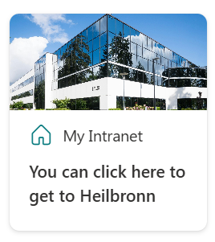

# ImageCard-MyLocation

## Summary

This Adaptive Card Extension (ACE) creates a dynamic link based on the user officeLocation or group membership and shows a dynamic image + text.

## Used SharePoint Framework Version

## Applies to

- SharePoint Framework Adaptive Card Extensions
- SharePoint Online
- Microsoft Graph API
- PnPjs

## Prerequisites

- SharePoint Online tenant with permissions to create lists and Adaptive Card Extensions.
- Azure AD groups set up with user membership.
- SharePoint list created with columns:  
  - **Title** (Location name / Title)  
  - **URL** (link to office or resource)  
  - **imageURL** (optional image for display)
  - **GroupId** (optional if using the Group Membership mode)

## Solution

| Solution    | Author(s)                                               |
| ----------- | ------------------------------------------------------- |
| ImageCard-MyLocation | Lukas Bänsch, Communardo, [LinkedIn](https://de.linkedin.com/in/lukas-b%C3%A4nsch-322610104) |

## Version history

| Version | Date             | Comments        |
| ------- | ---------------- | --------------- |
| 1.0     | June 2, 2025 | Initial release |

## Disclaimer

**THIS CODE IS PROVIDED _AS IS_ WITHOUT WARRANTY OF ANY KIND, EITHER EXPRESS OR IMPLIED, INCLUDING ANY IMPLIED WARRANTIES OF FITNESS FOR A PARTICULAR PURPOSE, MERCHANTABILITY, OR NON-INFRINGEMENT.**

---

## Minimal Path to Awesome

- Clone this repository
- Ensure that you are at the solution folder
- in the command-line run:
  - **npm install**
  - **gulp serve**

> Include any additional steps as needed.

## Features

This card is supposed to help dynmically display content for users of multiple locations. Common use cases could include location specific home pages, or documents (e.g. menu plan). This way, you can use one adaptive card to show content for multiple different users without having to worry about the Viva Connections card limit.

- Supports two modes:  
  - **User Property Mode**: Uses the user’s Office Location profile property.  
  - **Group Membership Mode**: Uses Azure AD group membership to determine displayed content.
- Dynamic replacement of `{Location}` token in card description.
- Configurable external link based on user context or fallback URL.
- Supports fluent UI icons configurable from property pane.
- Fetches images and URLs from a SharePoint list.
- Implements clean separation of logic for fetching user properties and group memberships.

## References

- [Getting started with SharePoint Framework](https://docs.microsoft.com/en-us/sharepoint/dev/spfx/set-up-your-developer-tenant)
- [Building for Microsoft teams](https://docs.microsoft.com/en-us/sharepoint/dev/spfx/build-for-teams-overview)
- [Use Microsoft Graph in your solution](https://docs.microsoft.com/en-us/sharepoint/dev/spfx/web-parts/get-started/using-microsoft-graph-apis)
- [Publish SharePoint Framework applications to the Marketplace](https://docs.microsoft.com/en-us/sharepoint/dev/spfx/publish-to-marketplace-overview)
- [Microsoft 365 Patterns and Practices](https://aka.ms/m365pnp) - Guidance, tooling, samples and open-source controls for your Microsoft 365 development
