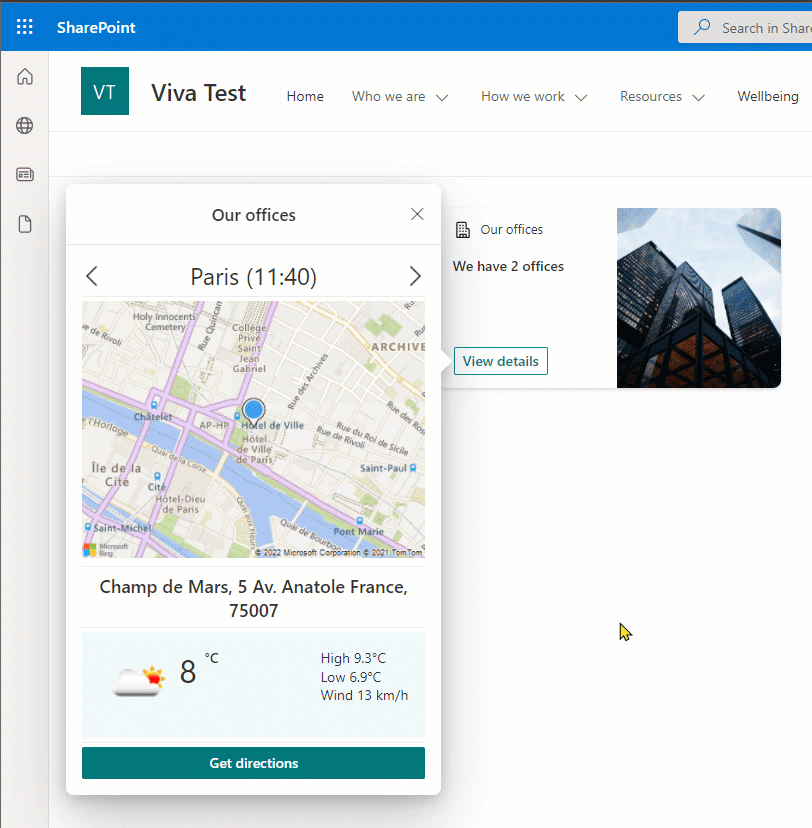
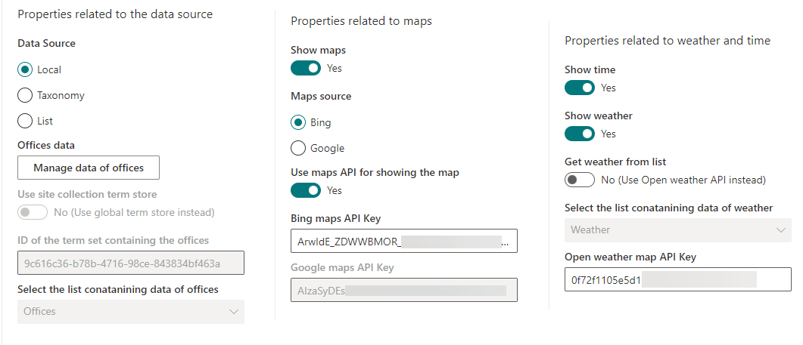
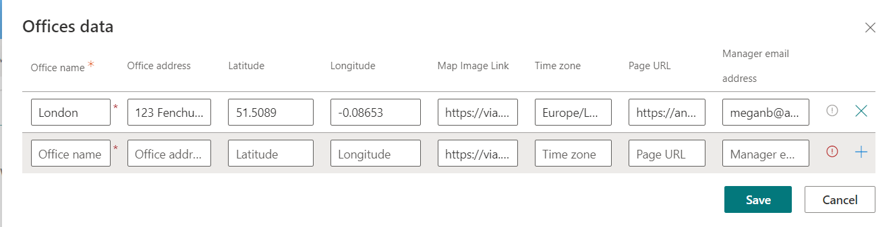
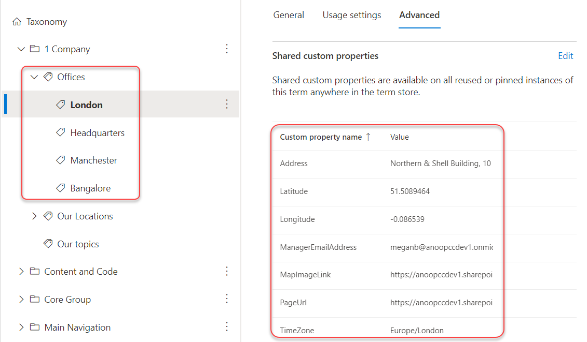
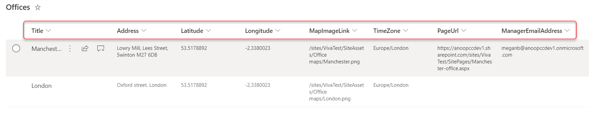

# Office locations

## Summary

This sample shows how to build an ACE with multiple card views to show the details of the offices in an organisation.

### Highlights
- Usage of multiple data sources (local properties, taxonomy or SharePoint list) to get the required data
- Usage of Bing and Google maps to get static maps
- Usage of the new "Show location" action
- Usage of OpenWeather API to get weather
- Load data on demand asynchronously in quick view
- Usage of fuzzy search to search data
- Conditional enabling/disabling of properties

### Demo

### Desktop view

### Desktop view with show location feature introduced in SPFx v1.14

### Mobile view

## Used SharePoint Framework Version

 

## Applies to

- [SharePoint Framework](https://aka.ms/spfx)
- [Microsoft 365 tenant](https://docs.microsoft.com/en-us/sharepoint/dev/spfx/set-up-your-developer-tenant)

> Get your own free development tenant by subscribing to [Microsoft 365 developer program](http://aka.ms/o365devprogram)

## Prerequisites

> Get a [Bing maps API key](https://www.bingmapsportal.com/) or a [Google maps API key](https://developers.google.com/maps/documentation/static-maps/get-api-key)

> Get an [OpenWeather API key](https://home.openweathermap.org/api_keys)

## Solution

Solution|Author(s)
--------|---------
office-locations | [Anoop Tatti](https://github.com/anoopt) ([https://linktr.ee/anoopt](https://linktr.ee/anoopt))

## Version history

Version|Date|Comments
-------|----|--------
1.0|February 15, 2022|Initial release

## Disclaimer

**THIS CODE IS PROVIDED *AS IS* WITHOUT WARRANTY OF ANY KIND, EITHER EXPRESS OR IMPLIED, INCLUDING ANY IMPLIED WARRANTIES OF FITNESS FOR A PARTICULAR PURPOSE, MERCHANTABILITY, OR NON-INFRINGEMENT.**

---

## Minimal Path to Awesome

- Clone this repository
- Ensure that you are at the solution folder
- in the command-line run:
  - **npm install**
  - **gulp serve**
- Add the ACE to the dashboard page
- Edit the properties, select `Data source` as `Local`
- Add data as per the requirement
- Select a map source
- Set `Use maps API for showing the map` as `true`
- Add either Bing maps API key or Google maps API key
- Set `Show weather` as `true`
- Add the OpenWeather API key
- Save the page

## Features

### Additional setup - Managing properties

#### All properties

#### Data source

The ACE has capability to use one of 3 data sources

1. Local property collection

Data can be added here as per the properties.
The `Map Image Link` by default contains a blank placeholder image. When maps API is not being used then this can be updated to point to a [static map image](#usage-of-maps-api) of size 400x240. 

2. Term store

A termset can be used as a data source for office locations.
That termset should have a custom property called `UsedForOfficeLocations` set to `true`.
The office terms have to be first level child of the termset.
Each office term must have custom properties called `Address`, `Latitude`, `Longitude`, `TimeZone` and `MapImageLink` (optional).
When maps API is not being used then this can be updated to point to a [static map image](#usage-of-maps-api) of size 400x240. 

3. SharePoint list

A list in the Home site can be used as a data source for office locations.
The list must have the following `single line of text` columns 
- Title
- Address
- Latitude
- Longitude
- MapImageLink
- TimeZone

When maps API is not being used then this can be updated to point to a [static map image](#usage-of-maps-api) of size 400x240. 

#### Usage of Maps API

The sample uses Bing maps or Google maps static API to show the map of the office location based on the latiude and longitude.
Since the image won't change frequently (and to avaoid multiple API calls), the image for a location can be generated in advance and stored in a document library.
The following links can be used to generate a static image
- [Bing maps static map image](https://staticmapmaker.com/bing/)
- [Google maps static map image](https://staticmapmaker.com/google/)

#### Weather details

The sample uses OpenWeather API to show the weather.
Set the [OpenWeather API](https://home.openweathermap.org/api_keys) key in properties to display the weather.
To avoid multiple API calls, the weather can be stored in a list. To do that, create a list in the Home site with the following single line of text columns:
- Title
- Latitude
- Longitude
- Icon
- Temperature
- High
- Low
- Wind Speed

Populate the list with offices by adding `Title`, `Latitude` and `Longitude` values.
A [Power Automate flow](./assets/Flow_GetWeather.zip) can be used to populate this list on an hourly basis.
The data from this list can then be used by setting the property `getWeatherFromList`.

## References

- [Getting started with SharePoint Framework](https://docs.microsoft.com/en-us/sharepoint/dev/spfx/set-up-your-developer-tenant)
- [Building for Microsoft teams](https://docs.microsoft.com/en-us/sharepoint/dev/spfx/build-for-teams-overview)
- [Use Microsoft Graph in your solution](https://docs.microsoft.com/en-us/sharepoint/dev/spfx/web-parts/get-started/using-microsoft-graph-apis)
- [Publish SharePoint Framework applications to the Marketplace](https://docs.microsoft.com/en-us/sharepoint/dev/spfx/publish-to-marketplace-overview)
- [Microsoft 365 Patterns and Practices](https://aka.ms/m365pnp) - Guidance, tooling, samples and open-source controls for your Microsoft 365 development

