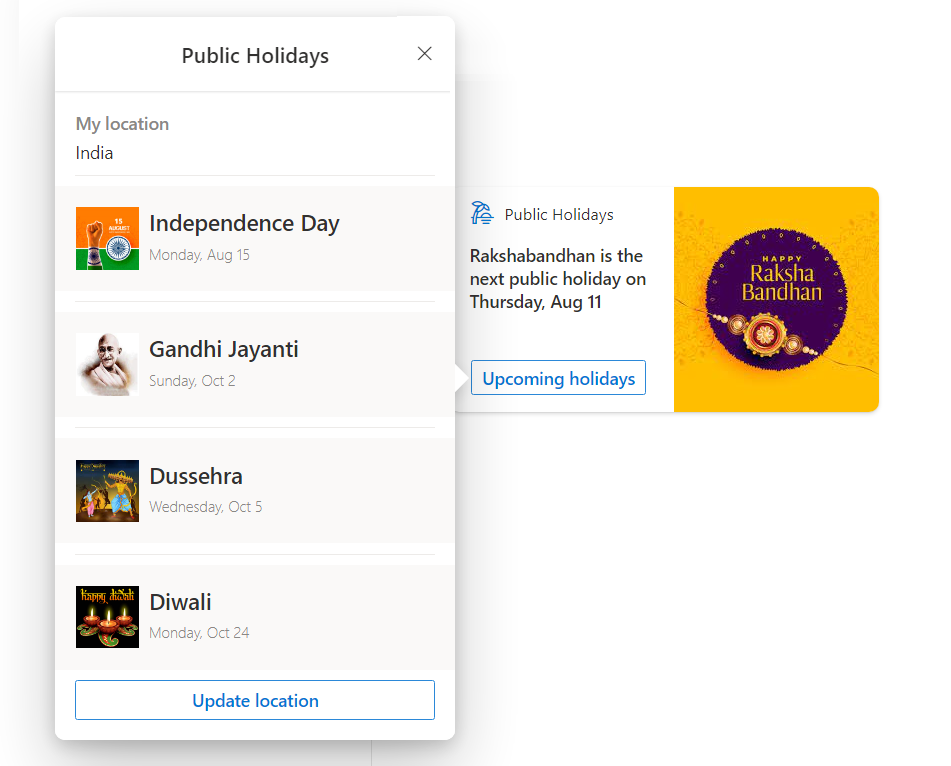
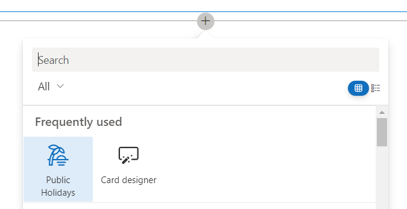
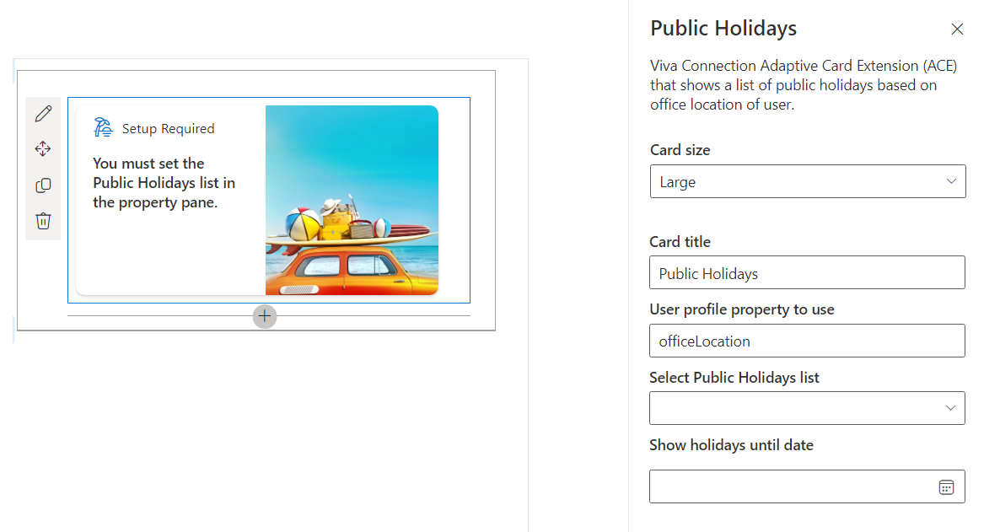
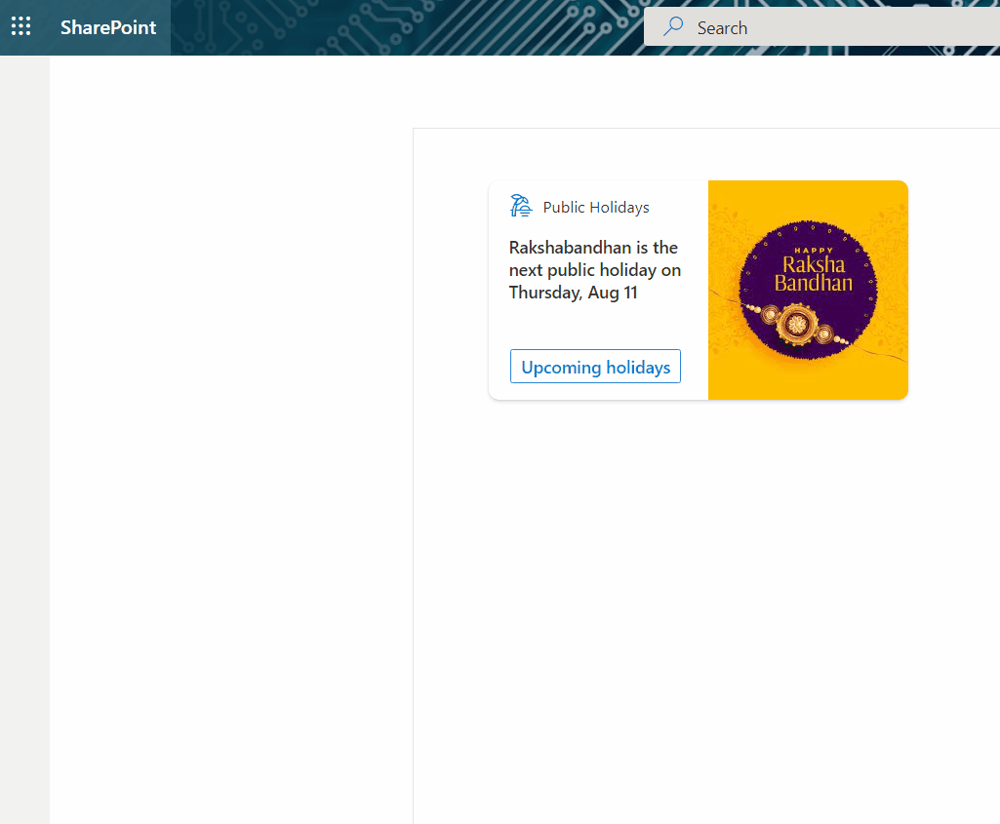
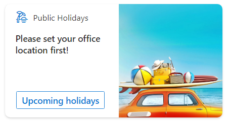
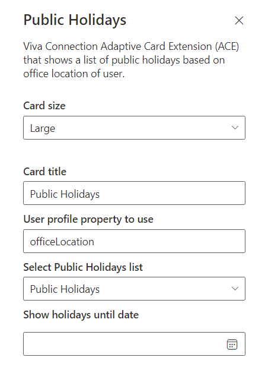

# Public Holidays

## Summary

This sample shows how to build an ACE with a card view and multiple quick views to display the public holidays for user based on their office location. Users can also use this ACE solution to update their office location.

### Highlights

- Displays current logged in user's public holidays in card view, based on their office location.
- Action button on card view to browse the public holidays and update the office location.
- Quick view showing public holidays based on their office location.

### Demo

## Used SharePoint Framework Version

## Applies to

- [SharePoint Framework](https://aka.ms/spfx)
- [Microsoft 365 tenant](https://docs.microsoft.com/en-us/sharepoint/dev/spfx/set-up-your-developer-tenant)

> Get your own free development tenant by subscribing to [Microsoft 365 developer program](http://aka.ms/o365devprogram)

## Prerequisites

**User property**

The `Office location` property for the users should be populated in the Azure AD.

**SharePoint list**

A SharePoint list with generic template (named `Public Holidays`) should be manually created on the SharePoint Home site to store the location wise list of public holidays. The schema of the list is as below.

Display Name|Internal Name|Type|Required|Comments
------------|-------------|----|--------|--------
Title|Title|Single line of text|Y|OOB Title column
OfficeLocation|OfficeLocation|Choice|Y|Type each office location on a separate line. This should be mapped with the user profile field from Azure AD which contains the user location.
Date|Date|Date and time|Y|Use this column to set public holiday date. Set `Include Time` to `No`.
Image|Image|Image|N|Use this column to optionally upload an image related to the public holiday. If not specified, a generic image stored at `src\adaptiveCardExtensions\publicHolidays\assets\PublicHoliday.jpg` will be displayed in a quick view.

## Configuration

Follow the below steps to configure the Public Holidays card on the Viva Connections dashboard:

1. Select the `Public Holidays` card on the Viva Connections dashboard to add.
  

2. The setup required card will be shown.
  

3. Configure the `Select Public Holidays list` property by selecting SharePoint list created as part of the pre-requisite (e.g., `Public Holidays`).
4. Optionally configure the `User profile property to use` property to set the user profile field from Azure AD which contains the user location.
5. Optionally configure the `Show holidays until date` property to limit the public holidays to be shown until a date. 
6. After the successful configuration, the card view should show the first upcoming holiday based on your office location.
7. Clicking the `Upcoming holidays` button on a card should display the list of upcoming holidays in a quick view. 
  
5. Click the `Update location` button on a quick view to update your office location.
6. The card should display the public holidays from the set office location.
  

## Other Screens

Below are the other screens displayed based on a scenarios mentioned below:

1. If wrong list is selected or an error occured:

  

2. If user profile property is not set:

  

## Property Pane Configuration

The card has below custom properties:

Property|Type|Required|Comments
--------|----|--------|--------
User profile property to use|String|Y|Default value is officeLocation
Select Public Holidays list|[PropertyFieldListPicker](https://pnp.github.io/sp-dev-fx-property-controls/controls/PropertyFieldListPicker/)|Y|To select the list with public holidays.
Show holidays until date|[PropertyFieldDateTimePicker](https://pnp.github.io/sp-dev-fx-property-controls/controls/PropertyFieldDateTimePicker/)|N|Specify the date until the public holidays to be shown.

## Solution

| Solution        | Author(s)                                               |
| --------------- | ------------------------------------------------------- |
| Public Holidays | [Nanddeep Nachan](https://github.com/nanddeepn), [@NanddeepNachan](https://twitter.com/NanddeepNachan), [Blog](https://nanddeepnachanblogs.com) |
&nbsp;|[Ravi Kulkarni (Microsoft)](https://github.com/ravi16a87), [@RaviKul16a87](https://twitter.com/RaviKul16a87)
&nbsp;|[Smita Nachan](https://github.com/SmitaNachan), [@SmitaNachan](https://twitter.com/SmitaNachan)

## Version history

| Version | Date             | Comments        |
| ------- | ---------------- | --------------- |
| 1.0     | August 03, 2022 | Initial release |

## Disclaimer

**THIS CODE IS PROVIDED _AS IS_ WITHOUT WARRANTY OF ANY KIND, EITHER EXPRESS OR IMPLIED, INCLUDING ANY IMPLIED WARRANTIES OF FITNESS FOR A PARTICULAR PURPOSE, MERCHANTABILITY, OR NON-INFRINGEMENT.**

---

## Minimal Path to Awesome

- Clone this repository
- Ensure all pre-requisites are met
- Ensure that you are at the solution folder
- in the command-line run:
  - **npm install**
  - **gulp serve**

## Features

This extension illustrates the following concepts:

- Using PnP JS to get the SharePoint list data
- Using [PropertyFieldListPicker](https://pnp.github.io/sp-dev-fx-property-controls/controls/PropertyFieldListPicker/) and [PropertyFieldDateTimePicker](https://pnp.github.io/sp-dev-fx-property-controls/controls/PropertyFieldDateTimePicker/) PnP Controls
- Submit action handling in ACE and Quick View
- Customizing Quick View Adaptive Card JSON template to create customized UI

## References

- [Getting started with SharePoint Framework](https://docs.microsoft.com/en-us/sharepoint/dev/spfx/set-up-your-developer-tenant)
- [Building for Microsoft teams](https://docs.microsoft.com/en-us/sharepoint/dev/spfx/build-for-teams-overview)
- [Use Microsoft Graph in your solution](https://docs.microsoft.com/en-us/sharepoint/dev/spfx/web-parts/get-started/using-microsoft-graph-apis)
- [Publish SharePoint Framework applications to the Marketplace](https://docs.microsoft.com/en-us/sharepoint/dev/spfx/publish-to-marketplace-overview)
- [Microsoft 365 Patterns and Practices](https://aka.ms/m365pnp) - Guidance, tooling, samples and open-source controls for your Microsoft 365 development
- [Build your first SharePoint Adaptive Card Extension](https://docs.microsoft.com/en-us/sharepoint/dev/spfx/viva/get-started/build-first-sharepoint-adaptive-card-extension)

