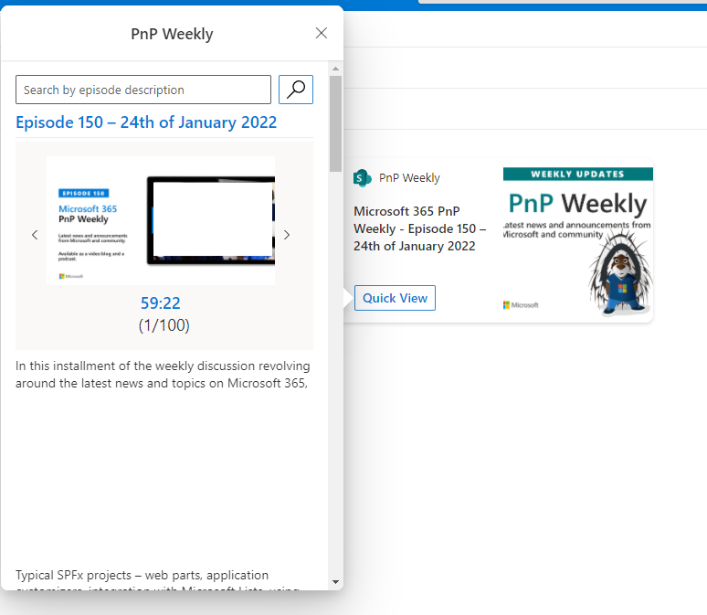

# RSS

## Summary

This ACEs access to RSS from PnP Weekly and display in  episodes, audio and description as slider with search capability of description.

## Used SharePoint Framework Version

## Applies to

- [SharePoint Framework](https://aka.ms/spfx)
- [Microsoft 365 tenant](https://docs.microsoft.com/en-us/sharepoint/dev/spfx/set-up-your-developer-tenant)

> Get your own free development tenant by subscribing to [Microsoft 365 developer program](http://aka.ms/o365devprogram)

## Solution

Solution|Author(s)
--------|---------
ImageCard-rss | André Lage ([@aaclage](https://twitter.com/aaclage)) Datalynx AG

## Version history

Version|Date|Comments
-------|----|--------
1.0|January 27, 2022|Initial release

## Disclaimer

**THIS CODE IS PROVIDED *AS IS* WITHOUT WARRANTY OF ANY KIND, EITHER EXPRESS OR IMPLIED, INCLUDING ANY IMPLIED WARRANTIES OF FITNESS FOR A PARTICULAR PURPOSE, MERCHANTABILITY, OR NON-INFRINGEMENT.**

---

## Minimal Path to Awesome

- Clone this repository
- Ensure that you are at the solution folder
- In the command-line run:
  - **npm install**
- After that create the sppkg file using
  - **gulp bundle --ship**
  - **gulp package-solution --ship**
- Deploy the package to the app catalogue site in your tenant
- in the command-line run:
  - **gulp serve -l --nobrowser**
- Open the workbench page (https://tenantname.sharepoint.com/sites/sitename/_layouts/15/workbench.aspx)
- Add the ACE to the page
- Edit the properties of ACE based on the user needs.

## Features

Description of the extension that expands upon high-level summary above.

This extension illustrates the following concepts:

- Access to RSS from PnP Weekly and convert to json objects
- Slider of each episode with audio and description
- Search capabilty of description of episodes.

> Notice that better pictures and documentation will increase the sample usage and the value you are providing for others. Thanks for your submissions advance.

> Share your web part with others through Microsoft 365 Patterns and Practices program to get visibility and exposure. More details on the community, open-source projects and other activities from http://aka.ms/m365pnp.

## References

- [Getting started with SharePoint Framework](https://docs.microsoft.com/en-us/sharepoint/dev/spfx/set-up-your-developer-tenant)
- [Building for Microsoft teams](https://docs.microsoft.com/en-us/sharepoint/dev/spfx/build-for-teams-overview)
- [Use Microsoft Graph in your solution](https://docs.microsoft.com/en-us/sharepoint/dev/spfx/web-parts/get-started/using-microsoft-graph-apis)
- [Publish SharePoint Framework applications to the Marketplace](https://docs.microsoft.com/en-us/sharepoint/dev/spfx/publish-to-marketplace-overview)
- [Microsoft 365 Patterns and Practices](https://aka.ms/m365pnp) - Guidance, tooling, samples and open-source controls for your Microsoft 365 development