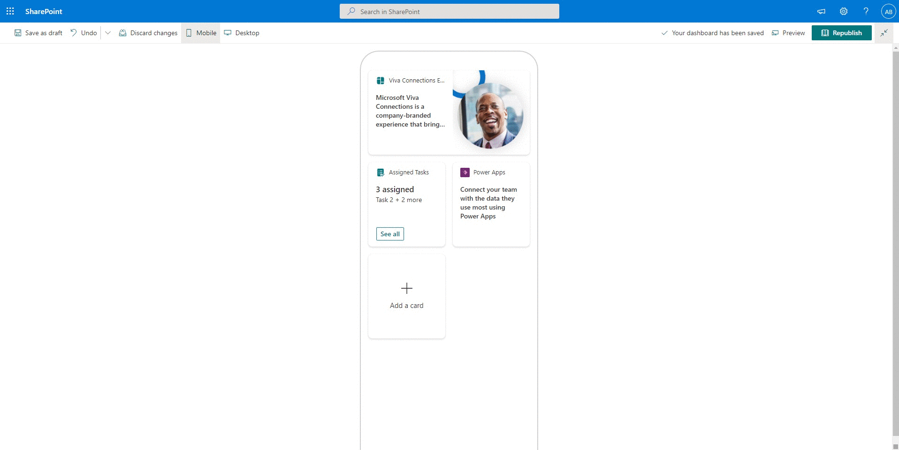
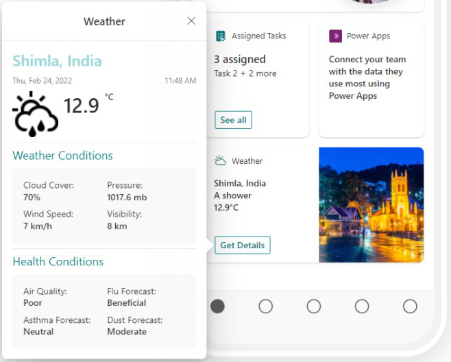
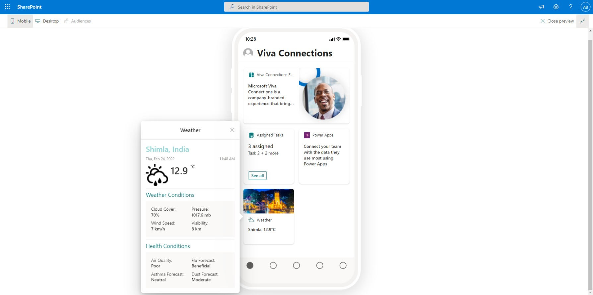
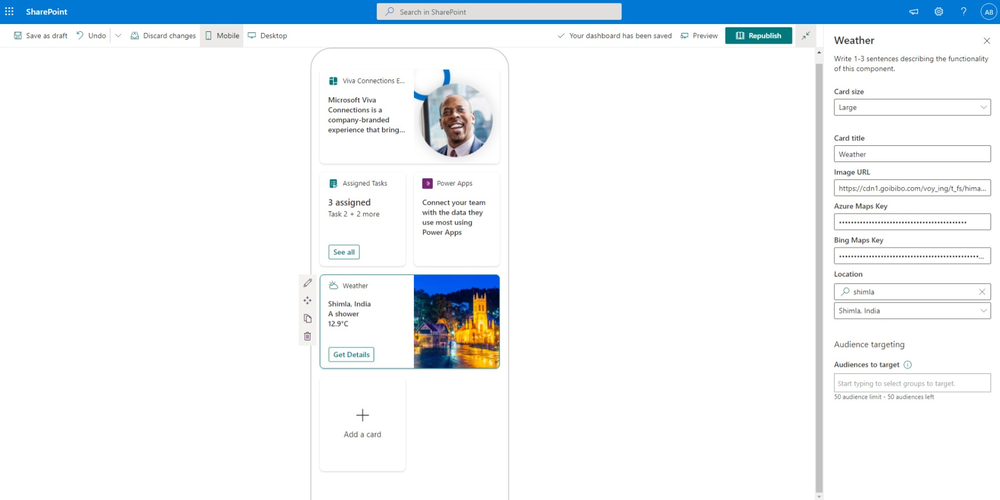
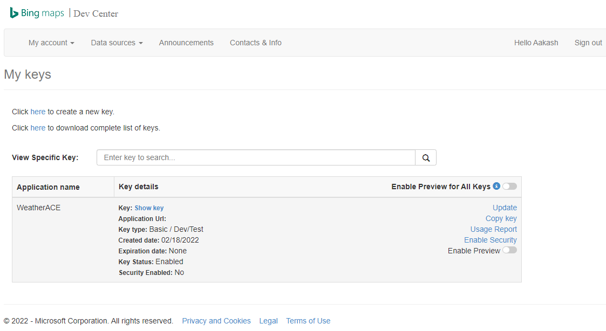
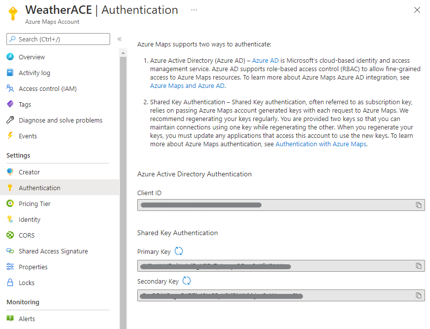

# Weather ACE

## Summary

This Adaptive Card Extension allows users to search for and select a location to get information about its weather conditions, air quality, and health indices. The location and weather data is retrieved by using [Bing Maps](https://docs.microsoft.com/en-us/bingmaps/rest-services/?toc=https%3A%2F%2Fdocs.microsoft.com%2Fen-us%2Fbingmaps%2Frest-services%2Ftoc.json&bc=https%3A%2F%2Fdocs.microsoft.com%2Fen-us%2FBingMaps%2Fbreadcrumb%2Ftoc.json) and [Azure Maps](https://docs.microsoft.com/en-us/azure/azure-maps/about-azure-maps) REST API.

## Used SharePoint Framework Version

## Applies to

- [SharePoint Framework](https://aka.ms/spfx)
- [Microsoft 365 tenant](https://docs.microsoft.com/en-us/sharepoint/dev/spfx/set-up-your-developer-tenant)

> Get your own free development tenant by subscribing to [Microsoft 365 developer program](http://aka.ms/o365devprogram)

## Prerequisites

- To search for locations based on keywords, Bing Maps REST API will be used. The below steps need to be followed to use the Bing Maps REST API:
  - **Create a Bing Maps account** through the [Bing Maps Dev Center](https://www.bingmapsportal.com/). Detailed steps mentioned at [this link](https://docs.microsoft.com/en-us/bingmaps/getting-started/bing-maps-dev-center-help/creating-a-bing-maps-account).
  - **Create a Bing Maps Key** after signing in to the Bing Maps Dev Center using the account created in the previous step. Detailed steps mentioned at [this link](https://docs.microsoft.com/en-us/bingmaps/getting-started/bing-maps-dev-center-help/getting-a-bing-maps-key). Copy this key and paste it in the web part's _Bing Maps Key_ property.
  
- To retrieve the weather information for a location, Azure Maps REST API will be used. The below steps need to be followed to use the Bing Maps REST API:
  - **Create an Azure Maps account** through the [Azure Portal](https://portal.azure.com/).
  - Go to Azure Maps account and **copy the Primary Key or Secondary Key** from the _Authentication_ tab. Paste this key in the web part's Azure Maps API Key property.
  

## Features

This extension illustrates the following concepts:

- [Find a Location by query](https://docs.microsoft.com/en-us/bingmaps/rest-services/locations/find-a-location-by-query) using **Bing Maps REST API** in the web part property pane.
- [Get Current Weather Conditions](https://docs.microsoft.com/en-us/rest/api/maps/weather/get-current-conditions), [Get Air Quality](https://docs.microsoft.com/en-us/rest/api/maps/weather/get-current-air-quality), and [Get Daily Indices](https://docs.microsoft.com/en-us/rest/api/maps/weather/get-daily-indices) using **Azure Maps REST API**.
- Render different content in ACE's Card View based on the selected card size.

## Solution

Solution|Author(s)
--------|---------
WEATHER-ACE | [Aakash Bhardwaj](https://github.com/aakashbhardwaj619) ([@aakash_316](https://twitter.com/aakash_316)), Microsoft

## Version history

Version|Date|Comments
-------|----|--------
1.0|February 24, 2022|Initial release

## Disclaimer

**THIS CODE IS PROVIDED _AS IS_ WITHOUT WARRANTY OF ANY KIND, EITHER EXPRESS OR IMPLIED, INCLUDING ANY IMPLIED WARRANTIES OF FITNESS FOR A PARTICULAR PURPOSE, MERCHANTABILITY, OR NON-INFRINGEMENT.**

---

## Minimal Path to Awesome

- Clone this repository
- Ensure that you are at the solution folder
- In the command-line run:
  - `npm install`
  - `gulp serve`
- Browse to your hosted workbench <https://YOURTENANT.sharepoint.com/sites/_layouts/15/workbench.aspx> and add the adaptive card extension.

## References

- [Getting started with SharePoint Framework](https://docs.microsoft.com/en-us/sharepoint/dev/spfx/set-up-your-developer-tenant)
- [Building for Microsoft teams](https://docs.microsoft.com/en-us/sharepoint/dev/spfx/build-for-teams-overview)
- [Use Microsoft Graph in your solution](https://docs.microsoft.com/en-us/sharepoint/dev/spfx/web-parts/get-started/using-microsoft-graph-apis)
- [Publish SharePoint Framework applications to the Marketplace](https://docs.microsoft.com/en-us/sharepoint/dev/spfx/publish-to-marketplace-overview)
- [Microsoft 365 Patterns and Practices](https://aka.ms/m365pnp) - Guidance, tooling, samples and open-source controls for your Microsoft 365 development

