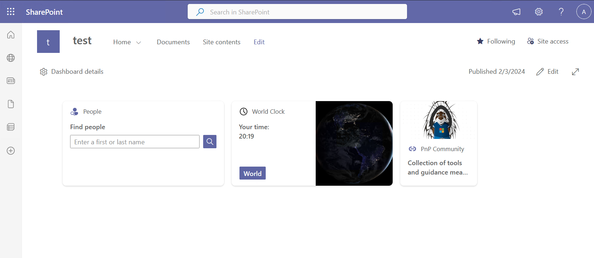
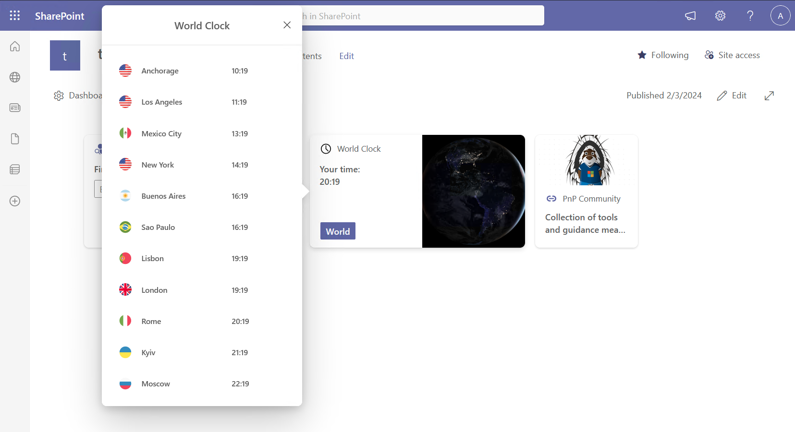

# World Clock

## Summary

A simple Adaptive Card Extension that shows the current time for different timezones.

## Compatibility

## Applies to

- [SharePoint Framework](https://docs.microsoft.com/sharepoint/dev/spfx/sharepoint-framework-overview)

## Solution

| Solution   | Author(s)                                 |
| ---------- | ----------------------------------------- |
| WorldClock | [Matteo Serpi](https://github.com/srpmtt) |

## Version history

| Version | Date              | Comments        |
| ------- | ----------------- | --------------- |
| 1.0     | February 03, 2024 | Initial release |

## Disclaimer

**THIS CODE IS PROVIDED _AS IS_ WITHOUT WARRANTY OF ANY KIND, EITHER EXPRESS OR IMPLIED, INCLUDING ANY IMPLIED WARRANTIES OF FITNESS FOR A PARTICULAR PURPOSE, MERCHANTABILITY, OR NON-INFRINGEMENT.**

---

## Minimal Path to Awesome

- Clone this repository
- Ensure that you are at the solution folder

  - in the command line run:
    - `npm install`
    - `gulp build --ship`
    - `gulp bundle --ship`
    - `gulp package-solution --ship`

- Browse to your SharePoint app catalog and load the SPFx package.

    
