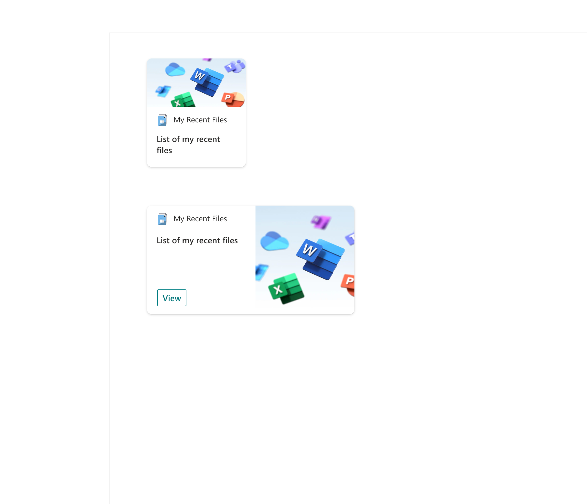
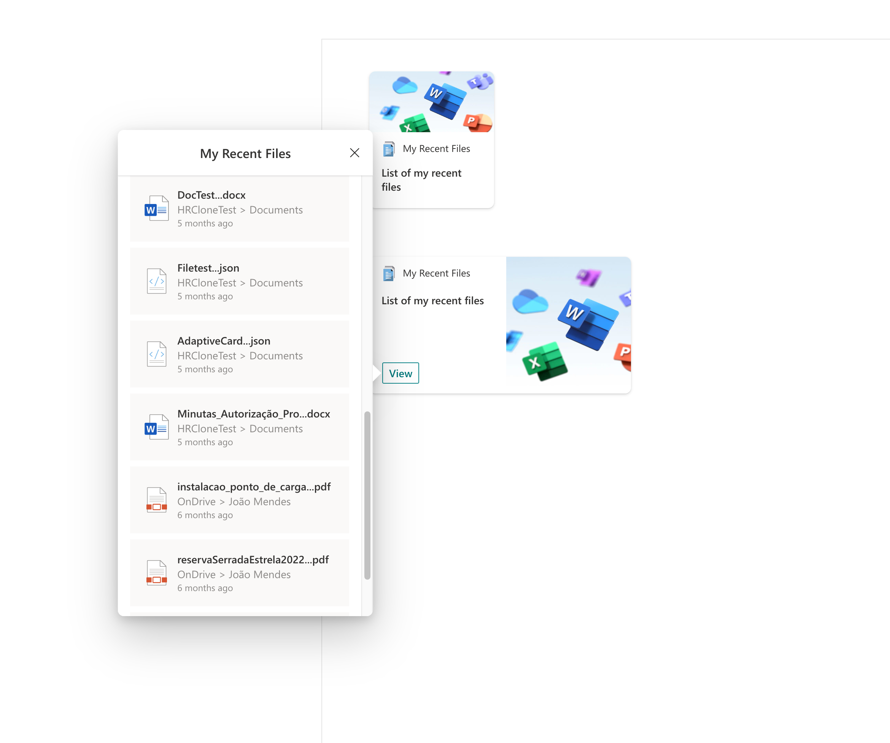

# My Recent Files

## Summary

This Adaptive Card Extension allows user quick access recent files

This ACE, use Microsoft Graph API and needs the user approve the required permissions, after they have added the app to app catalog.

## Compatibility

## Permissions

Microsoft Graph

- Files.Read

## Applies to

- [SharePoint Framework](https://docs.microsoft.com/sharepoint/dev/spfx/sharepoint-framework-overview)
- [Microsoft 365 tenant](https://docs.microsoft.com/sharepoint/dev/spfx/set-up-your-development-environment)

## Prerequisites

This ACE need Microsoft Graph Permissions:

- Files.Read

## Solution

| Solution             | Author(s)                                                                                                      |
| -------------------- | -------------------------------------------------------------------------------------------------------------- |
| ACE-MY-RECENT-FILES | [João Mendes](https://github.com/joaojmendes) ([@joaojmendes](https://twitter.com/joaojmendes)), VALO Solutions Ltd |

## Version history

| Version | Date              | Comments                                                        |
| ------- | ----------------- | --------------------------------------------------------------- |
| 1.0     | April 12, 2022    | Initial release                                                 |
| 1.1     | July 31, 2026     | Upgraded to SPFx 1.23.0 |

## Disclaimer

**THIS CODE IS PROVIDED *AS IS* WITHOUT WARRANTY OF ANY KIND, EITHER EXPRESS OR IMPLIED, INCLUDING ANY IMPLIED WARRANTIES OF FITNESS FOR A PARTICULAR PURPOSE, MERCHANTABILITY, OR NON-INFRINGEMENT.**

---

## Minimal Path to Awesome

- Clone this repository
- Ensure that you are at the solution folder

  - in the command line run:
    - `npm install`
    - `npm run build`
    - Browse to your SharePoint app catalog and load the generated SPFx package (`sharepoint/solution/spfx-ace-my-recent-files.sppkg`).
    - Browse to your SharePoint Admin Center and under advanced you will need to open Api Access and allow the requests for Microsoft Graph.

