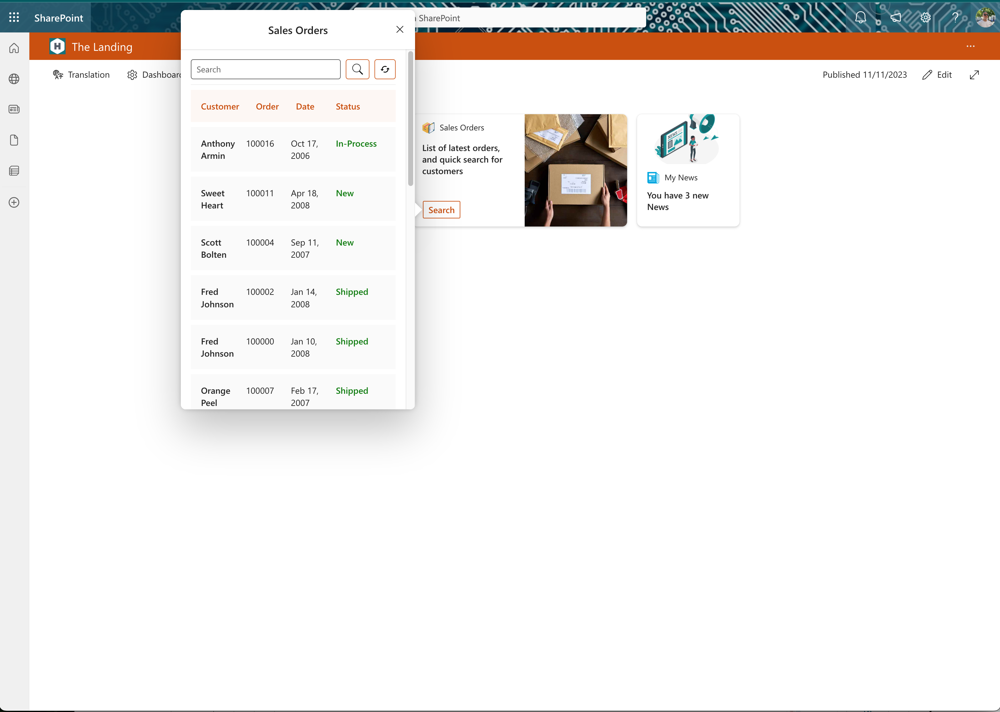

# Sales-Orders

## Summary

This Adaptive Card Extension allows user  list and Search Data (Sales Orders) using Microsoft Graph Connector.

This ACE, uses  Microsoft Graph Connector to get data of Sales Order. To run this sample you need to create a Microsoft Graph Connector available on <https://github.com/pnp/graph-connectors-samples> . Please see the following link to create a Microsoft Graph Connector  for this sample <https://github.com/pnp/graph-connectors-samples/tree/main/samples/nodejs-javascript-IBMDB2>

## Compatibility

## Permissions

## Applies to

- [SharePoint Framework](https://docs.microsoft.com/sharepoint/dev/spfx/sharepoint-framework-overview)
- [Microsoft 365 tenant](https://docs.microsoft.com/sharepoint/dev/spfx/set-up-your-development-environment)

## Prerequisites

This ACE use <https://github.com/pnp/graph-connectors-samples/tree/main/samples/nodejs-javascript-IBMDB2>  to get data from your system. Please is the following link to create a Microsoft Graph Connector  for this sample

## Solution

| Solution             | Author(s)                                                                                                      |
| -------------------- | -------------------------------------------------------------------------------------------------------------- |
| SalesOrders | [João Mendes](https://github.com/joaojmendes) ([@joaojmendes](https://twitter.com/joaojmendes)) |

## Version history

| Version | Date              | Comments        |
| ------- | ----------------- | --------------- |
| 1.0     | November 11, 2023 | Initial release |

## Disclaimer

**THIS CODE IS PROVIDED *AS IS* WITHOUT WARRANTY OF ANY KIND, EITHER EXPRESS OR IMPLIED, INCLUDING ANY IMPLIED WARRANTIES OF FITNESS FOR A PARTICULAR PURPOSE, MERCHANTABILITY, OR NON-INFRINGEMENT.**

---

## Minimal Path to Awesome

- Clone this repository
- Ensure that you are at the solution folder

  - in the command line run:
    - `npm install`
      - `gulp build --ship`
      - `gulp bundle --ship`
      - `gulp package-solution --ship`
    - Browse to your SharePoint app catalog and load the SPFx package.
    - Browse to your SharePoint Admin Center and under advanced you will need to open Api Access and allow the requests for Microsoft Graph.
- If you have the APIs permissions already allowed you can follow the below steps.

  - in the command line run:
    *`npm install`
    - `gulp serve --nobrowser`
    - browse to your hosted workbench [https://YOURTENANT.sharepoint.com/sites/_layouts/15/workbench.aspx](https://YOURTENANT.sharepoint.com/sites/_layouts/15/workbench.aspx) and add the adaptive card extension.

