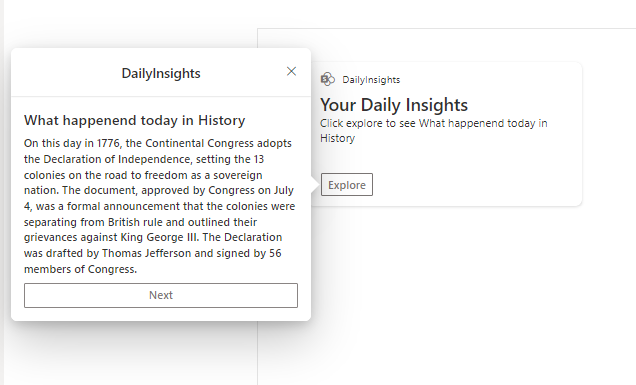
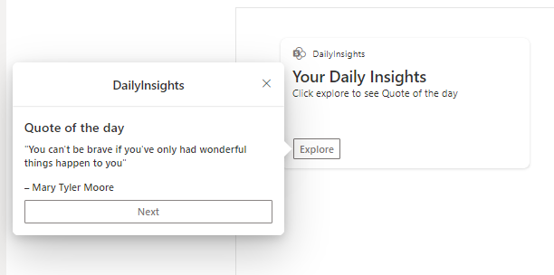
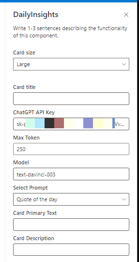

# Daily Insights with ChatGPT

## Summary

ACE to display Daily Insights based on ChatGPT OpenAI API. This sample shows how to build an ACE with a PrimaryText card view and a quick view and use ChatGPT OpenAI API. Use this Card on Viva Connections to provide user with some quotes, tip, grammar tip, coding tip etc.

## ACE in Action

Below are some screenshot of the ACE

 

## Summary

- Idea of this webpart is to send pre-configured prompt to ChatGPT API to get response and display in Quick View.
- This card can be configured to show 
  - Quote of the day
  - Fact of the day
  - Tip of the day
  - What happenend today in History
  - Grammar Tip
  - Motivational Words
  - Life Hack of the day
  - Health tip of the day
  - Meditation tip of the day
  - Coding tip
- We are using [completions API](https://platform.openai.com/docs/api-reference/completions/create)
- Below are configurable options
  - API Key
  - Select Prompt/Category
  - Max Token, refer this [link](https://platform.openai.com/docs/guides/rate-limits/overview) to understand rate limit
  - Card Title and Description.
- Using Session Storage to store the response per session to limit number of request per user.
- Allowing user to Use Next button to get new response(limits to 5, to save requests)

Note - It is advisable to have call API from server side 

## Used SharePoint Framework Version

## Applies to

- [SharePoint Framework](https://aka.ms/spfx)
- [Microsoft 365 tenant](https://docs.microsoft.com/en-us/sharepoint/dev/spfx/set-up-your-developer-tenant)

> Get your own free development tenant by subscribing to [Microsoft 365 developer program](http://aka.ms/o365devprogram)

## Prerequisites

> Get your [ChatGPT API Key](https://platform.openai.com/account/api-keys)

## Solution

Solution|Author(s)
--------|---------
ChatGPT-DailyInsights | [Siddharth Vaghasia](https://github.com/siddharth-vaghasia) 
ChatGPT-DailyInsights | [Kunj Sangani](https://github.com/kunj-sangani)

## Version history

Version|Date|Comments
-------|----|--------
1.0|Feb 18, 2023|Initial release

## Disclaimer

**THIS CODE IS PROVIDED *AS IS* WITHOUT WARRANTY OF ANY KIND, EITHER EXPRESS OR IMPLIED, INCLUDING ANY IMPLIED WARRANTIES OF FITNESS FOR A PARTICULAR PURPOSE, MERCHANTABILITY, OR NON-INFRINGEMENT.**

---

## Minimal Path to Awesome

- If you want to direcly use the packge you can download it from [here](./assets/ace-chatgpt-dailyinsights.sppkg) or follow below steps to build in your enviorment.

- Clone this repository
- Ensure that you are at the solution folder
- in the command-line run:
  - **npm install**
- After that, create the sppkg file using
  - **gulp bundle --ship**
  - **gulp package-solution --ship**
- Deploy the package to the app catalogue site in your tenant
- in the command-line run:
  - **gulp serve -l --nobrowser**
- or if using spfx-fast-serve, in the command-line run:
  - **npm run serve**
- Open the workbench page (<https://tenantname.sharepoint.com/sites/sitename/_layouts/15/workbench.aspx>)
- Add the ACE [***Daily Insights***] to the page
- Configure the webpart with required properties.

## Concept Explored

This extension illustrates the following technical concepts:

- Using ChatGPT API in ACE
- State management in ACE
- Card Properties Configuration.

## References

- [Getting started with SharePoint Framework](https://docs.microsoft.com/en-us/sharepoint/dev/spfx/set-up-your-developer-tenant)
- [Build your first SharePoint Adaptive Card Extension](https://docs.microsoft.com/en-us/sharepoint/dev/spfx/viva/get-started/build-first-sharepoint-adaptive-card-extension)
- [Blog on First Adaptive card](https://siddharthvaghasia.com/2021/12/29/create-your-first-adaptive-card-extension-with-spfx/)
- [Microsoft 365 Patterns and Practices](https://aka.ms/m365pnp) - Guidance, tooling, samples and open-source controls for your Microsoft 365 development

