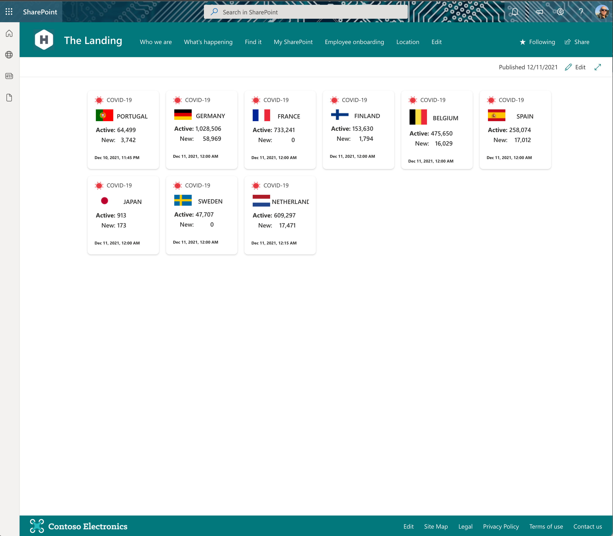
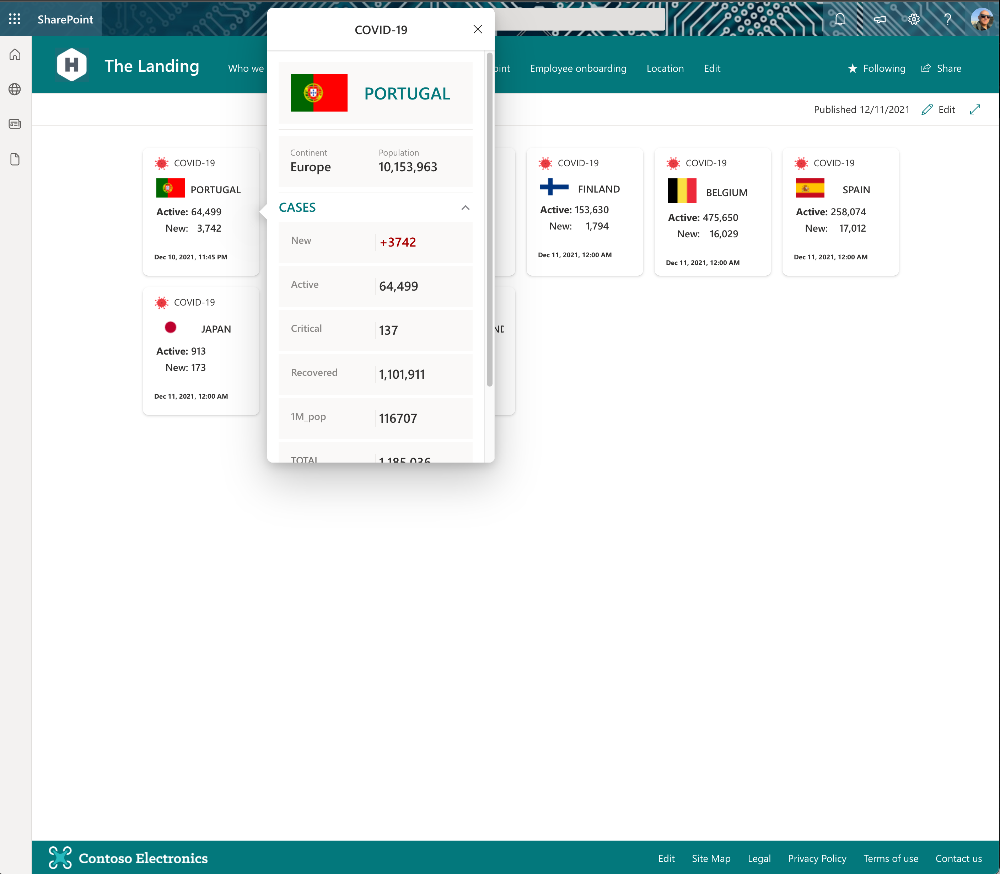
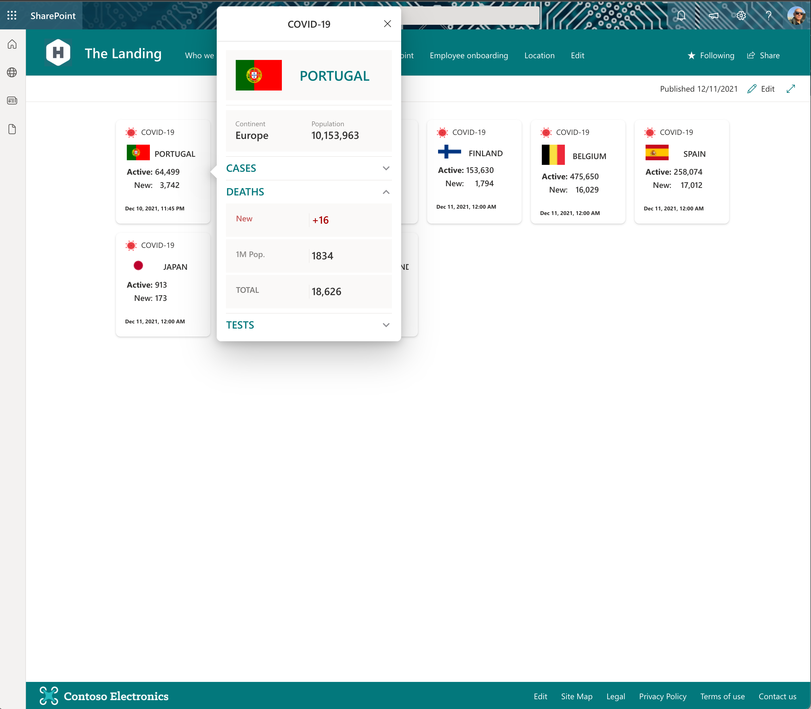

# COVID-19 Indicator

## Summary

This Adaptive Card Extension allow user select a country to get information about COVID-19 cases. The data is retrieved by REST API provided by https://rapidapi.com/api-sports/api/covid-193/ .

 The Data is updated every hour.

## Compatibility

## Applies to

- [SharePoint Framework](https://docs.microsoft.com/sharepoint/dev/spfx/sharepoint-framework-overview)
- [Microsoft 365 tenant](https://docs.microsoft.com/sharepoint/dev/spfx/set-up-your-development-environment)

## Solution

Solution|Author(s)
--------|---------
ACE-COVID-INDICATOR | [João Mendes](https://github.com/joaojmendes) ([@joaojmendes](https://twitter.com/joaojmendes)), VALO Solutions Ltd

## Version history

Version|Date|Comments
-------|----|--------
1.0|December 12, 2021|Initial release

## Disclaimer

**THIS CODE IS PROVIDED *AS IS* WITHOUT WARRANTY OF ANY KIND, EITHER EXPRESS OR IMPLIED, INCLUDING ANY IMPLIED WARRANTIES OF FITNESS FOR A PARTICULAR PURPOSE, MERCHANTABILITY, OR NON-INFRINGEMENT.**

---

## Minimal Path to Awesome

- Clone this repository
- Ensure that you are at the solution folder
  - in the command line run:
    - `npm install`
      - `gulp build --ship`
      - `gulp bundle --ship`
      - `gulp package-solution --ship`
    - Browse to your SharePoint app catalog and load the SPFx package.
   

- If you have the APIs permissions already allowed you can follow the below steps.
  - in the command line run:
        *`npm install`
        * `gulp serve --nobrowser`
    - browse to your hosted workbench <https://YOURTENANT.sharepoint.com/sites/_layouts/15/workbench.aspx> and add the adaptive card extension.

