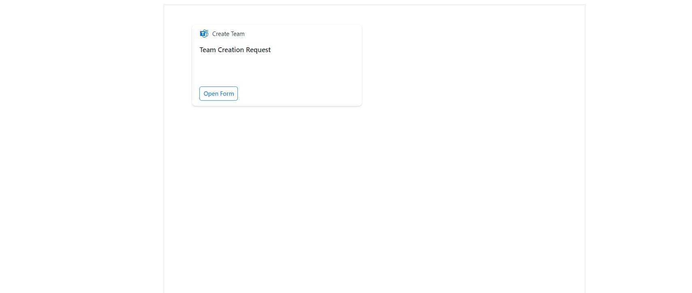

# ace-cardgallery

## Summary

This solution provides a team provision feature based on default templates using Graph API and ACEs 
>See [Features](#Features) section for individual listing of samples.

## Used SharePoint Framework Version

## Applies to

- [SharePoint Framework](https://aka.ms/spfx)
- [Microsoft 365 tenant](https://docs.microsoft.com/en-us/sharepoint/dev/spfx/set-up-your-developer-tenant)

> Get your own free development tenant by subscribing to [Microsoft 365 developer program](http://aka.ms/o365devprogram)

## Prerequisites

> After deploy web-part in app catalog, User needs to approve Graph API permission from SharePoint admin center from API management blade to access team members and handle block Sign In query from SPFx Code.

## Solution

Solution|Author(s)
--------|---------
Create Team| [Dipen Shah](https://github.com/Dips365) [@Dips365](https://twitter.com/Dips_365) [Rapid Circle](https://en.rapidcircle.com/)

## Version history

Version|Date|Comments
-------|----|--------
1.0|october 10, 2021|Initial release

## Disclaimer

**THIS CODE IS PROVIDED *AS IS* WITHOUT WARRANTY OF ANY KIND, EITHER EXPRESS OR IMPLIED, INCLUDING ANY IMPLIED WARRANTIES OF FITNESS FOR A PARTICULAR PURPOSE, MERCHANTABILITY, OR NON-INFRINGEMENT.**

---

## Minimal Path to Awesome

The [deploy](./deploy) contains a pre-built production solution (create-team.sppkg) that can be uploaded into your app catalog. Follow these [instructions](https://docs.microsoft.com/en-us/sharepoint/administration/manage-the-app-catalog#add-apps-to-the-app-catalog) to add the sppkg file to the tenant app catalog in your environment. If you do not have a tenant app catalog the same instructions detail creating one.

To test the solution yourself, you can follow these steps:

- Clone this repository
- Ensure that you are at the solution folder
- in the command-line run:
  - **npm install**
  - **gulp serve**

## Features

Roughly based on the samples provided by the [Adaptive Card documentation](https://adaptivecards.io/samples/), these samples help demonstrate the functionality of the Adaptive Card extensions. The solution contains the following examples:

- Agenda

To design your own adaptive cards to use with an Adaptive Card Extension check out the [Adaptive Card designer](https://adaptivecards.io/designer/)

## References

- [Getting started with SharePoint Framework](https://docs.microsoft.com/en-us/sharepoint/dev/spfx/set-up-your-developer-tenant)
- [Building for Microsoft teams](https://docs.microsoft.com/en-us/sharepoint/dev/spfx/build-for-teams-overview)
- [Use Microsoft Graph in your solution](https://docs.microsoft.com/en-us/sharepoint/dev/spfx/web-parts/get-started/using-microsoft-graph-apis)
- [Publish SharePoint Framework applications to the Marketplace](https://docs.microsoft.com/en-us/sharepoint/dev/spfx/publish-to-marketplace-overview)
- [Microsoft 365 Patterns and Practices](https://aka.ms/m365pnp) - Guidance, tooling, samples and open-source controls for your Microsoft 365 development

