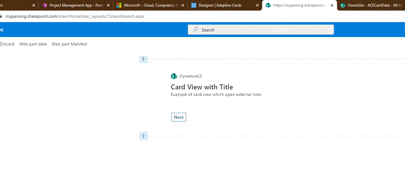
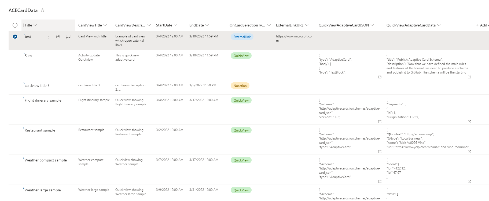

# Dynamic Announcements

## Summary

This ACE card would be useful for organization use it to make Annoucements driven from SharePoint List.  This dynamic ACE component can be used to add to Viva connection dashboard and drive the CardView and QuickView from SP list. It filters the data form SP list based on start date and end date and for each row.
Each row will represents the Card view with title and description and it can be configured from List if we want to open external link or display a Quick View. The Quickview adaptive card template and data is also read from column in SP list to resuse same card for diffrent scenarios. 

This sample is for more like ACE component for read only information which can be displayed. 

## Features

- ACE component to show multiple cards/items form SP list at a time based on dates
- Same component can render diffrent Adaptive card format as Quickview based from individual SP list item
- On click of Card view, it will open either external URL or Quick view or no action based on the item's configuration(OnCardSelectionType)
- There are columns for Quickview adaptive card json template and seperate column for data which will drive how quickview is rendered for particular item
- To make the card dynamic, we can write PowerAutomate or something and update the JSON object in the column based on our requirement according to the adaptive card template.
- Prev and Next button to navigate through diffrent items
- Option to create List from configuration Panel
- Option to enable Auto Rotate card every 4 seconds
- Same card be added multiple times on Dashboard pointing to diffrent lists.

List Data Sample Screenshot

## Used SharePoint Framework Version

## Applies to

- [SharePoint Framework](https://aka.ms/spfx)
- [Microsoft 365 tenant](https://docs.microsoft.com/en-us/sharepoint/dev/spfx/set-up-your-developer-tenant)

> Get your own free development tenant by subscribing to [Microsoft 365 developer program](http://aka.ms/o365devprogram)

## Technical Notes

> Card works on SP list which following schema and its columns explanation. Option to create list from ACE configuration pane.

1. `CardViewTitle`: Text to be display on Card View Title area
2. `CardViewDescription`: Text to be displayed on Card View Description area
3. `OnCardSelectionType`: Choice column to what should be done on click on Card View, Options are
    a. Noaction: Nothing will happen on click on Card View
    b. ExternalLink: External link will open on click of cardview, which link to be opened can be added to column 'ExternalLinkURL'
    c. QuickView: A QuickView will open on click on card for this item, Adapative card template will read from 'QuickViewAdaptiveCardJSON' and data will be read from 'QuickViewAdaptiveCardData'
4. `ExternalLinkURL`: Link to open on click of Card View, this will only be applicatoin if OnCardSelectionType is selected as 'ExternalLink'
5. `QuickViewAdaptiveCardJSON`: Multile line of text column where we can configure the Adaptive Card Template JSON object, it should be a valid JSON object which you get by desiging your adaptive card at this [link](https://adaptivecards.io/designer/)
6. `QuickViewAdaptiveCardData`: Multile line of text column where we can put dynamic data in form of a valid JSON object to make the Adaptive card dynamic by passing values. This column can be updated via from PowerAutomate or scheduler to display data from external system or from anywhere within M365 product line. 
7. `StartDate`: Start date after which this entry should start displaying on the component
8. `EndDate`: End date till which this entry should start displaying on the component. Data would be filtered based if today is greater than StartDate and less than EndDate.

You can refer and download sample data for quick reference from [here](./assets/sampledata.xlsx)

## Solution

Solution|Author(s)
--------|---------
PrimaryTextCard-Dynamic-Announcements | [Siddharth Vaghasia](https://siddharthvaghasia.com)

## Version history

Version|Date|Comments
-------|----|--------
1.0|March 14, 2022|Initial release

## Disclaimer

**THIS CODE IS PROVIDED *AS IS* WITHOUT WARRANTY OF ANY KIND, EITHER EXPRESS OR IMPLIED, INCLUDING ANY IMPLIED WARRANTIES OF FITNESS FOR A PARTICULAR PURPOSE, MERCHANTABILITY, OR NON-INFRINGEMENT.**

---

## Minimal Path to Awesome

- Clone this repository
- Ensure that you are at the solution folder
- in the command-line run:
  - **npm install**
  - **gulp serve**

## Concept Explored

This extension illustrates the following technical concepts:

- Making dynamic Cards driven from SharePoint list
- Getting data from SharePoint List

## References

- [Getting started with SharePoint Framework](https://docs.microsoft.com/en-us/sharepoint/dev/spfx/set-up-your-developer-tenant)
- [Building for Microsoft teams](https://docs.microsoft.com/en-us/sharepoint/dev/spfx/build-for-teams-overview)
- [Use Microsoft Graph in your solution](https://docs.microsoft.com/en-us/sharepoint/dev/spfx/web-parts/get-started/using-microsoft-graph-apis)
- [Publish SharePoint Framework applications to the Marketplace](https://docs.microsoft.com/en-us/sharepoint/dev/spfx/publish-to-marketplace-overview)
- [Microsoft 365 Patterns and Practices](https://aka.ms/m365pnp) - Guidance, tooling, samples and open-source controls for your Microsoft 365 development

