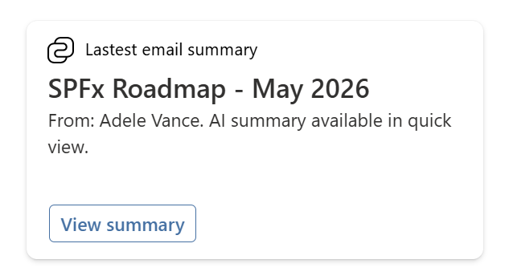
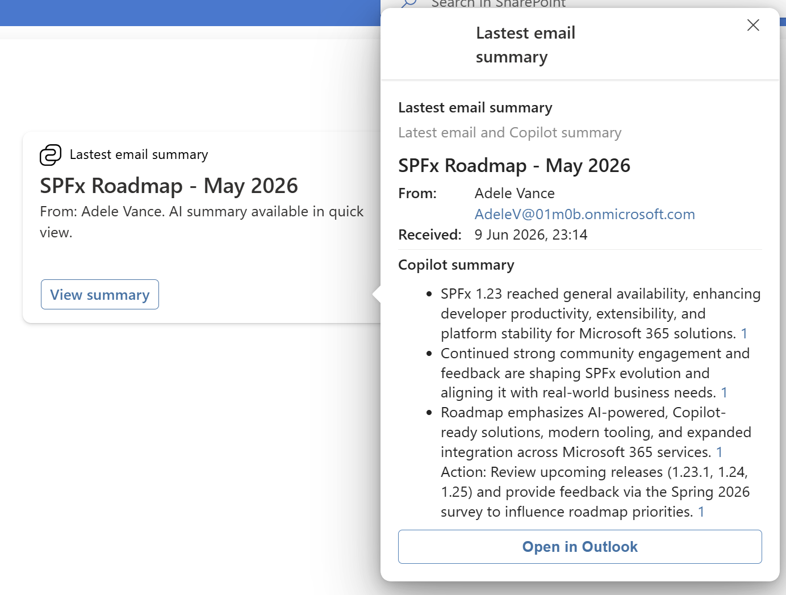

# Email Summary

## Summary

This Adaptive Card Extension displays the user's latest received email on the Viva Connections dashboard and shows the Copilot-generated summary of that email in the quick view.

Card view:

Quick view (with Copilot summary):

## Compatibility

Every SPFx version is optimally compatible with specific versions of Node.js. In order to be able to build this sample, you need to ensure that the version of Node on your workstation matches one of the versions listed in this section. This sample will not work on a different version of Node.
Refer to <https://aka.ms/spfx-matrix> for more information on SPFx compatibility.

This sample is optimally compatible with the following environment configuration:

## Applies to

- [SharePoint Framework](https://aka.ms/spfx)
- [Microsoft 365 tenant](https://docs.microsoft.com/sharepoint/dev/spfx/set-up-your-developer-tenant)

> Get your own free development tenant by subscribing to [Microsoft 365 developer program](http://aka.ms/o365devprogram)

## Prerequisites

> The following Microsoft Graph API permissions must be approved in the SharePoint admin center after the package is deployed:
>
> - `Mail.Read`

## Solution

| Solution    | Author(s)                                               |
| ----------- | ------------------------------------------------------- |
| PrimaryTextCard-EmailSummary | [Aimery Thomas](https://github.com/a1mery), [@aimery_thomas](https://twitter.com/aimery_thomas) |

## Version history

| Version | Date          | Comments        |
| ------- | ------------- | --------------- |
| 1.0     | June 9, 2026  | Initial release |

## Disclaimer

**THIS CODE IS PROVIDED _AS IS_ WITHOUT WARRANTY OF ANY KIND, EITHER EXPRESS OR IMPLIED, INCLUDING ANY IMPLIED WARRANTIES OF FITNESS FOR A PARTICULAR PURPOSE, MERCHANTABILITY, OR NON-INFRINGEMENT.**

---

## Minimal Path to Awesome

- Clone this repository
- Ensure that you are at the solution folder
- In the command-line run:
  - **npm install -g @rushstack/heft**
  - **npm install**
  - **heft start** (to test locally)
  - **heft test --clean --production && heft package-solution --production** (to build the production package)
- Deploy the package (`PrimaryTextCard-EmailSummary.sppkg`) to the tenant app catalogue.
- The solution needs the following Microsoft Graph API permissions. Approve the API access requests in the SharePoint admin center.

  | Permissions                  |
  |------------------------------|
  | Mail.Read                    |

- Add the ACE **PrimaryTextCardEmailSummary** to the Viva Connections Dashboard.

Other build commands can be listed using `heft --help`.

## Features

This sample demonstrates how to surface the user's most recent email on the Viva Connections dashboard together with a Copilot-generated summary, giving users an at-a-glance view of what just landed in their inbox without leaving SharePoint.

This Adaptive Card Extension illustrates the following concepts:

- Use of the **Microsoft Graph Mail API** (`/me/messages`) to retrieve the user's latest received email
- Building an ACE with the new **Heft-based** SPFx 1.23 toolchain (no more gulp)
- Use of the Microsoft 365 Copilot Chat API to generate a summary of the email content
- Rendering a **PrimaryText** card view with an action that opens a detailed **quick view**
- Opening the original email directly in Outlook from the quick view

## References

- [Getting started with SharePoint Framework](https://docs.microsoft.com/sharepoint/dev/spfx/set-up-your-developer-tenant)
- [Building for Microsoft teams](https://docs.microsoft.com/sharepoint/dev/spfx/build-for-teams-overview)
- [Use Microsoft Graph in your solution](https://docs.microsoft.com/sharepoint/dev/spfx/web-parts/get-started/using-microsoft-graph-apis)
- [Publish SharePoint Framework applications to the Marketplace](https://docs.microsoft.com/sharepoint/dev/spfx/publish-to-marketplace-overview)
- [Microsoft 365 Patterns and Practices](https://aka.ms/m365pnp) - Guidance, tooling, samples and open-source controls for your Microsoft 365 development
- [Heft Documentation](https://heft.rushstack.io/)
