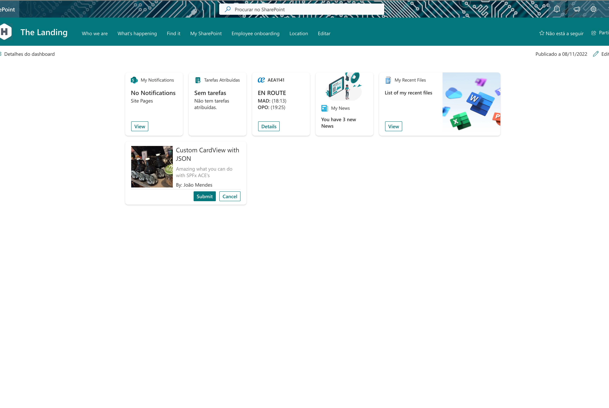
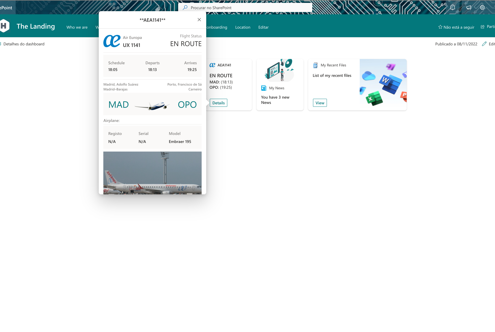
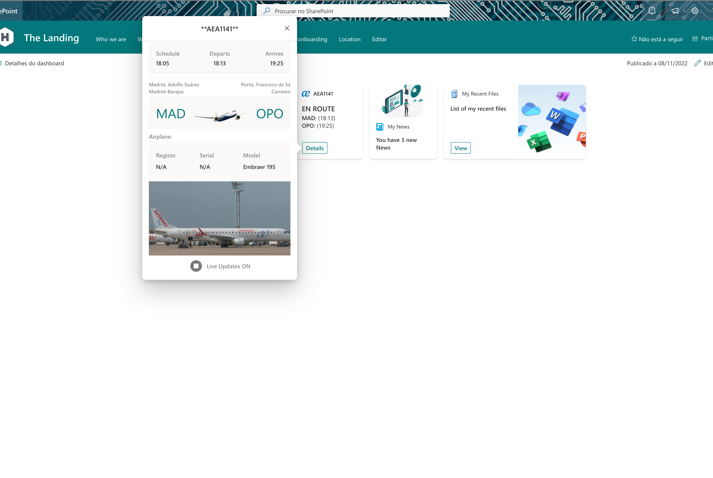

# Flight-Tracker

## Summary

This Adaptive Card Extension allows user to follow in nreal time a flight 

This ACE, use exteranl API (https://aerodatabox.p.rapidapi.com/flights/number/) to get data of flight, please see https://rapidapi.com/aedbx-aedbx/api/aerodatabox/ to get more information. 

## Compatibility

## Permissions

## Applies to

- [SharePoint Framework](https://docs.microsoft.com/sharepoint/dev/spfx/sharepoint-framework-overview)
- [Microsoft 365 tenant](https://docs.microsoft.com/sharepoint/dev/spfx/set-up-your-development-environment)

## Prerequisites

This ACE use https://aerodatabox.p.rapidapi.com/flights/number/ API, please see https://rapidapi.com/aedbx-aedbx/api/aerodatabox/ to get more information. 
It has a limit number of request per month in free plan.

## Solution

| Solution             | Author(s)                                                                                                      |
| -------------------- | -------------------------------------------------------------------------------------------------------------- |
| FlightTracker | [João Mendes](https://github.com/joaojmendes) ([@joaojmendes](https://twitter.com/joaojmendes)), StaffBase |

## Version history

| Version | Date              | Comments        |
| ------- | ----------------- | --------------- |
| 1.0     | November 8, 2022 | Initial release |

## Disclaimer

**THIS CODE IS PROVIDED *AS IS* WITHOUT WARRANTY OF ANY KIND, EITHER EXPRESS OR IMPLIED, INCLUDING ANY IMPLIED WARRANTIES OF FITNESS FOR A PARTICULAR PURPOSE, MERCHANTABILITY, OR NON-INFRINGEMENT.**

---

## Minimal Path to Awesome

- Clone this repository
- Ensure that you are at the solution folder

  - in the command line run:
    - `npm install`
      - `gulp build --ship`
      - `gulp bundle --ship`
      - `gulp package-solution --ship`
    - Browse to your SharePoint app catalog and load the SPFx package.
    - Browse to your SharePoint Admin Center and under advanced you will need to open Api Access and allow the requests for Microsoft Graph.
- If you have the APIs permissions already allowed you can follow the below steps.

  - in the command line run:
    *`npm install`
    * `gulp serve --nobrowser`
    - browse to your hosted workbench [https://YOURTENANT.sharepoint.com/sites/_layouts/15/workbench.aspx](https://YOURTENANT.sharepoint.com/sites/_layouts/15/workbench.aspx) and add the adaptive card extension.

