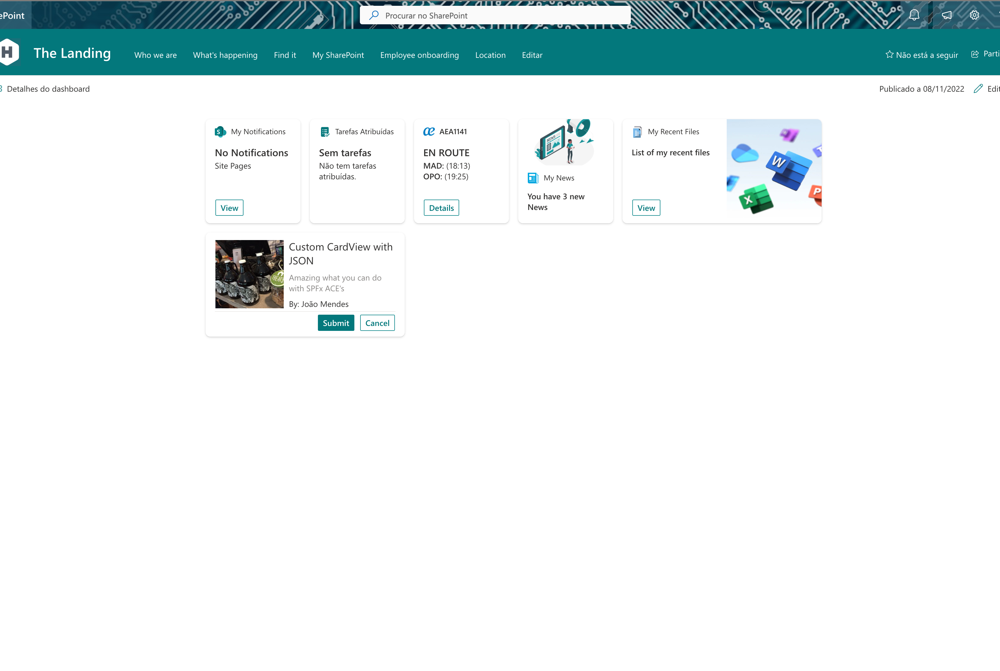
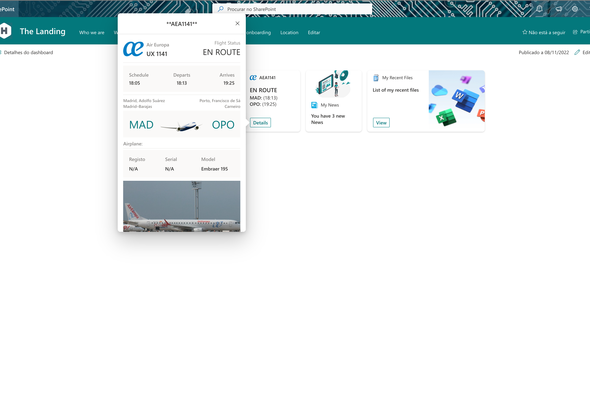
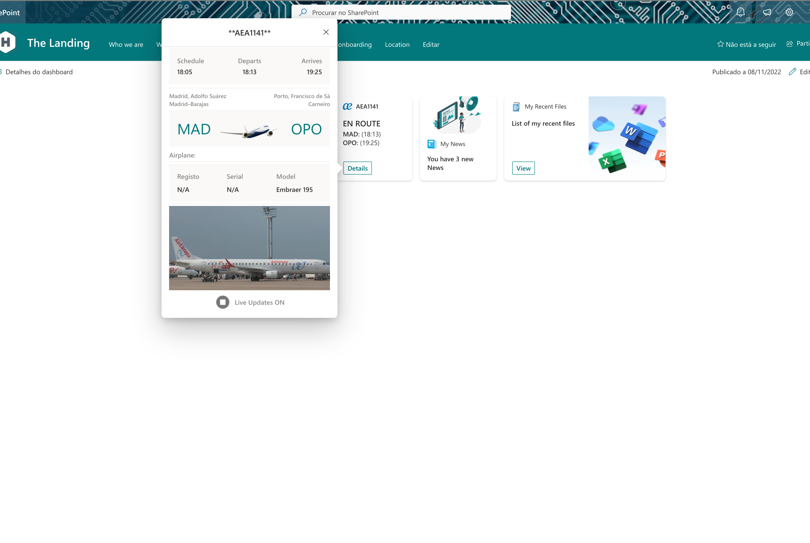

# Flight-Tracker

## Summary

This Adaptive Card Extension allows user to follow in real time a flight.

This ACE, uses the external API (<https://aerodatabox.p.rapidapi.com/flights/number/>) to get data of flight, please see <https://rapidapi.com/aedbx-aedbx/api/aerodatabox/> to get more information.

## Compatibility

## Permissions

## Applies to

- [SharePoint Framework](https://docs.microsoft.com/sharepoint/dev/spfx/sharepoint-framework-overview)
- [Microsoft 365 tenant](https://docs.microsoft.com/sharepoint/dev/spfx/set-up-your-development-environment)

## Prerequisites

This ACE use <https://aerodatabox.p.rapidapi.com/flights/number/> API, please see <https://rapidapi.com/aedbx-aedbx/api/aerodatabox/> to get more information.
It has a limit number of request per month in free plan.

## Solution

| Solution             | Author(s)                                                                                                      |
| -------------------- | -------------------------------------------------------------------------------------------------------------- |
| FlightTracker | [João Mendes](https://github.com/joaojmendes) ([@joaojmendes](https://twitter.com/joaojmendes)), StaffBase |

## Version history

| Version | Date              | Comments                 |
| ------- | ----------------- | ------------------------ |
| 1.0     | November 8, 2022 | Initial release          |
| 1.1     | August 26, 2026   | Upgraded to SPFx 1.23.0  |

## Disclaimer

**THIS CODE IS PROVIDED *AS IS* WITHOUT WARRANTY OF ANY KIND, EITHER EXPRESS OR IMPLIED, INCLUDING ANY IMPLIED WARRANTIES OF FITNESS FOR A PARTICULAR PURPOSE, MERCHANTABILITY, OR NON-INFRINGEMENT.**

---

## Minimal Path to Awesome

- Clone this repository
- Ensure that you are at the solution folder
- in the command-line run:
  - **npm install**
  - **npm run start**

