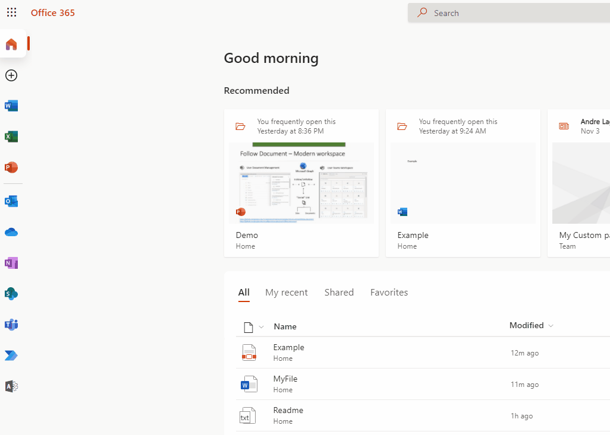

# Follow Document

## Summary

This example shows how to build an ACE with multiple card and quick views to get the current users "Followed Documents" marked by Microsoft 365 Homepage.

The sample uses **Microsoft Graph queries** to retrieve user **"Follow"** information of followed files and generate Thumbnails with links to support access to files.

Available features:
- ACE redirect link.
- Display Follow Documents as "Slider" or "List" view.
- Usage of Mockup data for testing.
- Search for file.
- Click on Site name redirect to Site.
- Click on File name redirect to File.
- Team icon, link to send message with file link to Teams. 
- Folder icon, redirect to Library where document is located.
- Unfollow icon, unfollow document and refresh view.
- Info icon, open the properties page of Document.
- Document with search icon allow to preview Document. 

Usage of following Technologies:
- Usage of Graph queries using  [Graph explorer](https://developer.microsoft.com/en-us/graph/graph-explorer)
- Usage of  [adaptive cards](https://adaptivecards.io/)

### Add Files as Favorites in Office Home Page



#### SharePoint Workbench preview


## Used SharePoint Framework Version


## Permissions

Microsoft Graph

- Files.Read.All
- Sites.Read.All
- Files.ReadWrite
- Sites.ReadWrite.All

## Applies to

- [SharePoint Framework](https://aka.ms/spfx)
- [Microsoft 365 tenant](https://docs.microsoft.com/en-us/sharepoint/dev/spfx/set-up-your-developer-tenant)

> Get your own free development tenant by subscribing to [Microsoft 365 developer program](http://aka.ms/o365devprogram)

## Prerequisites

### Grant the service principal permission to the Microsoft Graph API

Once installed, the solution will request the required permissions via the **Microsoft 365 admin portal > SharePoint > Advanced > API access**.
If you prefer to approve the permissions in advance, for example when testing the solution in the Workbench page without installing it, you can do so using the [CLI for Microsoft 365](https://pnp.github.io/cli-microsoft365/):

```bash
o365 spo login https://contoso-admin.sharepoint.com
o365 spo serviceprincipal grant add --resource 'Microsoft Graph' --scope 'Files.Read.All'
o365 spo serviceprincipal grant add --resource 'Microsoft Graph' --scope 'Sites.Read.All'
o365 spo serviceprincipal grant add --resource 'Microsoft Graph' --scope 'Files.ReadWrite'
o365 spo serviceprincipal grant add --resource 'Microsoft Graph' --scope 'Sites.ReadWrite.All'
```

## Solution

Solution|Author(s)
--------|---------
PrimaryTextCard-Follow-Documents | André Lage ([@aaclage](https://twitter.com/aaclage)) Datalynx AG

## Version history

Version|Date|Comments
-------|----|--------
1.0| November 20, 2021|Initial release

## Disclaimer

**THIS CODE IS PROVIDED *AS IS* WITHOUT WARRANTY OF ANY KIND, EITHER EXPRESS OR IMPLIED, INCLUDING ANY IMPLIED WARRANTIES OF FITNESS FOR A PARTICULAR PURPOSE, MERCHANTABILITY, OR NON-INFRINGEMENT.**

---

## Minimal Path to Awesome

- Clone this repository
- Ensure that you are at the solution folder
- In the command-line run:
  - **npm install**
- After that create the sppkg file using
  - **gulp bundle --ship**
  - **gulp package-solution --ship**
- Deploy the package to the app catalogue site in your tenant
- The solution needs Microsoft Graph API permissions. Please follow **Prerequisites** chapter
- in the command-line run:
  - **gulp serve -l --nobrowser**
- Open the workbench page (https://tenantname.sharepoint.com/sites/sitename/_layouts/15/workbench.aspx)
- Add the ACE to the page
- Edit the properties of ACE based on the user needs.

## Features

Description of the extension that expands upon high-level summary above.

This extension illustrates the following concepts:

**ACE Properties:**
- Include custom Link to redirect from ACE WebPart
- Select View "Slider or List" with asssociated adaptative Card
- Mockup Data (dummy data for test if no follow document is selected)

**ACE WebPart "Follow" button:**
- **Slider View:**
- Display files as gallery
  - Search for File
  - Refresh Data
  - Site name where file is located and link to site
  - File name and link to File to open in the web
  - Slider to rotate Files with associated counting
- 5 additional support options 
  - Teams icon - Share to Teams link with file url reference
  - Folder icon - Link to folder where file is located
  - Unfollow icon - unfollow document and refresh view.
  - Info icon - Link to file properties page
  - Download icon - Link to download file
  - Preview icon - Expand/collapse of thumbnail of file (generated by Microsoft Graph)
 - **List View:**
 - List files 
  - Search for File
  - Refresh Data
  - Display icon of File
  - File Title and link to open in the web
  - Folder icon - Link to folder where file is located
  - Unfollow icon - unfollow document and refresh view.
  
## References

- [Getting started with SharePoint Framework](https://docs.microsoft.com/en-us/sharepoint/dev/spfx/set-up-your-developer-tenant)
- [Building for Microsoft teams](https://docs.microsoft.com/en-us/sharepoint/dev/spfx/build-for-teams-overview)
- [Use Microsoft Graph in your solution](https://docs.microsoft.com/en-us/sharepoint/dev/spfx/web-parts/get-started/using-microsoft-graph-apis)
- [Publish SharePoint Framework applications to the Marketplace](https://docs.microsoft.com/en-us/sharepoint/dev/spfx/publish-to-marketplace-overview)
- [Microsoft 365 Patterns and Practices](https://aka.ms/m365pnp) - Guidance, tooling, samples and open-source controls for your Microsoft 365 development
- [Tutorial to create ACE](https://docs.microsoft.com/en-us/sharepoint/dev/spfx/viva/get-started/build-first-sharepoint-adaptive-card-extension)