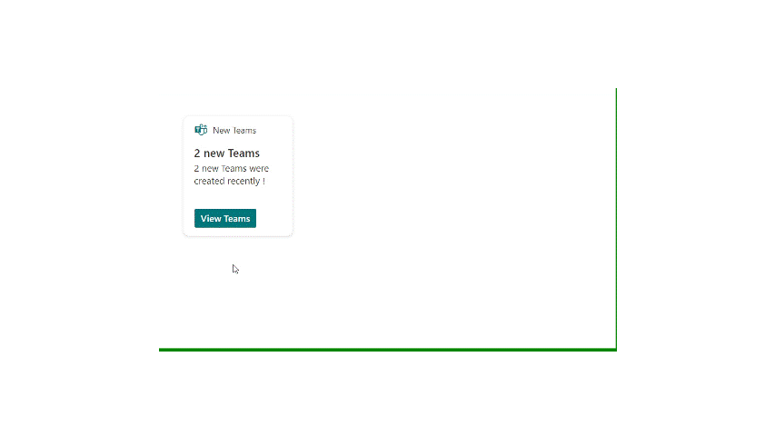

# Join New Teams

## Summary

This sample shows how to build an ACE that displays recently created Teams.

### Highlights

- Displays the most recently created public Teams (up to 20) that you are not a member of
- Quick view showing more details
- Quick view to join a specific team

### Demo

### Join a team

## Used SharePoint Framework Version

## Applies to

- [SharePoint Framework](https://aka.ms/spfx)
- [Microsoft 365 tenant](https://docs.microsoft.com/en-us/sharepoint/dev/spfx/set-up-your-developer-tenant)

> Get your own free development tenant by subscribing to [Microsoft 365 developer program](http://aka.ms/o365devprogram)

## Permissions

Microsoft Graph

- GroupMember.ReadWrite.All
- Group.Read.All

## Prerequisites

> `GroupMember.ReadWrite.All` and `Group.Read.All` permission to be approved after uploading the package

## Solution

Solution|Author(s)
--------|---------
Join New Teams | [Aimery Thomas](https://github.com/a1mery), [@aimery_thomas](https://twitter.com/aimery_thomas)

## Version history

Version|Date|Comments
-------|----|--------
1.0|February 28, 2021|Initial release
1.1|March 06, 2023|Upgrade to SPFx v1.16.1

## Disclaimer

**THIS CODE IS PROVIDED *AS IS* WITHOUT WARRANTY OF ANY KIND, EITHER EXPRESS OR IMPLIED, INCLUDING ANY IMPLIED WARRANTIES OF FITNESS FOR A PARTICULAR PURPOSE, MERCHANTABILITY, OR NON-INFRINGEMENT.**

---

## Minimal Path to Awesome

- Clone this repository
- Ensure that you are at the solution folder
- in the command-line run:
  - **npm install**
  - **gulp bundle --ship**
  - **gulp package-solution --ship**
- Deploy the package (new-teams-client-side-solution.sppkg) to the tenant app catalogue.
- The solution needs following Microsoft Graph API permissions. Approve the API access requests in the SharePoint admin center.

  | Permissions               |
  |---------------------------|
  | GroupMember.ReadWrite.All |
  | Group.Read.All            |

- Add the ACE **New Teams** to the Dashboard.
- Be sure to create a new Public Team if no new ones exist. Make sure you create the team with a user that isn't the user you are testing with as the user creating teh team is automatically added to the team as an owner.

## Features

This sample uses the Graph API to display recently created Teams (public ones) and allows the user join a specific team.

## References

- [Getting started with SharePoint Framework](https://docs.microsoft.com/en-us/sharepoint/dev/spfx/set-up-your-developer-tenant)
- [Building for Microsoft teams](https://docs.microsoft.com/en-us/sharepoint/dev/spfx/build-for-teams-overview)
- [Use Microsoft Graph in your solution](https://docs.microsoft.com/en-us/sharepoint/dev/spfx/web-parts/get-started/using-microsoft-graph-apis)
- [Publish SharePoint Framework applications to the Marketplace](https://docs.microsoft.com/en-us/sharepoint/dev/spfx/publish-to-marketplace-overview)
- [Microsoft 365 Patterns and Practices](https://aka.ms/m365pnp) - Guidance, tooling, samples and open-source controls for your Microsoft 365 development

