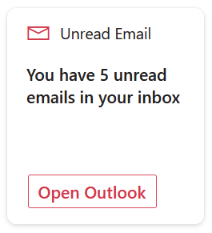

# basic-card-unread-emails

## Summary

This Adaptive Card Extension uses the Microsoft Graph to get unread emails in your inbox and displays that as a ACE

## Used SharePoint Framework Version

## Permissions

Microsoft Graph

- Mail.BasicRead

## Applies to

- [SharePoint Framework](https://aka.ms/spfx)
- [Microsoft 365 tenant](https://docs.microsoft.com/en-us/sharepoint/dev/spfx/set-up-your-developer-tenant)

> Get your own free development tenant by subscribing to [Microsoft 365 developer program](http://aka.ms/o365devprogram)

## Prerequisites

## Solution

Solution|Author(s)
--------|---------
PrimaryTextCard-Graph-UnreadEmails | [Nick Brown](https://github.com/techienickb) ([@techienickb](https://twitter.com/techienickb))

## Version history

Version|Date|Comments
-------|----|--------
1.0|December 06, 2021|Initial release

## Disclaimer

**THIS CODE IS PROVIDED *AS IS* WITHOUT WARRANTY OF ANY KIND, EITHER EXPRESS OR IMPLIED, INCLUDING ANY IMPLIED WARRANTIES OF FITNESS FOR A PARTICULAR PURPOSE, MERCHANTABILITY, OR NON-INFRINGEMENT.**

---

## Minimal Path to Awesome

- Clone this repository
- Ensure that you are at the solution folder
    * in the command line run:
      * `npm install`
      * `gulp build --ship`
      * `gulp bundle --ship`
      * `gulp package-solution --ship`
    * Browse to your SharePoint app catalog and load the SPFX package. 
    * Browse to your SharePoint Admin Center and under advanced you will need to open Api Access and allow the requests for Microsoft Graph. 
* If you have the APIs permissions already allowed you can follow the below steps.
    * in the command line run:
        * `npm install`
        * `gulp serve --nobrowser`
    * browse to your hosted workbench https://YOURTENANT.sharepoint.com/sites/_layouts/15/workbench.aspx and add the adaptive card extension.

## Features

This ACE displays an unread email count for the signed in user's inbox.  If no unread emails will display a different message

This extension illustrates the following concepts:

- Using the graph to display unread email count

> Share your web part with others through Microsoft 365 Patterns and Practices program to get visibility and exposure. More details on the community, open-source projects and other activities from http://aka.ms/m365pnp.

## References

- [Getting started with SharePoint Framework](https://docs.microsoft.com/en-us/sharepoint/dev/spfx/set-up-your-developer-tenant)
- [Building for Microsoft teams](https://docs.microsoft.com/en-us/sharepoint/dev/spfx/build-for-teams-overview)
- [Use Microsoft Graph in your solution](https://docs.microsoft.com/en-us/sharepoint/dev/spfx/web-parts/get-started/using-microsoft-graph-apis)
- [Publish SharePoint Framework applications to the Marketplace](https://docs.microsoft.com/en-us/sharepoint/dev/spfx/publish-to-marketplace-overview)
- [Microsoft 365 Patterns and Practices](https://aka.ms/m365pnp) - Guidance, tooling, samples and open-source controls for your Microsoft 365 development

