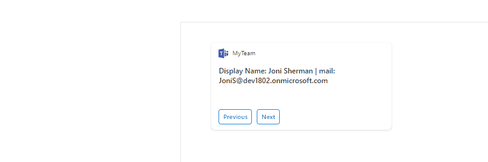
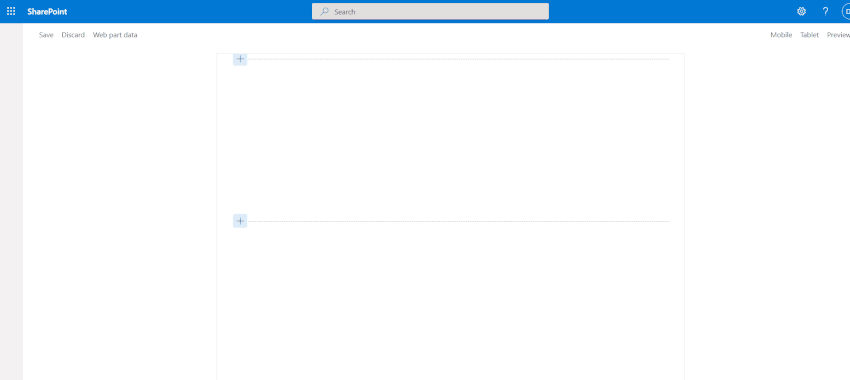
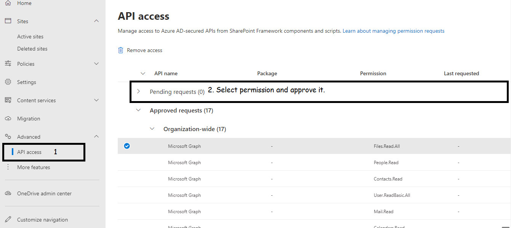

# Display and Manage Team

## Summary
> Display all team members who directly reports to me using Graph API in ACEs card View with two button.

> Display User's information on click on Card view. Information will display on Quick View component of ACEs.

> Change Block sign in property when user clicked on Block Sign-In Button in Quick View.

## Compatibility

 
 
 
 

## Applies to

* [SharePoint Framework](https://docs.microsoft.com/sharepoint/dev/spfx/sharepoint-framework-overview)
* [Microsoft 365 tenant](https://docs.microsoft.com/sharepoint/dev/spfx/set-up-your-development-environment)
* [SharePoint Adaptive Card Extension](https://docs.microsoft.com/en-us/sharepoint/dev/spfx/viva/get-started/build-first-sharepoint-adaptive-card-extension)
* [Consume the Microsoft Graph in the SharePoint Framework](https://docs.microsoft.com/en-us/sharepoint/dev/spfx/use-aad-tutorial)

## Prerequisites

> After deploy web-part in app catalog, User needs to approve Graph API permission from SharePoint admin center from API management blade to access team members and handle block Sign In query from SPFx Code.

## Solution

Solution|Author(s)
--------|---------
ManageTeam | [Dipen Shah](https://github.com/Dips365) [@Dips365](https://twitter.com/Dips_365) [Rapid Circle](https://en.rapidcircle.com/)

## Version history

Version|Date|Comments
-------|----|--------
1.0|September 20, 2021|Initial Commit

## Disclaimer

**THIS CODE IS PROVIDED *AS IS* WITHOUT WARRANTY OF ANY KIND, EITHER EXPRESS OR IMPLIED, INCLUDING ANY IMPLIED WARRANTIES OF FITNESS FOR A PARTICULAR PURPOSE, MERCHANTABILITY, OR NON-INFRINGEMENT.**

---

## Minimal Path to Awesome

* Clone this repository
* in the command line run:
  * `npm install`
  * `gulp serve`

> Include any additional steps as needed.
> DELETE THIS PARAGRAPH BEFORE SUBMITTING

## Features
This Adaptive Card Extension illustrates the following concepts on top of the SharePoint Framework:

* Introduction on ACEs
* Graph API integration
* Handle Queries on Quick View

