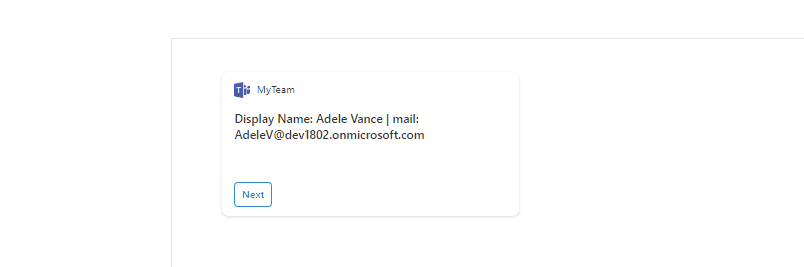
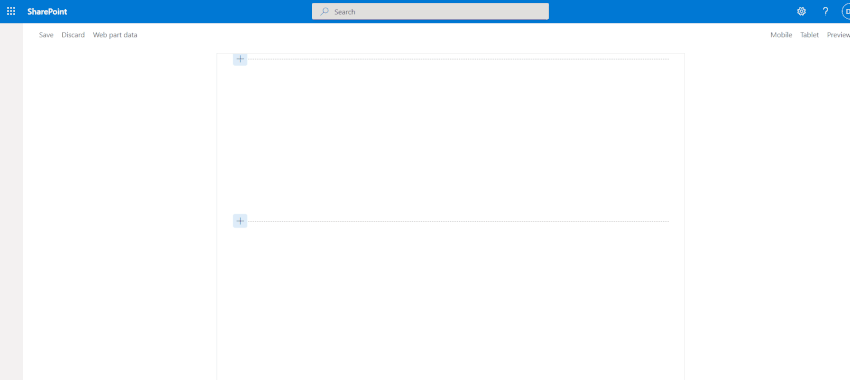
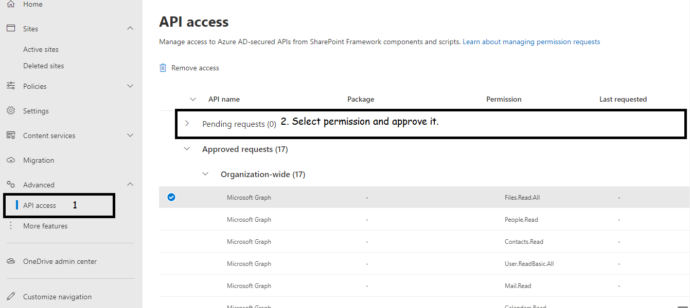

# Display and Manage Team

## Summary

This sample shows how to manage a team using the Adaptive Card Extension (ACE).

The following are scenarios covered by this sample.

- Display all team members who directly reports to me using the Microsoft Graph API in the Card view along with two buttons.

    

- Display details about a user with a click on the Card view. The corresponding information will display on the Quick view component of the ACE.

    

- Change the block sign-in property when the user chooses the **Block Sign-In** button in the Quick view.

    

## Compatibility

## Applies to

* [SharePoint Framework](https://docs.microsoft.com/sharepoint/dev/spfx/sharepoint-framework-overview)
* [Microsoft 365 tenant](https://docs.microsoft.com/sharepoint/dev/spfx/set-up-your-development-environment)
* [SharePoint Adaptive Card Extension](https://docs.microsoft.com/en-us/sharepoint/dev/spfx/viva/get-started/build-first-sharepoint-adaptive-card-extension)
* [Consume the Microsoft Graph in the SharePoint Framework](https://docs.microsoft.com/en-us/sharepoint/dev/spfx/use-aad-tutorial)

## Prerequisites

After deploying the solution to the app catalog, a SharePoint administrator needs to approve the Microsoft Graph API permissions from SharePoint admin center > Advanced > API access, which gives the solution access to team members and supports the handling of block sign-in.

## Solution

| Solution   | Author(s)                                                                                                                                                             |
|------------|-----------------------------------------------------------------------------------------------------------------------------------------------------------------------|
| ManageTeam | [Dipen Shah](https://github.com/Dips365) [@Dips365](https://twitter.com/Dips_365) [Rapid Circle](https://en.rapidcircle.com/) [Aimery Thomas](https://github.com/a1mery) |

## Version history

| Version | Date               | Comments                    |
|---------|--------------------|-----------------------------|
| 1.1     | July 12, 2026      | Upgraded to SPFx 1.23.0     |
| 1.0     | September 20, 2021 | Initial Commit              |

## Disclaimer

**THIS CODE IS PROVIDED *AS IS* WITHOUT WARRANTY OF ANY KIND, EITHER EXPRESS OR IMPLIED, INCLUDING ANY IMPLIED WARRANTIES OF FITNESS FOR A PARTICULAR PURPOSE, MERCHANTABILITY, OR NON-INFRINGEMENT.**

---

## Minimal path to awesome

* Clone this repository
* Ensure that you are at the solution folder
* in the command line run:
  * `npm install`
  * `npm run start`

## Features

This Adaptive Card Extension illustrates the following concepts on top of the SharePoint Framework:

* Introduction on ACEs
* Microsoft Graph API integration
* Handle queries on Quick View

## References

- [Getting started with SharePoint Framework](https://docs.microsoft.com/en-us/sharepoint/dev/spfx/set-up-your-developer-tenant)
- [Building for Microsoft teams](https://docs.microsoft.com/en-us/sharepoint/dev/spfx/build-for-teams-overview)
- [Use Microsoft Graph in your solution](https://docs.microsoft.com/en-us/sharepoint/dev/spfx/web-parts/get-started/using-microsoft-graph-apis)
- [Publish SharePoint Framework applications to the Marketplace](https://docs.microsoft.com/en-us/sharepoint/dev/spfx/publish-to-marketplace-overview)
- [Microsoft 365 Patterns and Practices](https://aka.ms/m365pnp) - Guidance, tooling, samples and open-source controls for your Microsoft 365 development

