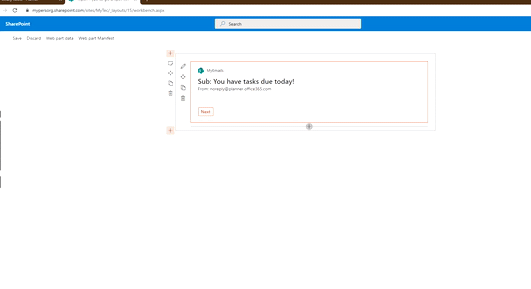
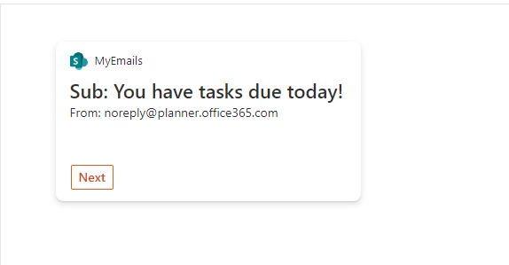
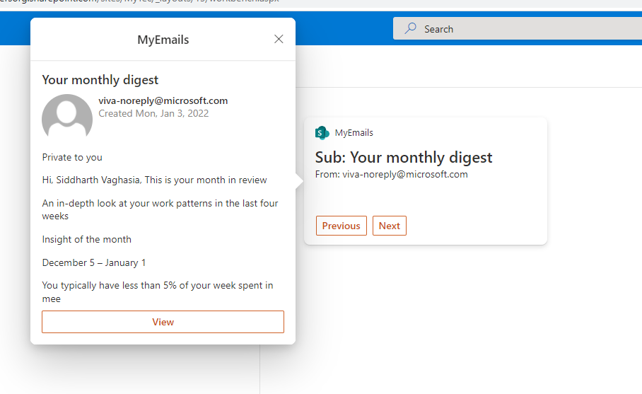

# My Emails

## Summary

This sample shows how to build an ACE with a PrimaryText card view and a quick view to display current logged in user's emails in card view and detail in quick view

##  ACE in Action

## Summary

- Displays current logged in user'e email in card view
- Action buttons on card view to navigate between emails
- QuickView showing email details on click on email
- View button on Quick View to take user to targeted email in outlook web

Screenshots for quick reference

## Used SharePoint Framework Version

## Applies to

- [SharePoint Framework](https://aka.ms/spfx)
- [Microsoft 365 tenant](https://docs.microsoft.com/en-us/sharepoint/dev/spfx/set-up-your-developer-tenant)

> Get your own free development tenant by subscribing to [Microsoft 365 developer program](http://aka.ms/o365devprogram)

## Prerequisites

> Following Microsoft Graph permissions needs to be approved after uploading the package in the App Catalog

| Permissions         |
|---------------------|
| Mail.Read           |
| Mail.ReadBasic      |
 

## Solution

Solution|Author(s)
--------|---------
PrimaryTextCard-MyEmails | [Siddharth Vaghasia](https://twitter.com/siddh_me)

## Version history

Version|Date|Comments
-------|----|--------
1.0|January 03, 2022|Initial release

## Disclaimer

**THIS CODE IS PROVIDED *AS IS* WITHOUT WARRANTY OF ANY KIND, EITHER EXPRESS OR IMPLIED, INCLUDING ANY IMPLIED WARRANTIES OF FITNESS FOR A PARTICULAR PURPOSE, MERCHANTABILITY, OR NON-INFRINGEMENT.**

---

## Minimal Path to Awesome

- Clone this repository
- Ensure that you are at the solution folder
- in the command-line run:
  - **npm install**
- After that, create the sppkg file using
  - **gulp bundle --ship**
  - **gulp package-solution --ship**
- Deploy the package to the app catalogue site in your tenant

- The solution needs following Microsoft Graph API permission. So, approve the API access request in the SharePoint admin centre

  | Permissions         |
  |---------------------|
  | Mail.Read           |
  | Mail.ReadBasic      |

- in the command-line run:
  - **gulp serve -l --nobrowser**
- or if using spfx-fast-serve, in the command-line run:
  - **npm run serve**
- Open the workbench page (https://tenantname.sharepoint.com/sites/sitename/_layouts/15/workbench.aspx)
- Add the ACE [***MyEmails***] to the page 

## Concept Explored

This extension illustrates the following tecnical concepts:

- Using Microsoft Graph to get the Logged in user's emails
- Using State and actions buttons to navigate through diffrent emails by adding previous and next buttons
- Submit action handling of Card view to show Quick view
- Customizing Quick View Adpative Card JSOM template to create customized UI

## References

- [Getting started with SharePoint Framework](https://docs.microsoft.com/en-us/sharepoint/dev/spfx/set-up-your-developer-tenant)
- [Build your first SharePoint Adaptive Card Extension](https://docs.microsoft.com/en-us/sharepoint/dev/spfx/viva/get-started/build-first-sharepoint-adaptive-card-extension)
- [My blog on First Adaptive card](https://siddharthvaghasia.com/2021/12/29/create-your-first-adaptive-card-extension-with-spfx/)
- [My blog on how to consume Graph API in ACE](https://siddharthvaghasia.com/2022/01/02/how-to-call-and-show-graph-api-data-in-spfx-ace/)
- [Use Microsoft Graph in your solution](https://docs.microsoft.com/en-us/sharepoint/dev/spfx/web-parts/get-started/using-microsoft-graph-apis)
- [Microsoft 365 Patterns and Practices](https://aka.ms/m365pnp) - Guidance, tooling, samples and open-source controls for your Microsoft 365 development

