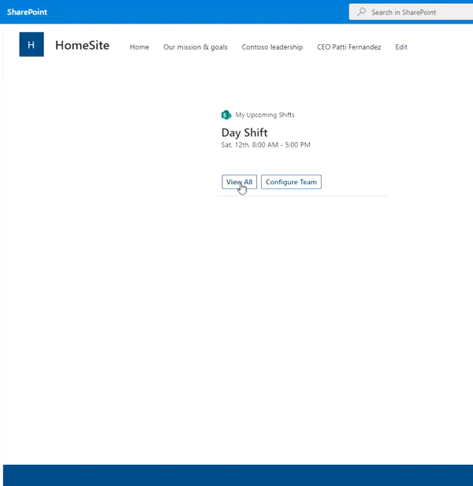

# My Upcoming Shifts

## Summary

This sample shows how to build an ACE with a PrimaryText card view and a quick view to display current logged in user's immediate upcoming shift in card view and all upcoming shifts in Quick view. This sample also show concept on how to make the ACE configurable based on logged in user preference. It allows users to select a particular team from his joined teams to select from where he wanted to show his upcoming shift.
User preference(settings) would be stored in his OneDrive as json file on applications's personal folder.

## ACE in Action

## Summary

- Displays current logged in immediate upcoming shift in card view
- Action buttons on card view to view all upcoming shifts and also choose his targeted Team to get shift data.
- Option for the logged in user(NOT admin) to configure Teams from which he wanted to show his upcoming shifts
- User settings(preference) of selected team would be stored in user's OneDrive
- Configurable property to choose to show Shift date as Title or Shift label(Display name) as Title

## Used SharePoint Framework Version

## Applies to

- [SharePoint Framework](https://aka.ms/spfx)
- [Microsoft 365 tenant](https://docs.microsoft.com/en-us/sharepoint/dev/spfx/set-up-your-developer-tenant)

> Get your own free development tenant by subscribing to [Microsoft 365 developer program](http://aka.ms/o365devprogram)

## Prerequisites

> Following Microsoft Graph permissions needs to be approved after uploading the package in the App Catalog

| Permissions         |
|---------------------|
| User.Read           |
| Files.ReadWrite     |
| Group.Read.All      |
| Schedule.Read.All   |

## Solution

Solution|Author(s)
--------|---------
PrimaryTextCard-MyEmails | [Siddharth Vaghasia](https://twitter.com/siddh_me)

## Version history

Version|Date|Comments
-------|----|--------
1.0|Feb 07, 2022|Initial release

## Disclaimer

**THIS CODE IS PROVIDED *AS IS* WITHOUT WARRANTY OF ANY KIND, EITHER EXPRESS OR IMPLIED, INCLUDING ANY IMPLIED WARRANTIES OF FITNESS FOR A PARTICULAR PURPOSE, MERCHANTABILITY, OR NON-INFRINGEMENT.**

---

## Minimal Path to Awesome

- Clone this repository
- Ensure that you are at the solution folder
- in the command-line run:
  - **npm install**
- After that, create the sppkg file using
  - **gulp bundle --ship**
  - **gulp package-solution --ship**
- Deploy the package to the app catalogue site in your tenant

- The solution needs following Microsoft Graph API permission. So, approve the API access request in the SharePoint admin centre

| Permissions         |
|---------------------|
| User.Read           |
| Files.ReadWrite     |
| Group.Read.All      |
| Schedule.Read.All   |

- in the command-line run:
  - **gulp serve -l --nobrowser**
- or if using spfx-fast-serve, in the command-line run:
  - **npm run serve**
- Open the workbench page (<https://tenantname.sharepoint.com/sites/sitename/_layouts/15/workbench.aspx>)
- Add the ACE [***My Shifts***] to the page
- Ensure Shifts is installed and configured and you are an owner of the group

## Concept Explored

This extension illustrates the following technical concepts:

- Using Microsoft Graph to get the Logged in information
- Using Microsoft Graph to store/read user's settings(preference) in application's personal folder of user's OneDrive
- Submit action handling of Card view to show Quick view
- Customizing Quick View Adaptive Card JSON template to create customized UI
- Usage of multiple Quickviews

## References

- [Getting started with SharePoint Framework](https://docs.microsoft.com/en-us/sharepoint/dev/spfx/set-up-your-developer-tenant)
- [Build your first SharePoint Adaptive Card Extension](https://docs.microsoft.com/en-us/sharepoint/dev/spfx/viva/get-started/build-first-sharepoint-adaptive-card-extension)
- [My blog on First Adaptive card](https://siddharthvaghasia.com/2021/12/29/create-your-first-adaptive-card-extension-with-spfx/)
- [My blog on how to consume Graph API in ACE](https://siddharthvaghasia.com/2022/01/02/how-to-call-and-show-graph-api-data-in-spfx-ace/)
- [Storing User Settings in app's Personal Folder](https://blog.mastykarz.nl/easiest-store-user-settings-microsoft-365-app/)
- [Use Microsoft Graph in your solution](https://docs.microsoft.com/en-us/sharepoint/dev/spfx/web-parts/get-started/using-microsoft-graph-apis)
- [Microsoft 365 Patterns and Practices](https://aka.ms/m365pnp) - Guidance, tooling, samples and open-source controls for your Microsoft 365 development

