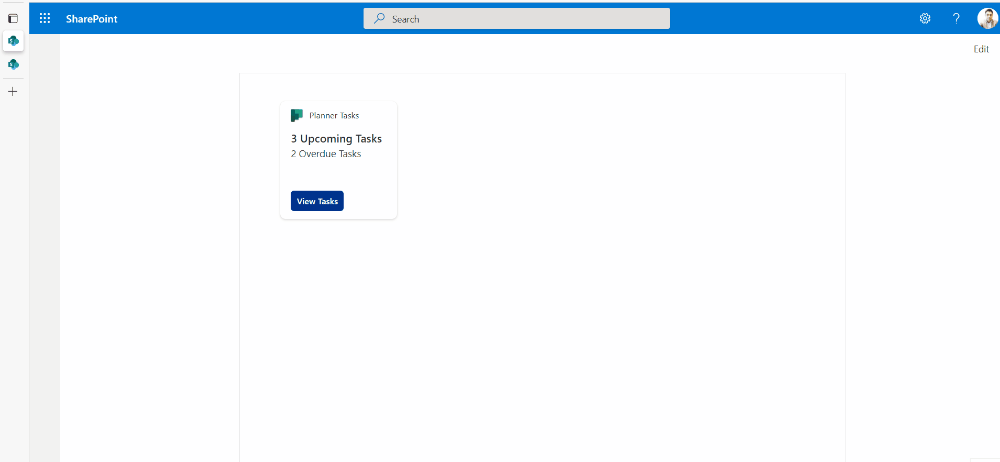
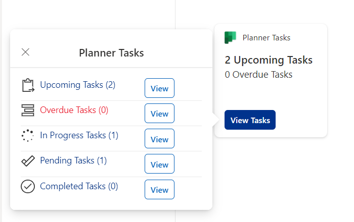
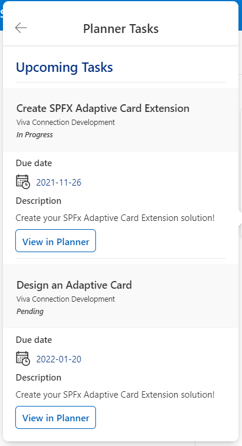
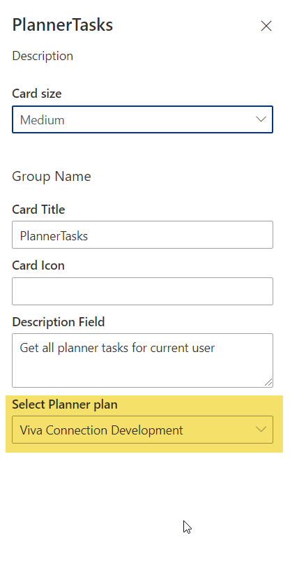

# Planner Tasks

## Summary

This sample shows how to build an ACE with a PrimaryText card view and multiple quick views to display logged-in user Planner Tasks from all associated plans.

### Highlights

- Using Microsoft Graph to get the planner tasks
- Custom property control - Aysnc Dropdown Property pane field to fetch current user's associated Planner plans via Graph
- Submit action handling in ACE and Quick View
- Theme based display
  
### Demo

### Screenshots of other cards

View Card Tasks Summary

View Card Tasks Detail

Custom Async Dropdown control to show available plans

## Used SharePoint Framework Version

## Applies to

- [SharePoint Framework](https://aka.ms/spfx)
- [Microsoft 365 tenant](https://docs.microsoft.com/en-us/sharepoint/dev/spfx/set-up-your-developer-tenant)

> Get your own free development tenant by subscribing to [Microsoft 365 developer program](http://aka.ms/o365devprogram)

## Prerequisites

> Following Microsoft Graph permissions needs to be approved after uploading the package in the App Catalog

| Permissions         |
|---------------------|
| Tasks.Read          |
| Tasks.ReadWrite     |
| Group.Read.All      |
| Group.ReadWrite.All |

## Solution

| Solution       | Author(s)                                                                                       |
| -------------- | ----------------------------------------------------------------------------------------------- |
| Planner Tasks | [Ejaz Hussain](https://github.com/ejazhussain) ([https://www.ejazhussain.com/](https://www.ejazhussain.com/)) |

## Version history

| Version | Date               | Comments        |
| ------- | ------------------ | --------------- |
| 1.0     | September 17, 2021 | Initial release |

## Disclaimer

**THIS CODE IS PROVIDED *AS IS* WITHOUT WARRANTY OF ANY KIND, EITHER EXPRESS OR IMPLIED, INCLUDING ANY IMPLIED WARRANTIES OF FITNESS FOR A PARTICULAR PURPOSE, MERCHANTABILITY, OR NON-INFRINGEMENT.**

---

## Minimal Path to Awesome

- Clone this repository
- Ensure that you are at the solution folder
- in the command-line run:
  - **npm install**
- After that, create the sppkg file using
  - **gulp bundle --ship**
  - **gulp package-solution --ship**
- Deploy the package to the app catalogue site in your tenant
- The solution needs following Microsoft Graph API permission. So, approve the API access request in the SharePoint admin centre

  | Permissions         |
  |---------------------|
  | Tasks.Read          |
  | Tasks.ReadWrite     |
  | Group.Read.All      |
  | Group.ReadWrite.All |

- in the command-line run:
  - **gulp serve -l --nobrowser**
- or if using spfx-fast-serve, in the command-line run:
  - **npm run serve**
- Open the workbench page (<https://tenantname.sharepoint.com/sites/sitename/_layouts/15/workbench.aspx>)
- Add the ACE [***PlannerTasks***] to the page

## Features

- Using Microsoft Graph to get the planner tasks
- Custom property control - Aysnc Dropdown Property pane field to fetch current user's associated Planner plans via Graph
- Submit action handling in ACE and Quick View
- Theme based display

## References

- [Getting started with SharePoint Framework](https://docs.microsoft.com/en-us/sharepoint/dev/spfx/set-up-your-developer-tenant)
- [Building for Microsoft teams](https://docs.microsoft.com/en-us/sharepoint/dev/spfx/build-for-teams-overview)
- [Use Microsoft Graph in your solution](https://docs.microsoft.com/en-us/sharepoint/dev/spfx/web-parts/get-started/using-microsoft-graph-apis)
- [Publish SharePoint Framework applications to the Marketplace](https://docs.microsoft.com/en-us/sharepoint/dev/spfx/publish-to-marketplace-overview)
- [Microsoft 365 Patterns and Practices](https://aka.ms/m365pnp) - Guidance, tooling, samples and open-source controls for your Microsoft 365 development
- [Tutorial to create ACE](https://docs.microsoft.com/en-us/sharepoint/dev/spfx/viva/get-started/build-first-sharepoint-adaptive-card-extension)

