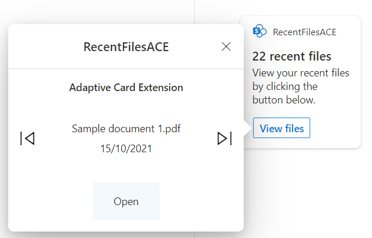
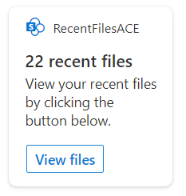
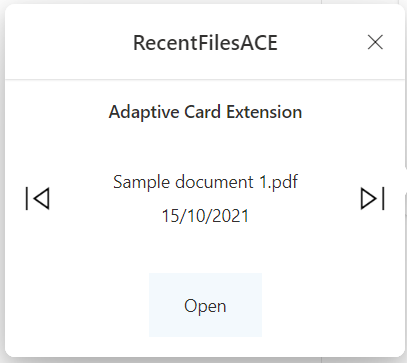

# primary-text-recent-files

## Summary

Viva Connection Adaptive Card Extension (ACE) that shows the recent files for the current user.

Quick view and card view

Card view

Quick view

## Designer

Just want to see the Adaptive Card template?

    <a href="https://adaptivecards.io/designer/index.html?card=https%3A%2F%2Fraw.githubusercontent.com%2Fpnp%2Fsp-dev-fx-aces%2Fmain%2Fsamples%2FPrimaryTextCard-RecentFiles%2Fsrc%2FadaptiveCardExtensions%2FrecentFilesAce%2FquickView%2Ftemplate%2FQuickViewTemplate.json&data=https%3A%2F%2Fraw.githubusercontent.com%2Fpnp%2Fsp-dev-fx-aces%2Fmain%2Fsamples%2FPrimaryTextCard-RecentFiles%2Fassets%2FquickViewSampleData.json">
        

## Used SharePoint Framework Version

## Applies to

- [SharePoint Framework](https://aka.ms/spfx)
- [Microsoft 365 tenant](https://docs.microsoft.com/en-us/sharepoint/dev/spfx/set-up-your-developer-tenant)

> Get your own free development tenant by subscribing to [Microsoft 365 developer program](http://aka.ms/o365devprogram)

## Prerequisites

This ACE need Microsoft Graph Permissions:

- Files.Read.All

## Solution

Solution|Author(s)
--------|---------
primary-text-recent-files | [GuidoZam](https://github.com/GuidoZam)

## Version history

Version|Date|Comments
-------|----|--------
1.0|April 7, 2022|Initial release

## Disclaimer

**THIS CODE IS PROVIDED *AS IS* WITHOUT WARRANTY OF ANY KIND, EITHER EXPRESS OR IMPLIED, INCLUDING ANY IMPLIED WARRANTIES OF FITNESS FOR A PARTICULAR PURPOSE, MERCHANTABILITY, OR NON-INFRINGEMENT.**

---

## Minimal Path to Awesome

- Clone this repository
- Ensure that you are at the solution folder
  - in the command line run:
    - `npm install`
      - `gulp build --ship`
      - `gulp bundle --ship`
      - `gulp package-solution --ship`
    - Browse to your SharePoint app catalog and load the SPFx package.
    - Browse to your SharePoint Admin Center and under advanced you will need to open Api Access and allow the requests for Microsoft Graph.

- If you have the APIs permissions already allowed you can follow the below steps.
  - in the command line run:
        *`npm install`
        * `gulp serve --nobrowser`
    - browse to your hosted workbench <https://YOURTENANT.sharepoint.com/sites/_layouts/15/workbench.aspx> and add the adaptive card extension.

## Features

Viva Connection Adaptive Card Extension (ACE) that shows the recent files for the current user using Microsoft Graph.
In the CardView the user can find the number of the recent files, clicking on the "View files" button the QuickView opens and the user can view all the recent files and open the one needed by clicking on the "Open" button.

## References

- [Getting started with SharePoint Framework](https://docs.microsoft.com/en-us/sharepoint/dev/spfx/set-up-your-developer-tenant)
- [Building for Microsoft teams](https://docs.microsoft.com/en-us/sharepoint/dev/spfx/build-for-teams-overview)
- [Use Microsoft Graph in your solution](https://docs.microsoft.com/en-us/sharepoint/dev/spfx/web-parts/get-started/using-microsoft-graph-apis)
- [Publish SharePoint Framework applications to the Marketplace](https://docs.microsoft.com/en-us/sharepoint/dev/spfx/publish-to-marketplace-overview)
- [Microsoft 365 Patterns and Practices](https://aka.ms/m365pnp) - Guidance, tooling, samples and open-source controls for your Microsoft 365 development
