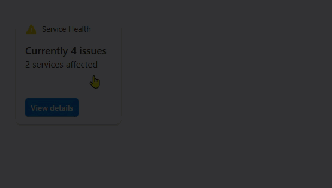
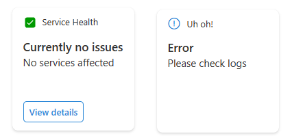

# Service health

## Summary

This sample shows how to build an ACE with a card view and multiple quick views to display the status of the affected services in a tenant.

### Highlights
- Using Microsoft Graph to get service health data
- Submit action handling in ACE and Quick View
- Theme based display
- Usage of loadash library for restructuring arrays

### Demo

#### Viva connections app (preview)

#### Dashboard in the home site 

### Screenshots of other cards

## Used SharePoint Framework Version

 

## Applies to

- [SharePoint Framework](https://aka.ms/spfx)
- [Microsoft 365 tenant](https://docs.microsoft.com/en-us/sharepoint/dev/spfx/set-up-your-developer-tenant)

> Get your own free development tenant by subscribing to [Microsoft 365 developer program](http://aka.ms/o365devprogram)

## Prerequisites

> `ServiceHealth.Read.All` permission to be approved after uploading the package

## Solution

Solution|Author(s)
--------|---------
Service-health | [Anoop Tatti](https://github.com/anoopt) ([https://linktr.ee/anoopt](https://linktr.ee/anoopt))

## Version history

Version|Date|Comments
-------|----|--------
1.0|September 12, 2021|Initial release
1.1|November 1, 2021|Updated to SPFx 1.13.0, Minor UI updates

## Disclaimer

**THIS CODE IS PROVIDED *AS IS* WITHOUT WARRANTY OF ANY KIND, EITHER EXPRESS OR IMPLIED, INCLUDING ANY IMPLIED WARRANTIES OF FITNESS FOR A PARTICULAR PURPOSE, MERCHANTABILITY, OR NON-INFRINGEMENT.**

---

## Minimal Path to Awesome

- Clone this repository
- Ensure that you are at the solution folder
- in the command-line run:
  - **npm install**
- After that create the sppkg file using
  - **gulp bundle --ship**
  - **gulp package-solution --ship**
- Deploy the package to the app catalogue site in your tenant
- The solution needs `ServiceHealth.Read.All` permission of Microsoft Graph API. So, approve the API access request in the SharePoint admin center
- in the command-line run:
  - **gulp serve -l --nobrowser**
- or if using spfx-fast-serve, in the command-line run:
  - **npm run serve**
- Open the workbench page (https://tenantname.sharepoint.com/sites/sitename/_layouts/15/workbench.aspx)
- Add the ACE to the page

## Features

This sample uses Microsoft Graph API to get service health data of the tenant. The value obtained from Graph is restructred using `loadash` - so that it can be easily displayed in adaptive cards.

## References

- [Getting started with SharePoint Framework](https://docs.microsoft.com/en-us/sharepoint/dev/spfx/set-up-your-developer-tenant)
- [Building for Microsoft teams](https://docs.microsoft.com/en-us/sharepoint/dev/spfx/build-for-teams-overview)
- [Use Microsoft Graph in your solution](https://docs.microsoft.com/en-us/sharepoint/dev/spfx/web-parts/get-started/using-microsoft-graph-apis)
- [Publish SharePoint Framework applications to the Marketplace](https://docs.microsoft.com/en-us/sharepoint/dev/spfx/publish-to-marketplace-overview)
- [Microsoft 365 Patterns and Practices](https://aka.ms/m365pnp) - Guidance, tooling, samples and open-source controls for your Microsoft 365 development
- [Tutorial to create ACE](https://docs.microsoft.com/en-us/sharepoint/dev/spfx/viva/get-started/build-first-sharepoint-adaptive-card-extension)