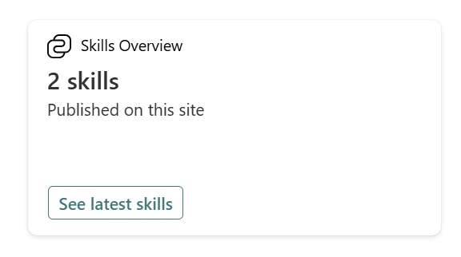
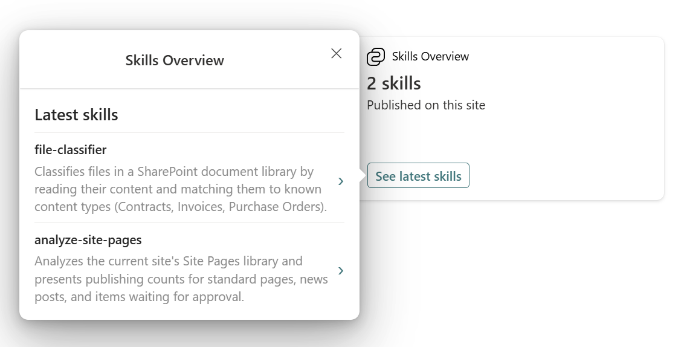
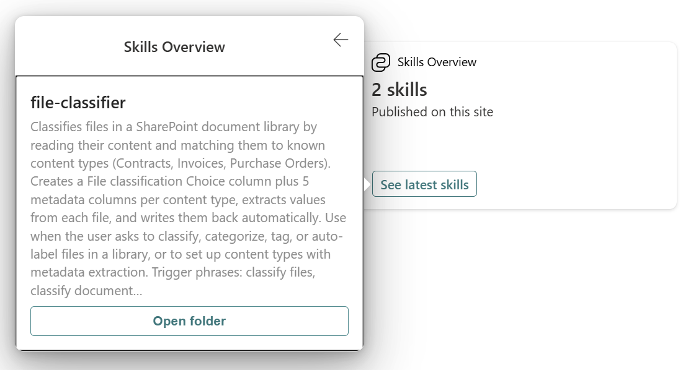

# PrimaryTextCard-SkillsOverview

## Summary

This Adaptive Card Extension gives an overview of the SharePoint skills in the current SharePoint site.

The card displays the total number of skills found in the site.
From the card, users can open a quick view that lists the latest skills, and drill into a detail view to read the description of a selected skill.

## Used SharePoint Framework Version

## Applies to

- [SharePoint Framework](https://aka.ms/spfx)
- [Microsoft 365 tenant](https://docs.microsoft.com/en-us/sharepoint/dev/spfx/set-up-your-developer-tenant)

## Solution

| Solution                       | Author(s)                                                                                       |
| ------------------------------ | ----------------------------------------------------------------------------------------------- |
| PrimaryTextCard-SkillsOverview | [Aimery Thomas](https://github.com/a1mery) |

## Version history

| Version | Date          | Comments        |
| ------- | ------------- | --------------- |
| 1.0     | June 23, 2026 | Initial release |

## Disclaimer

**THIS CODE IS PROVIDED _AS IS_ WITHOUT WARRANTY OF ANY KIND, EITHER EXPRESS OR IMPLIED, INCLUDING ANY IMPLIED WARRANTIES OF FITNESS FOR A PARTICULAR PURPOSE, MERCHANTABILITY, OR NON-INFRINGEMENT.**

---

## Minimal Path to Awesome

- Clone this repository
- Ensure that you are at the solution folder
- In the command-line run:
  - **npm install**
  - **heft test --clean --production**
  - **heft package-solution --production**
- Deploy the package (`PrimaryTextCard-SkillsOverview.sppkg`) to the tenant app catalogue.
- Add the ACE **Skills Overview** to a Viva Connections dashboard.

Other build commands can be listed using `heft --help`.

## Features

This sample demonstrates how to:

- Build an SPFx 1.23 Adaptive Card Extension with the new Heft-based build pipeline.
- Use PnPjs to read folders, files and file content from a SharePoint document library.
- Combine a Primary Text card view with multiple quick views (list view and detail view) and navigate between them.

## References

- [Getting started with SharePoint Framework](https://docs.microsoft.com/en-us/sharepoint/dev/spfx/set-up-your-developer-tenant)
- [Building for Microsoft Teams](https://docs.microsoft.com/en-us/sharepoint/dev/spfx/build-for-teams-overview)
- [Use Microsoft Graph in your solution](https://docs.microsoft.com/en-us/sharepoint/dev/spfx/web-parts/get-started/using-microsoft-graph-apis)
- [Publish SharePoint Framework applications to the Marketplace](https://docs.microsoft.com/en-us/sharepoint/dev/spfx/publish-to-marketplace-overview)
- [Microsoft 365 Patterns and Practices](https://aka.ms/m365pnp) - Guidance, tooling, samples and open-source controls for your Microsoft 365 development
- [Heft Documentation](https://heft.rushstack.io/)
