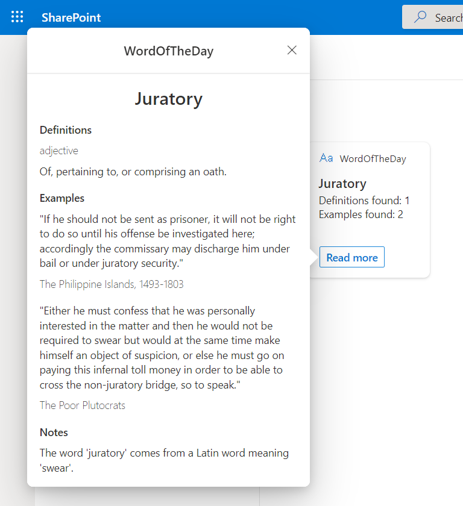
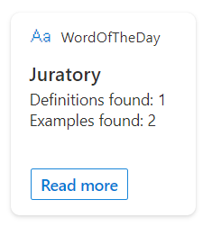
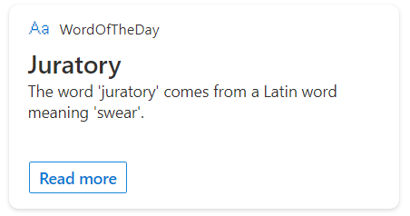
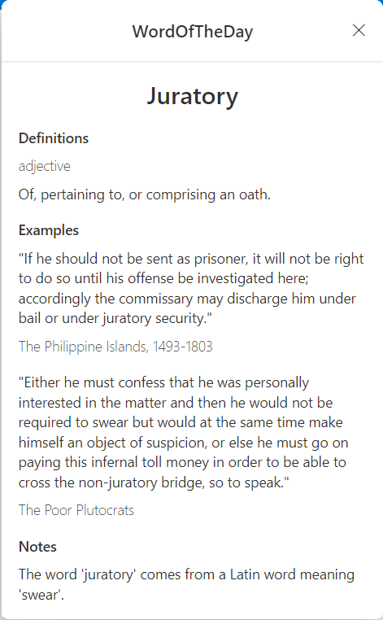
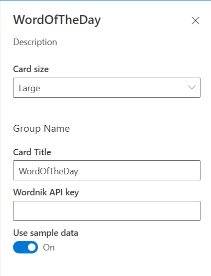

# primary-text-word-of-the-day

## Summary

Viva Connection Adaptive Card Extension (ACE) that shows the word of the day.

Quick view and card view

Medium size card view

Large size card view

Quick view

Property pane

## Designer

Just want to see the Adaptive Card template?

    <a href="https://adaptivecards.io/designer/index.html?card=https%3A%2F%2Fraw.githubusercontent.com%2Fpnp%2Fsp-dev-fx-aces%2Fmain%2Fsamples%2FPrimaryTextCard-WordOfTheDay%2Fsrc%2FadaptiveCardExtensions%2FrecentFilesAce%2FquickView%2Ftemplate%2FQuickViewTemplate.json&data=https%3A%2F%2Fraw.githubusercontent.com%2Fpnp%2Fsp-dev-fx-aces%2Fmain%2Fsamples%2FPrimaryTextCard-WordOfTheDay%2Fassets%2FquickViewSampleData.json">
        

## Used SharePoint Framework Version

## Applies to

- [SharePoint Framework](https://aka.ms/spfx)
- [Microsoft 365 tenant](https://docs.microsoft.com/en-us/sharepoint/dev/spfx/set-up-your-developer-tenant)

> Get your own free development tenant by subscribing to [Microsoft 365 developer program](http://aka.ms/o365devprogram)

## Prerequisites

You should get an API key from [Wordnik](https://www.wordnik.com/) to properly configure the ACE, otherwise you can still use it with sample data.

## Solution

Solution|Author(s)
--------|---------
primary-text-word-of-the-day | [GuidoZam](https://github.com/GuidoZam)

## Version history

Version|Date|Comments
-------|----|--------
1.0|April 14, 2022|Initial release

## Disclaimer

**THIS CODE IS PROVIDED *AS IS* WITHOUT WARRANTY OF ANY KIND, EITHER EXPRESS OR IMPLIED, INCLUDING ANY IMPLIED WARRANTIES OF FITNESS FOR A PARTICULAR PURPOSE, MERCHANTABILITY, OR NON-INFRINGEMENT.**

---

## Minimal Path to Awesome

- Clone this repository
- Sign up on [Wordnik site](https://www.wordnik.com/) and ask for an API key (otherwise you can still use the ACE with some sample data). Note it can take up to 7 business days to get the API key from Wordnik.
- Ensure that you are at the solution folder
- in the command-line run:
  - **npm install**
  - **gulp serve**

## Features

Viva Connection Adaptive Card Extension (ACE) that shows the word of the day using Wordnik's REST APIs.
If you're only evaluating this ACE and don't want to sign up to Wordnik you can try the ACE with some sample data, just turn on the toggle in the property pane.

## References

- [Getting started with SharePoint Framework](https://docs.microsoft.com/en-us/sharepoint/dev/spfx/set-up-your-developer-tenant)
- [Building for Microsoft teams](https://docs.microsoft.com/en-us/sharepoint/dev/spfx/build-for-teams-overview)
- [Use Microsoft Graph in your solution](https://docs.microsoft.com/en-us/sharepoint/dev/spfx/web-parts/get-started/using-microsoft-graph-apis)
- [Publish SharePoint Framework applications to the Marketplace](https://docs.microsoft.com/en-us/sharepoint/dev/spfx/publish-to-marketplace-overview)
- [Microsoft 365 Patterns and Practices](https://aka.ms/m365pnp) - Guidance, tooling, samples and open-source controls for your Microsoft 365 development
