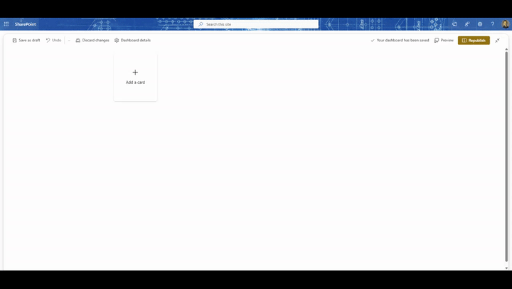

# Today with Work IQ (PrimaryTextCard-WorkIQ-TodaySummary)

## Summary

This ACE puts a Work IQ-generated "what's relevant to you today" summary on the Viva Connections dashboard: a short headline in the Card View, and a Quick View that expands into the files, meeting, and flagged thread Work IQ pulled the summary from. It's grounded in the signed-in user's own mail, calendar, files, and Teams messages — with their existing Microsoft 365 permissions, sensitivity labels, and compliance policies enforced automatically, because that's how Work IQ works.

I write about the Work IQ API and Foundry Agent Service at [codingwithramin.com](https://codingwithramin.com), and I've covered the Work IQ service principal setup, the Work IQ Gateway, and repo scaffolding in Part 1 of my Work IQ series ("Meet Work IQ"), and the 10 generic MCP verbs in "Work IQ as MCP Tools" — both in my [work-iq-samples](https://github.com/AhmadiRamin/work-iq-samples) repo. This sample doesn't use MCP at all, so most of that MCP-specific context is background reading, not required reading — it calls the **Work IQ REST Chat API** instead, for reasons covered below.

## Why this, and why not the alternatives that already exist

As of July 2026, nobody's published this exact combination — Work IQ grounding rendered as a Viva Connections dashboard card — but two adjacent things exist, and it's worth being explicit about how this differs:

- **[react-copilot-apis ("Copilot API Showcase")](https://github.com/pnp/sp-dev-fx-webparts) by Nello D'Andrea** calls the *beta* Microsoft 365 Copilot Graph endpoints from an SPFx **web part**. It's the closest prior art in this ecosystem, but it's a web part (not an ACE, so no Card View/Quick View lifecycle), and it targets the beta Graph Copilot surface rather than the GA Work IQ REST API.
- **Microsoft's own "SharePoint Copilot Apps" preview** ships a flagship "My Day" demo that's explicitly "powered by Work IQ" — but it renders *inside the Copilot canvas* via MCP Apps, not on the Viva Connections dashboard. Same underlying data source, different surface entirely.
- This repo already has Graph-based personal cards with a similar shape — *My Recent Files*, *Upcoming Events Viewer*, *Follow Documents* — but they query Microsoft Graph directly with no AI grounding or synthesis. This card's headline is a Copilot-generated sentence, not a list of the 5 most recent files.

## ACE in Action



## Used SharePoint Framework Version


## Applies to

- [SharePoint Framework](https://aka.ms/spfx)
- [Microsoft 365 tenant](https://docs.microsoft.com/en-us/sharepoint/dev/spfx/set-up-your-developer-tenant)
- [Work IQ](https://learn.microsoft.com/en-us/microsoft-365/copilot/extensibility/work-iq/) — GA since June 16, 2026, billed through usage-based Copilot Credits (no separate SKU or per-user license)

> Get your own free development tenant by subscribing to the [Microsoft 365 developer program](http://aka.ms/o365devprogram)

## Architecture: why a proxy Function, not a direct call

This sample calls Work IQ from a thin **C# Azure Function proxy** rather than directly from the browser. Both are legitimate options — the direct path (SPFx acquires a delegated token via `AadTokenProvider`/`AadHttpClient` and calls Work IQ REST straight from the client, the same mechanism you'd use for any Entra-secured API from SPFx) is noted as a code comment alternative in `src/services/WorkIQProxyService.ts`. I picked the proxy for three reasons:

1. **The multitenant issuer requirement is easier to get right server-side.** Work IQ requires the access token's issuer (`iss`) to match the signed-in user's *home* tenant — not `/common`, not the tenant where the app is registered. Doing the On-Behalf-Of exchange in a Function with one MSAL confidential client per tenant (see `api/WorkIQTodaySummaryFunction/Services/OboTokenService.cs`) is a lot easier to reason about and test than juggling authorities in the browser.
2. **Retries and timeouts belong server-side.** The REST API doesn't support long-running requests and is prone to gateway timeouts — a Function is a better place to handle that than SPFx's card lifecycle.
3. **Caching controls Copilot Credits spend.** See the dedicated section below.

The specific way the Function validates the caller's token and picks an OBO authority per tenant (`AadTokenValidationMiddleware` + `OboTokenService`) is **my own design**, not a documented Microsoft pattern — Work IQ's docs cover the OBO flow itself but not this proxy-relay shape. I've flagged that in the code comments too.

## Prerequisites

1. **Work IQ enabled in your tenant.** If you haven't already, follow the tenant-level service principal setup from [Part 1 of my Work IQ series](https://codingwithramin.com/?p=624) or Microsoft's [Enable Work IQ](https://learn.microsoft.com/en-us/microsoft-365/copilot/extensibility/work-iq/enable-work-iq) guide. Users also need a Copilot license with usage-based billing (Copilot Credits) assigned — a freshly assigned license can take 15–30 minutes for the semantic index to build.
2. **One Entra app registration for the proxy Function** (this sample calls it `WorkIQ-TodaySummary-Proxy`; rename it and update `config/package-solution.json`'s `webApiPermissionRequests[0].resource` to match if you use a different name):
   - **Supported account types: Accounts in any organizational directory (Multitenant)**. This is not optional — see the multitenant gotcha below.
   - **Expose an API** → set the Application ID URI to `api://<client-id>` → add a scope named `access_as_user`, available to admins and users.
   - **API permissions** → **Add a permission** → **APIs my organization uses** → search "Work IQ" → **Delegated permissions** → `WorkIQAgent.Ask` → **Grant admin consent**.
   - **Certificates & secrets** → create a client secret (or, better for production, a certificate) for the Function's OBO calls.
3. **Deploy the Azure Function** (`api/WorkIQTodaySummaryFunction`) and set its app settings from step 2 — see `local.settings.example.json` for the full list (`WorkIQ__ClientId`, `WorkIQ__ClientSecret`, `WorkIQ__ProxyAudience`).
4. **Deploy the SPFx package** to your tenant app catalog.
5. **Approve the API access request — this step is easy to miss and causes a silent auth failure if you skip it.** In the SharePoint admin center, go to **Advanced → API access**, find the pending request for `WorkIQ-TodaySummary-Proxy` / `access_as_user`, and approve it. Until you do, `AadHttpClientFactory.getClient()` in the ACE will fail before the card ever reaches the Function.
6. **Add the card to a Viva Connections dashboard** and configure it: set *Proxy function URL* to your deployed Function's base URL, and *Proxy function Application ID URI* to `api://<client-id>` from step 2.

## Known limitations (Work IQ's, not this sample's)

- The REST API is **text-only** — no file creation, no sending email, no scheduling. It can only describe things, never act on them.
- It **doesn't support long-running requests**; chat messages that trigger one are prone to gateway timeouts. The Function surfaces this as a friendly "try again shortly" error rather than a raw 504.
- Responses are **AI-generated and should read as a summary, not a fact** — the Card View copy says "Here's what looks relevant today," not "Here's what's happening today," and the Quick View repeats that disclaimer.
- There's **no per-source include/exclude toggle** in the REST API beyond web search grounding. The *"Include Teams messages"* property pane setting is implemented by steering the prompt wording (see `WorkIQClient.BuildPrompt`), not by a Work IQ request parameter — because no such parameter exists yet.

## Caching and Copilot Credits

The Function caches the last summary per user (in-memory, keyed by tenant + user + the "include Teams messages" flag) for `WorkIQ__CacheTtlMinutes` (default 15). A dashboard reload within that window is served from cache instead of calling Work IQ again. There's also a floor (`WorkIQ__MinCacheTtlMinutes`, default 5) that wins even over a manual "refresh" click in the Quick View, so someone mashing refresh can't spam Work IQ calls. This is a deliberate design decision, not an afterthought: Work IQ bills through usage-based Copilot Credits, and a dashboard card that calls it on every render for every user would get expensive fast. For a single-instance sample, in-memory caching is enough; a multi-instance production deployment would want a shared cache (Azure Cache for Redis, say) so every Function instance agrees on the last response for a given user.

## Solution

| Solution | Author(s) |
| --- | --- |
| PrimaryTextCard-WorkIQ-TodaySummary | [Ramin Ahmadi](https://github.com/AhmadiRamin) ([codingwithramin.com](https://codingwithramin.com)) |

## Version history

| Version | Date | Comments |
| --- | --- | --- |
| 1.0 | July 10, 2026 | Initial release |

## Disclaimer

**THIS CODE IS PROVIDED *AS IS* WITHOUT WARRANTY OF ANY KIND, EITHER EXPRESS OR IMPLIED, INCLUDING ANY IMPLIED WARRANTIES OF FITNESS FOR A PARTICULAR PURPOSE, MERCHANTABILITY, OR NON-INFRINGEMENT.**

The proxy's token-validation and per-tenant OBO pattern (see "Architecture" above) is a design choice made for this sample, not an officially documented Microsoft reference architecture — review it before using it as-is in production.

---

## Minimal Path to Awesome

This sample has two projects: the SPFx ACE at the repo root, and the C# Azure Function proxy under `api/WorkIQTodaySummaryFunction`.

**Azure Function:**

```bash
cd api/WorkIQTodaySummaryFunction
cp local.settings.example.json local.settings.json   # fill in the WorkIQ__* values from the Prerequisites
dotnet build
func start
```

**SPFx ACE:**

```bash
npm install
npm start          # runs `heft start --clean`
```

To produce a production build and package:

```bash
npm run build       # runs `heft test --clean --production && heft package-solution --production`
```

Then follow the [Prerequisites](#prerequisites) steps above to deploy the Function, deploy the `.sppkg`, approve API access, and configure the card on a Viva Connections dashboard.

## Walkthrough

- **Card View** shows a title ("Today with Work IQ" by default, configurable), a one-line headline, and a footnote ("AI-generated from your files, meetings, and messages"). While the first load is in flight it shows a loading message; if Work IQ isn't enabled or consented for the user yet, it shows that explicitly instead of a generic error.
- **Quick View** repeats the full headline, lists the items Work IQ cited (files, meetings, flagged threads) with an icon and an "Open" link where available, and has a **Try again** button that forces a refresh (subject to the caching floor above).
- **Property pane** lets a page author set the card title, the refresh interval, whether to nudge the prompt toward including Teams messages, and the proxy Function's URL and Application ID URI.

## Concept Explored

This extension illustrates:

- A Primary Text Card View + Quick View ACE built on the stable, documented path (`BasePrimaryTextCardView`, Adaptive Card JSON templating with `$when`/`$data`) rather than newer or preview-stage custom-render APIs — deliberately, since this is a first ACE and the goal was the well-trodden route.
- Calling a custom Entra-secured API from SPFx via `AadHttpClientFactory`, with the `webApiPermissionRequests` / SharePoint admin center API access approval flow that requires.
- An On-Behalf-Of relay pattern for a downstream API (Work IQ) with its own multitenant issuer requirement.
- Explicit loading / error / "not enabled" UI states, driven entirely by Adaptive Card `$when` conditions on a single template rather than separate pushed views.
- Response caching as a cost-control mechanism for a usage-billed AI API, not just a performance optimization.

## References

- [Work IQ overview](https://learn.microsoft.com/en-us/microsoft-365/copilot/extensibility/work-iq/) and [Work IQ REST API overview](https://learn.microsoft.com/en-us/microsoft-365/copilot/extensibility/work-iq/rest/overview)
- [Work IQ API quickstart](https://learn.microsoft.com/en-us/microsoft-365/copilot/extensibility/work-iq-api-quickstart) (multitenant issuer requirement, OBO guidance)
- My [work-iq-samples](https://github.com/AhmadiRamin/work-iq-samples) repo
- [Viva Connections Extensibility guidance](https://aka.ms/viva/connections/extensibility)
- [Adaptive Card Documentation](https://adaptivecards.io/) and the [Adaptive Card designer](https://adaptivecards.io/designer/)
- [Microsoft identity platform: On-Behalf-Of flow](https://learn.microsoft.com/en-us/entra/identity-platform/v2-oauth2-on-behalf-of-flow)
- [Microsoft 365 Patterns and Practices](https://aka.ms/m365pnp) — Guidance, tooling, samples and open-source controls for your Microsoft 365 development
