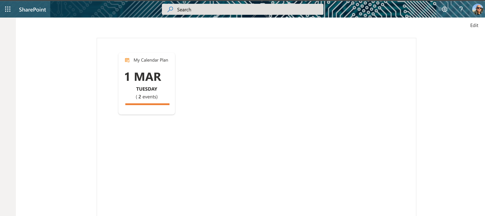
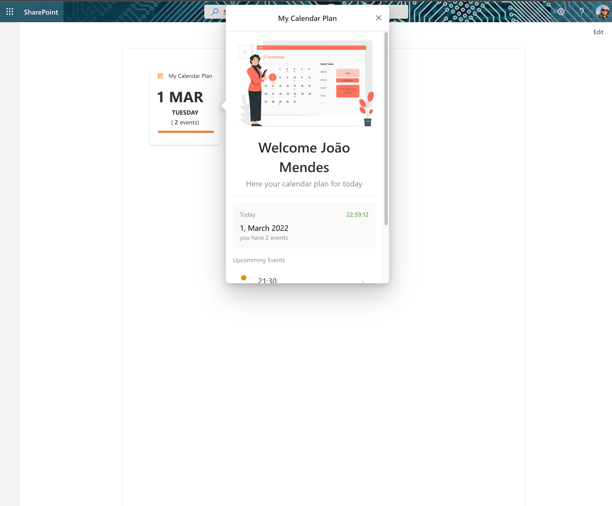
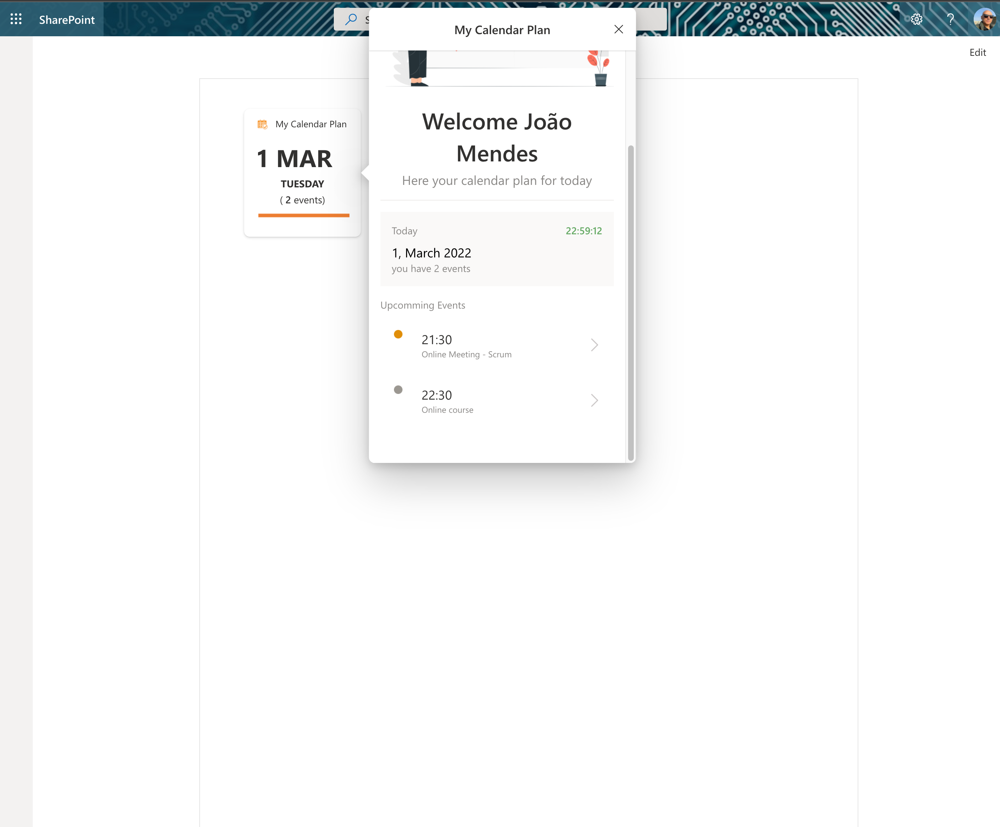

# My Calendar Plan

## Summary

This ACE show user events for specific day

## NOTE

This sample leverages MarkDown for the cardview. Markdown is currently not supported in the cardview for browser, desktop, or mobile and as such does not work on those platforms. The sample does provide a good sample of how to make connections to the Graph and retrieve data.

## Permissions

Microsoft Graph

- Calendars.Read

## Applies to

- [SharePoint Framework](https://docs.microsoft.com/sharepoint/dev/spfx/sharepoint-framework-overview)
- [Microsoft 365 tenant](https://docs.microsoft.com/sharepoint/dev/spfx/set-up-your-development-environment)

## Prerequisites

This ACE need Microsoft Graph Permissions:

- Calendars.Read

## Solution

Solution|Author(s)
--------|---------
ACE-MY-CALENDAR-PLAN | [João Mendes](https://github.com/joaojmendes) ([@joaojmendes](https://twitter.com/joaojmendes)), VALO Solutions Ltd

## Version history

Version|Date|Comments
-------|----|--------
1.0|February 25, 2022|Initial release
1.1|April 21, 2022|Switch to using localized date/time formatting in the card view
1.2|April 27, 2022|Toggle to turn off the set date
1.3|May 05, 2022|Upgrade to SPFX 1.14.0

## Disclaimer

**THIS CODE IS PROVIDED *AS IS* WITHOUT WARRANTY OF ANY KIND, EITHER EXPRESS OR IMPLIED, INCLUDING ANY IMPLIED WARRANTIES OF FITNESS FOR A PARTICULAR PURPOSE, MERCHANTABILITY, OR NON-INFRINGEMENT.**

---

## Minimal Path to Awesome

- Clone this repository
- Ensure that you are at the solution folder
  - in the command line run:
    - `npm install`
      - `gulp build --ship`
      - `gulp bundle --ship`
      - `gulp package-solution --ship`
    - Browse to your SharePoint app catalog and load the SPFx package.
    - Browse to your SharePoint Admin Center and under advanced you will need to open Api Access and allow the requests for Microsoft Graph.

- If you have the APIs permissions already allowed you can follow the below steps.
  - in the command line run:
        *`npm install`
        * `gulp serve --nobrowser`
    - browse to your hosted workbench <https://YOURTENANT.sharepoint.com/sites/_layouts/15/workbench.aspx> and add the adaptive card extension.

