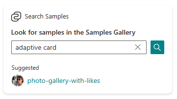
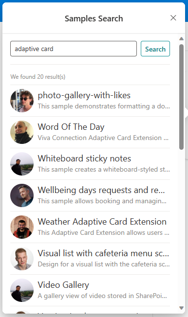

# searchcard-samplesgallery

## Summary

Viva Connection Adaptive Card Extension (ACE) that shows how to create a search card.

Here you can see the Search CardView in action:

While here you can see the Search Results QuickView in action:

## Used SharePoint Framework Version

## Applies to

- [SharePoint Framework](https://aka.ms/spfx)
- [Microsoft 365 tenant](https://docs.microsoft.com/en-us/sharepoint/dev/spfx/set-up-your-developer-tenant)

> Get your own free development tenant by subscribing to [Microsoft 365 developer program](http://aka.ms/o365devprogram)

## Solution

| Solution    | Author(s)                                               |
| ----------- | ------------------------------------------------------- |
| searchcard-samplesgallery | Paolo Pialorsi Paolo Pialorsi - [PiaSys.com](https://www.piasys.com/) - [@PaoloPia](https://twitter.com/PaoloPia) |

## Version history

| Version | Date             | Comments        |
| ------- | ---------------- | --------------- |
| 1.0     | October 31, 2023   | Initial release |

## Disclaimer

**THIS CODE IS PROVIDED _AS IS_ WITHOUT WARRANTY OF ANY KIND, EITHER EXPRESS OR IMPLIED, INCLUDING ANY IMPLIED WARRANTIES OF FITNESS FOR A PARTICULAR PURPOSE, MERCHANTABILITY, OR NON-INFRINGEMENT.**

---

## Minimal Path to Awesome

- Clone this repository
- Ensure that you are at the solution folder
- in the command-line run:
  - **npm install**
  - **gulp serve**

> Include any additional steps as needed.

## Features

This is a sample Adaptive Card Extension (ACE) that shows how to implement a Search enabled CardView, leveraging the new flexible templates for ACEs introduced by Microsoft in SharePoint Framework 1.18.x.
This sample ACE consumes the search engine of the [Microsoft Samples Gallery](https://adoption.microsoft.com/en-us/sample-solution-gallery/).

## References

- [Viva Connections Extensibility guidance](https://aka.ms/viva/connections/extensibility)
- [Adaptive Card Documentation](https://adaptivecards.io/)
- [Adaptive Card Extension Design Guidance](https://docs.microsoft.com/en-us/sharepoint/dev/spfx/viva/design/design-intro)
- [New Search Card Template for Adaptive Card Extensions](https://learn.microsoft.com/en-us/sharepoint/dev/spfx/release-1.18#new-search-card-template-for-adaptive-card-extensions)

