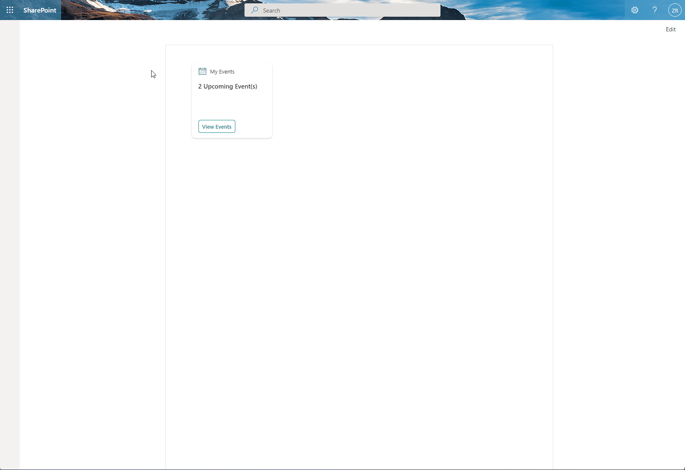

# ace-group-viewer

## Summary

This adaptive card extension sample will load upcoming events for the current user. The user can use the quick view card to view more details of the event and use the button to open the event details page. 

Event Page that loads in Outlook online

## Used SharePoint Framework Version

## Applies to

- [SharePoint Framework](https://aka.ms/spfx)
- [Microsoft 365 tenant](https://docs.microsoft.com/en-us/sharepoint/dev/spfx/set-up-your-developer-tenant)
- [Microsoft Graph](https://docs.microsoft.com/en-us/graph/overview)
- [PnPJS](https://pnp.github.io/pnpjs/)

> Get your own free development tenant by subscribing to [Microsoft 365 developer program](http://aka.ms/o365devprogram)

## Prerequisites

> No prerequisites required.

## Solution

Solution|Author(s)
--------|---------
ace-graph-upcomingevents | [Zach Roberts](https://github.com/zachroberts8668) ([@ZachSPODev](https://twitter.com/ZachSPODev))

## Version history

Version|Date|Comments
-------|----|--------
1.0|October 1, 2021|Initial release

## Disclaimer

**THIS CODE IS PROVIDED *AS IS* WITHOUT WARRANTY OF ANY KIND, EITHER EXPRESS OR IMPLIED, INCLUDING ANY IMPLIED WARRANTIES OF FITNESS FOR A PARTICULAR PURPOSE, MERCHANTABILITY, OR NON-INFRINGEMENT.**

---

## Minimal Path to Awesome

- Clone this repository
- Ensure that you are at the solution folder
* If your SharePoint tenant does not already allow API access to the following Microsoft Graph permissions: Directory.Read.All, Calendars.Read then please follow the below instructions.
    * in the command line run:
      * `npm install`
      * `gulp build --ship`
      * `gulp bundle --ship`
      * `gulp package-solution --ship`
    * browse to your SharePoint app catalog and load the SPFX package. Once loaded you will need to browse to your SharePoint Admin Center and under advanced you will need to open Api Access and allow the requests for Microsoft Graph. 
* If you have the APIs permissions already allowed you can follow the below steps.
    * in the command line run:
        * `npm install`
        * `gulp serve --nobrowser`
    * browse to your hosted workbench of a group site https://YOURTENANT.sharepoint.com/sites/SITENAME/_layouts/15/workbench.aspx and add the adaptive card extension.

## Features

This extension illustrates the following concepts:

- Using PnPJS to call Microsoft Graph to get the upcoming events for the current user.
- Iterate array content in an adaptive card.
- Slider property to adjust the number of days in advance the events it loads.

> Share your web part with others through Microsoft 365 Patterns and Practices program to get visibility and exposure. More details on the community, open-source projects and other activities from http://aka.ms/m365pnp.

## References

- [Getting started with SharePoint Framework](https://docs.microsoft.com/en-us/sharepoint/dev/spfx/set-up-your-developer-tenant)
- [Building for Microsoft teams](https://docs.microsoft.com/en-us/sharepoint/dev/spfx/build-for-teams-overview)
- [Use Microsoft Graph in your solution](https://docs.microsoft.com/en-us/sharepoint/dev/spfx/web-parts/get-started/using-microsoft-graph-apis)
- [Publish SharePoint Framework applications to the Marketplace](https://docs.microsoft.com/en-us/sharepoint/dev/spfx/publish-to-marketplace-overview)
- [Microsoft 365 Patterns and Practices](https://aka.ms/m365pnp) - Guidance, tooling, samples and open-source controls for your Microsoft 365 development