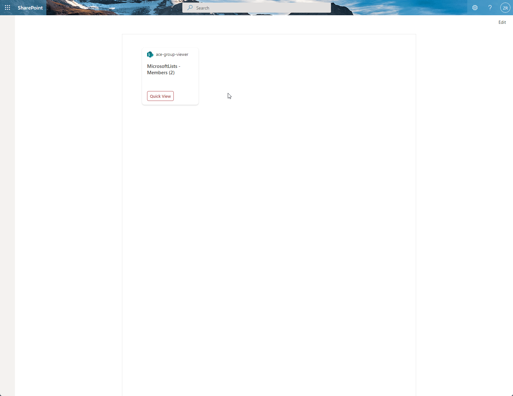

# Group Viewer

## Summary

This adaptive card extension sample will load the group and group members of the current site it is on. Clicking the card or quick view will display a list of members and with actions to email that member. 

## Used SharePoint Framework Version

## Applies to

- [SharePoint Framework](https://aka.ms/spfx)
- [Microsoft 365 tenant](https://docs.microsoft.com/en-us/sharepoint/dev/spfx/set-up-your-developer-tenant)
- [Microsoft Graph](https://docs.microsoft.com/en-us/graph/overview)
- [PnPJS](https://pnp.github.io/pnpjs/)

> Get your own free development tenant by subscribing to [Microsoft 365 developer program](http://aka.ms/o365devprogram)

## Prerequisites

> No prerequisites required.

## Solution

Solution|Author(s)
--------|---------
ace-group-viewer | [Zach Roberts](https://github.com/zachroberts8668) ([@ZachSPODev](https://twitter.com/ZachSPODev))

## Version history

Version|Date|Comments
-------|----|--------
1.0|September 29, 2021|Initial release

## Disclaimer

**THIS CODE IS PROVIDED *AS IS* WITHOUT WARRANTY OF ANY KIND, EITHER EXPRESS OR IMPLIED, INCLUDING ANY IMPLIED WARRANTIES OF FITNESS FOR A PARTICULAR PURPOSE, MERCHANTABILITY, OR NON-INFRINGEMENT.**

---

## Minimal Path to Awesome

- Clone this repository
- Ensure that you are at the solution folder
* If your SharePoint tenant does not already allow API access to the following Microsoft Graph permissions: Directory.Read.All, Group.Read.All and GroupMember.Read.All then please follow the below instructions.
    * in the command line run:
      * `npm install`
      * `gulp build --ship`
      * `gulp bundle --ship`
      * `gulp package-solution --ship`
    * browse to your SharePoint app catalog and load the SPFX package. Once loaded you will need to browse to your SharePoint Admin Center and under advanced you will need to open Api Access and allow the requests for Microsoft Graph. 
* If you have the APIs permissions already allowed you can follow the below steps.
    * in the command line run:
        * `npm install`
        * `gulp serve --nobrowser`
    * browse to your hosted workbench of a group site https://YOURTENANT.sharepoint.com/sites/SITENAME/_layouts/15/workbench.aspx and add the adaptive card extension.

## Features

Description of the extension that expands upon high-level summary above.

This extension illustrates the following concepts:

- Using PnPJS to call Microsoft Graph to gather group information and members for the current group site the Adaptive Card Extension is placed on.
- Iterate array content in an adaptive card.

## References

- [Getting started with SharePoint Framework](https://docs.microsoft.com/en-us/sharepoint/dev/spfx/set-up-your-developer-tenant)
- [Building for Microsoft teams](https://docs.microsoft.com/en-us/sharepoint/dev/spfx/build-for-teams-overview)
- [Use Microsoft Graph in your solution](https://docs.microsoft.com/en-us/sharepoint/dev/spfx/web-parts/get-started/using-microsoft-graph-apis)
- [Publish SharePoint Framework applications to the Marketplace](https://docs.microsoft.com/en-us/sharepoint/dev/spfx/publish-to-marketplace-overview)
- [Microsoft 365 Patterns and Practices](https://aka.ms/m365pnp) - Guidance, tooling, samples and open-source controls for your Microsoft 365 development